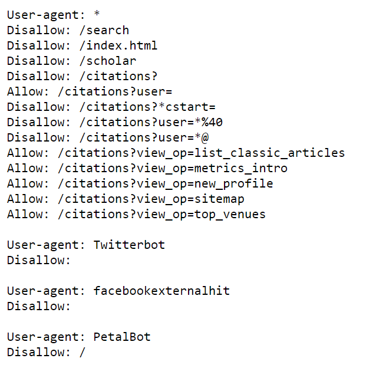

# Wyniki badań i analiz

## Baza danych Google Scholar (GS)

Przeszukiwanie bazy w tradycyjny sposób odbywa się poprzez wyszukiwarkę strony [Google Scholar](https://scholar.google.com).

```{r webshot_2, echo=TRUE}

library(webshot2)
webshot("https://scholar.google.com", 
        "Rysunki/wyszykiwarka_google_scholar.png")
```

Przeszukiwanie zasobów GS różni się pod kilkoma względami od przeszukiwania innych baz. Baza ta posiada własną listę operatorów, które nie występują w żadnej innej bazie danych. Stosować można podczas wyszukiwania niektóre popularne operatory ograniczające lub rozszerzające wyszukiwanie (takie jak cudzysłów lub gwiazdka), natomiast z innych jak operatora wyszukiwania logicznego NOT nie można skorzystać. Google używa znaku minus zamiast powszechnie używanego terminu NOT. GS używają niejawnego AND - a nie logicznego AND, czyli kiedy operator ten jest wprowadzane do zapytania wyszukiwania, Google traktuje je jako słowo w zapytaniu wyszukiwania i nie rozpoznaje go jako operatora wyszukiwania. GS ignoruje popularne słowa, takie jak a, and, the i tak dalej, z wyjątkiem gdy umieszczone są w cudzysłowie.

**Wybrane operatory wyszukiwania Google Scholar:**

**publikacja:** Wyniki będą zawierać tylko publikacje zawierające określone terminy. Na przykład wyszukiwanie "publication:computers in libraries" będzie zawierać tylko wyniki z publikacji Computers in Libraries.

**autor:** Lista wyników będzie zawierać tylko publikacje wskazanego autora, na przykład, autor: G Kulczycki

**define:** używany tylko w Google, gdy oczekuje się szybkich definicji, na przykład, "define:word"

**cudzysłów (" ")** używany do łączenia dokładnej frazy, może być również używany do zapewnienia, że określone słowo zostanie uwzględnione.

**Uniwersalne operatory logiczne i logika wyszukiwania:**

**OR** - znany również jako suma logiczna, operator OR "rozszerza wyszukiwanie poprzez uwzględnienie synonimów i powiązanych terminów w zapytaniu"

**znak minus (-)** główną funkcją znaku minus jest wykluczenie terminu, GS używa znaku minus zamiast powszechnie używanego terminu NOT.

**gwiazdka (\*)** używana jako operator wieloznaczny

Przykład wyszukiwania w basie GS dla frazy "elemental sulphur fertilization" w wyniku wyszukiwania uzyskuje się 42 pozycje publikacji (rys. \ref{GS_elemental}).

{width="100%"}


[Polityka firmy Google](https://policies.google.com/terms/archive/20190122?hl=en&gl=GB) określa, że dostęp do zasobów GS powinien odbywać poprzez interfejs ich wyszukiwarki i instrukcji podanych przez firmę. GS nie zapewnia API (Application Programming Interface), a dostęp do zasobów jest wyszczególniony poprzez plik robot.txt (rys. \ref{GS_robot}).

{width="70%"}

**Baza Google Scholar zezwala na dostęp do:**

-   profili użytkowników: Allow: /citations?user=

(np. [https://scholar.google.pl/citations?user=RNDE9-wAAAAJ&hl](https://scholar.google.pl/citations?user=RNDE9-wAAAAJ&hl=pl))

-   zestawienia obszarów dziedzin badawczych: Allow: /citations?view_op=list_classic_articles

(np. <https://scholar.google.com/citations?view_op=list_classic_articles&hl=en&by=2006>)

-   Zeztawienia kategorii czasopism: Allow: /citations?view_op=metrics_intro

(np. <https://scholar.google.com//citations?view_op=metrics_intro>)

### Wskaźniki biblometryczne dla wybranych naukowców

W ramach dozwolonego przez GS dostępu do bazy przeprowadzono analizę wskaźników bibliometrycznych dla wybranych naukowców za pomocą biblioteki [scholar v. 0.2.4](https://cran.r-project.org/web/packages/scholar/index.html).


### Zestawienie ilości opublikowanych artykułów dla kilku naukowców

Do analizy wybrano cztery profile naukowców, różniących się stażem pracy na Uczelni, żeby zobrazować intensywność i dynamikę ich potencjału publikacyjnego.

```{r ilosc_publikacji, echo=TRUE}

#wymagane bibloteki
library(scholar)
library(tidyverse)
library(ggplot2)

# id  użytkowników
Kulczycki <- "RNDE9-wAAAAJ"  
Sacala <- "jkj3pCQAAAAJ&hl" 
Samoraj <- "um0TaCEAAAAJ" 
Pietr <- "L6MYKCQAAAAJ&hl" 

# Ile artykułów opublikowali?
Kulczycki.num <- get_num_articles(Kulczycki)
Sacala.num <- get_num_articles(Sacala)
Samoraj.num <- get_num_articles(Samoraj)
Pietr.num <- get_num_articles(Pietr)

# utworzenie ramki danych
num <- data.frame (Ilosc = c(Kulczycki.num, 
                              Sacala.num, 
                              Samoraj.num, 
                              Pietr.num),
                  Osoba= c("Kulczycki", "Sacala", "Samoraj", "Pietr"))

# wizualizacja ilości cytowań
ggplot(num, aes(x=Osoba, y=Ilosc, fill = Osoba)) + 
geom_col()+
theme_bw() + 
scale_fill_brewer(palette = "BrBG")+
geom_text(aes(label=Ilosc),position=position_stack(vjust=1.1),size=6)+
theme( plot.title = element_text(size=14, hjust = 0.5),
       legend.position='none',
       axis.title.x=element_blank(),
       axis.text.x = element_text(face="bold", color="#993333", size=14),
       axis.text.y = element_text(size = 14),
       axis.title.y = element_text(size = 14))

```

Współprace publikacyjną dla wybranego naukowca przedstawiono z wykorzystaniem biblioteki [scholarnetwork](https://github.com/pablobarbera/scholarnetwork).

```{r wspolpraca, echo=TRUE, warning=FALSE}

library(igraph)
library(scholarnetwork)
library(ggplot2)
d <- extractNetwork(id="RNDE9-wAAAAJ", n=2)
str(d)
plotNetwork(d$nodes, d$edges, file="network.html")
# cleaning network data
network <- graph_from_data_frame(d$edges, directed=FALSE)
set.seed(123)
l <- layout.fruchterman.reingold(network, niter=50) # layout
fc <- walktrap.community(network) # community detection
# node locations
nodes <- data.frame(l); names(nodes) <- c("x", "y")
nodes$cluster <- factor(fc$membership)
nodes$label <- fc$names
nodes$degree <- degree(network)
# edge locations
edgelist <- get.edgelist(network, names=FALSE)
edges <- data.frame(nodes[edgelist[,1],c("x", "y")], nodes[edgelist[,2],c("x", "y")])
names(edges) <- c("x1", "y1", "x2", "y2")
# and now visualizing it...
p <- ggplot(nodes, aes(x=x, y=y, color=cluster, label=label, size=degree))
pq <- p + geom_text(color="black", aes(label=label, size=degree),
                    show_guide=FALSE) +
  # nodes
  geom_point(color="grey20", aes(fill=cluster),
             shape=21, show_guide=FALSE, alpha=1/2) +
  # edges
  geom_segment(
    aes(x=x1, y=y1, xend=x2, yend=y2, label=NA),
    data=edges, size=0.5, color="grey20", alpha=0.1) +
  ## note that here I add a border to the points
  scale_fill_discrete(labels=labels) +
  scale_size_continuous(range = c(3, 6)) +
  ggtitle("Sieć współautorstwa Grzegorza Kulczyckiego") +
  theme(
    plot.title = element_text(size = 14, color = "blue", face = "bold", hjust = 0.5),
    panel.background = element_rect(fill = "white"),
    plot.background = element_rect(fill="white"),
    axis.line = element_blank(), axis.text = element_blank(),
    axis.ticks = element_blank(),
    axis.title = element_blank(), panel.border = element_blank(),
    panel.grid.major = element_blank(),
    panel.grid.minor = element_blank(),
    legend.background = element_rect(colour = F, fill = "black"),
    legend.key = element_rect(fill = "black", colour = F),
    legend.title = element_text(color="white"),
    legend.text = element_text(color="white")
  ) +
  guides(fill = guide_legend(override.aes = list(size=4)))
pq


```

### Porównanie sumy cytowań dla publikacji napisanych przez naukowców w kolejnych latach ich pracy

Dla tych samych profili naukowców przeprowadzono także analizę cytowań ich publikacji. Wyznaczone krzywe na podstawie ilości cytowań wskazują na różnicę w ilości cytowań w latach dla tych naukowców. 

```{r porownanie, echo=TRUE}

library(scholar)
library(tidyverse)
library(ggplot2)
# id  użytkowników
ids <- c("RNDE9-wAAAAJ&hl", "jkj3pCQAAAAJ&hl",
         "L6MYKCQAAAAJ&hl","um0TaCEAAAAJ")
#utworzenie ramki danych
df <- compare_scholars(ids)
#usuniecie brakujących danych
df <- na.omit(df)
# wizualizacja ilości cytowań
p <- ggplot(df, aes(x=year, y=total, group = name)) +
  geom_line(aes(colour = name)) +
  scale_fill_brewer(palette = "BrBG")+
  geom_text(aes(label=total), size = 4, check_overlap = TRUE)+
  labs(y="Ilość cytowań")+
  labs(x="Lata")+
  theme_bw() +
  theme(plot.title = element_text(size=14, hjust = 0.5),
   legend.position="top",
   legend.title = element_text(colour="black", size=8, face="bold"),
   legend.text = element_text(colour="black", size=8,face="bold"),
   axis.text.x = element_text(face="bold", color="#993333", size=14),
   axis.title.x = element_text(size = 12),
   axis.text.y = element_text(size = 12),
   axis.title.y = element_text(size = 12))
p + guides(size = FALSE)

```

### Dynamika rozwoju publikacyjnego wybranych naukowców na podstawie ilości skumulowanych cytowań w zalezności od długości stażu pracy.

Na podstawie otrzymanego wykresu, uwidacznia się inna dynamika cytowań dla  młodych naukowców w porównaniu z pracownikami z dłuższym stażem. Wynikać to może z obecnego systemu ewaluacji, w którym młodzi naukowcy obecnie publikują prawie wyłącznie w języku angielskim w indeksowanych czasopismach dostępnych dla szerszego grona społeczności akademickiej.


```{r dynamika, echo=TRUE}
library(scholar)
library(plyr)
library(ggplot2)

ids <- c("RNDE9-wAAAAJ&hl", "jkj3pCQAAAAJ&hl","L6MYKCQAAAAJ&hl" , "um0TaCEAAAAJ")
df_3 <- compare_scholar_careers(ids)

## Add cumulative citation
df_3 <- ddply(.data = df_3,
            .variables = c("id"),
            .fun = transform,
            cumulative_cites = cumsum(cites))
## Plot
p <- ggplot(df_3, aes(x = career_year, y = cumulative_cites)) +
  geom_line(aes(colour = name)) +
  scale_fill_brewer(palette = "BrBG")+
  geom_text(aes(label=cumulative_cites), size=4,check_overlap = TRUE)+
  labs(y="Skumulowane cytowania")+
  labs(x="Lata pracy")+
  theme_bw()+
  theme( plot.title = element_text(size=14, hjust = 0.5),
         legend.position="top",
         legend.title = element_text(colour="black", size=8, face="bold"),
         legend.text = element_text(colour="black", size=8,face="bold"),
         axis.text.x = element_text(face="bold", color="#993333", size=14),
         axis.title.x = element_text(size = 12),
         axis.text.y = element_text(size = 12),
         axis.title.y = element_text(size = 12))
p + guides(size = FALSE)

```

### Metoda web scraping (GS)

Metody te nie są dozwolone na tej bazie danych, ale dla celów dydaktycznych w projekcie wykorzystano bibliotekę [BeautifulSoup](https://pypi.org/project/beautifulsoup4/) do uzyskania tytułów publikacji i linków dla profilu własnego (id = RNDE9-wAAAAJ) w GS. Moduł BeautifulSoup wykorzystuje się do parsowania i przeszukiwania dokumentów HTML.


```{python metody_scrab, echo=TRUE}

import pandas as pd
import requests
from bs4 import BeautifulSoup as bs

pd.set_option('display.max_columns', None)
pd.set_option('display.max_colwidth', 65)
big_df = pd.DataFrame()
headers = {
    'accept-language': 'en-US,en;q=0.9,pl-PL',
    'x-requested-with': 'XHR',
    'User-Agent': ('Mozilla/5.0 (Windows NT 10.0; Win64; x64) '
                   'AppleWebKit/537.36 (KHTML, like Gecko) '
                   'Chrome/105.0.0.0 Safari/537.36')}
s = requests.Session()
s.headers.update(headers)
payload = {'json': '1'}
x = 0
while True:
    url = (
    f'https://scholar.google.com/citations?hl=en&user=RNDE9-wAAAAJ&'
    f'cstart={x}&pagesize=100')
    r = s.post(url, data=payload)
    soup = bs(r.json()['B'], 'html.parser')
    works = [(x.get_text(), 'https://scholar.google.com' + x.get('href'))
             for x in soup.select('a') if 'javascript:void(0)' not in x.get('href')
             and len(x.get_text()) > 7]
    if not works:  
        break
    df = pd.DataFrame(works, columns=['Paper', 'Link'])
    big_df = pd.concat([big_df, df], axis=0, ignore_index=True)
    x += 100  
csv_file_path = 'output.csv'
big_df.to_csv(csv_file_path, index=False, encoding='utf-8')

limited_df = big_df.head(10)
print(limited_df)

```


Wynik wyszukiwania zapisywany jest do pliku csv (rys. \ref{plik_csv}), dane z tego pliku można wykorzystać do dalszych analiz i wizualizacji.

{width="100%"} 

Z otrzymanego pliku csv wyodrębniono tytuły publikacji jako plik txt w celu wykonania chmury wyrazów.

### Utworzenie oddzielnych plików z tytułami w języku angielskim i polskim

Ponieważ w pliku znajdują się tytuły w języku angielskim i polskim, wykorzystano bibliotekę [langdetect 1.0.9](https://pypi.org/project/langdetect/) do stworzenia oddzielnych plików z tytułami w języku angielskim i polskim.


```{python echo=TRUE}

from langdetect import detect
import pandas as pd

# Odczytaj plik i przeczytaj tytuły artykułów
with open('siarka.txt', 'r', encoding='utf-8') as file:
    article_titles = file.readlines()

# Inicjalizacja list na tytuły po angielsku i po polsku
english_titles = []
polish_titles = []

# Podział tytułów na dwa zestawy bazując na wykrytym języku
for title in article_titles:
    if detect(title) == 'en':
        english_titles.append(title)
    elif detect(title) == 'pl':
        polish_titles.append(title)

# Zapisz tytuły artykułów po angielsku do pliku
with open('english_titles.txt', 'w', encoding='utf-8') as file:
    file.writelines(english_titles)

# Zapisz tytuły artykułów po polsku do pliku
with open('polish_titles.txt', 'w', encoding='utf-8') as file:
    file.writelines(polish_titles)

```

Pliki te wykorzystano do stworzenia chmur wyrazów w języku angielskim i polskim za pomocą biblioteki [wordcloud](https://cran.r-project.org/web/packages/wordcloud/index.html).

### Utworzenie chmury wyrazów w języku angielskim:

```{r wordcloud_en, echo=TRUE, warning=FALSE}
library(tm)
#library(SnowballC)
library(wordcloud)
library(RColorBrewer)

filePath <- "english_titles.txt"
text <- readLines(filePath)
docs <- Corpus(VectorSource(text))
toSpace <- content_transformer(function (x , pattern ) gsub(pattern, " ", x))
docs <- tm_map(docs, toSpace, "/")
docs <- tm_map(docs, toSpace, "@")
docs <- tm_map(docs, toSpace, "\\|")
docs <- tm_map(docs, content_transformer(tolower))
docs <- tm_map(docs, removeNumbers)
docs <- tm_map(docs, removeWords, stopwords("english"))
docs <- tm_map(docs, removeWords, c("blabla1", "blabla2")) 
docs <- tm_map(docs, removePunctuation)
docs <- tm_map(docs, stripWhitespace)
dtm <- TermDocumentMatrix(docs)
m <- as.matrix(dtm)
v <- sort(rowSums(m),decreasing=TRUE)
d <- data.frame(word = names(v),freq=v)
head(d, 10)
set.seed(1234)
wordcloud(words = d$word, freq = d$freq, min.freq = 1,
          max.words=200, random.order=FALSE, rot.per=0.35, 
          colors=brewer.pal(8, "Dark2"))
```

### Utworzenie chmury wyrazów w języku polskim:

```{r wordcloud_pl, echo=TRUE, warning=FALSE}
library(tm)
library(SnowballC)
library(wordcloud)
library(RColorBrewer)

filePath <- "polish_titles.txt"
text <- readLines(filePath)
docs <- Corpus(VectorSource(text))
toSpace <- content_transformer(function (x , pattern ) gsub(pattern, " ", x))
docs <- tm_map(docs, toSpace, "/")
docs <- tm_map(docs, toSpace, "@")
docs <- tm_map(docs, toSpace, "\\|")
docs <- tm_map(docs, content_transformer(tolower))
docs <- tm_map(docs, removeNumbers)
docs <- tm_map(docs, removeWords, stopwords("english"))
docs <- tm_map(docs, removeWords, c("blabla1", "blabla2")) 
docs <- tm_map(docs, removePunctuation)
docs <- tm_map(docs, stripWhitespace)
dtm <- TermDocumentMatrix(docs)
m <- as.matrix(dtm)
v <- sort(rowSums(m),decreasing=TRUE)
d <- data.frame(word = names(v),freq=v)
head(d, 10)
set.seed(1234)
wordcloud(words = d$word, freq = d$freq, min.freq = 1,
          max.words=200, random.order=FALSE, rot.per=0.35, 
          colors=brewer.pal(8, "Dark2"))
```


## Baza danych Semantic Scholar (SS)

W przypadku bazy Semantic Scholar przy przeszukiwaniu istnieje możliwość korzystania z interfejsu API REST (ang. Representational State Transfer). Kluczową cechą API REST jest wykorzystanie protokołu HTTP (Hypertext Transfer Protocol) do komunikacji między klientem a serwerem oraz stosowanie standardowych metod HTTP, takich jak GET, POST, PUT, DELETE, itp., do manipulowania zasobami. Ogólnie jest to technika, która pozwala na automatyczny dostęp i pobieranie informacji między różnymi maszynami.

Interfejs API umożliwia wyszukiwanie i eksplorowanie danych publikacji naukowych dotyczących autorów, artykułów, czy cytowań. [Semantic Scholar API](https://www.semanticscholar.org/product/api) umożliwia skorzystanie z następujących usług :

-   **Academic Graph:** Zapewnia dane o autorach, artykułach, cytowaniach, miejscach, osadzeniach SPECTER2 i innych, które umożliwiają bezpośrednie połączenie z odpowiednią stroną na semanticscholar.org, aby uzyskać więcej informacji.

-   **Rekomendacje:** Zawiera rekomendowane artykuły podobne do danego artykułu.

-   **Datasets:** Udostępnia linki do pobrania zbiorów danych na wykresie akademickim.

-   **Conference Peer Review:** Zapewnia narzędzia pomagające organizatorom konferencji z problemem przypisywania recenzentów do zgłoszeń konferencyjnych. Obejmuje wykrywanie konfliktu interesów w oparciu o relacje między współautorami oraz obliczanie wyniku dopasowania między recenzentem a tematem zgłoszenia w oparciu o historię publikacji recenzenta.

Użytkownik bazy Semantic Scholar możne złożyć wniosek o przyznanie klucza API, dzięki czemu uzyskuje następujące parametry połączenia:

-   Limit szybkości: - 1 żądanie na sekundę dla następujących punktów końcowych:

/paper/batch

/paper/search

/rekomendacje

-   10 żądań na sekundę dla wszystkich innych połączeń

Dostęp do dużych ilości danych za pośrednictwem interfejsów API jest istotny ze względu na przeprowadzenie lepszych i głębszych analiz, które mogą wydobyć ukrytą wiedzę i znaleźć nowe wzorce zachowań [@velez-estevez2023] 

Poniżej przedstawiono możliwości przeszukiwanie bazy danych Semantic Scholar:

### Wyszukanie nazwisk autorów publikacji poprzez id ich profili z wykorzystaniem biblioteki [semanticscholar 0.7.0](https://pypi.org/project/semanticscholar).


```{python nazwiska_naukowcow, echo=TRUE}

from semanticscholar import SemanticScholar

sch = SemanticScholar()
list_of_author_ids = ['113275711', '12961311', '87266064', '113633308']
results = sch.get_authors(list_of_author_ids)
print("Użytkownicy bazy Semantic Scholar:")
for item in results:
    print(item.name)
    
```


### Przeszukiwanie bazy poprzez frazę słów z wykorzystaniem biblioteki [semanticscholar 0.7.0](https://pypi.org/project/semanticscholar).


```{python slowa_kluczowe, echo=TRUE}

from semanticscholar import SemanticScholar

sch = SemanticScholar()
results = sch.search_paper('elemental sulphur fertilization')
counter = 1
print("Wyniki wyszukiwania 10 pierwszych rekordów: ")
for index, item in enumerate(results):
    # Print the number and title of the paper
    print(f"{index+1}. {item.title}")
    counter += 1
    if counter > 10:
        break

```


### Przeszukiwanie bazy danych z wykorzystaniem [ChatOpenAI](https://platform.openai.com/apps) z pomocą [Semantic Scholar API Tool](https://python.langchain.com/docs/integrations/tools/semanticscholar) 

Na rysunku \ref{langchain_cod} przedstawiono skrypt wykorzystujący ChatGPT do przeszukiwania i uzyskiwania odpowiedzi na zadawane pytania z bazy Semantic Scholar. W skrypcie zastosowano własny klucz API wygenerowany na stronie [OpenAI](https://platform.openai.com/api-keys).


{width="100%"}

Przykład uzyskanych wyników dla  zadawanych pytań poprzez skrypt Semantic Scholar API Tool rys. \ref{langchain_output}

{width="100%"}


