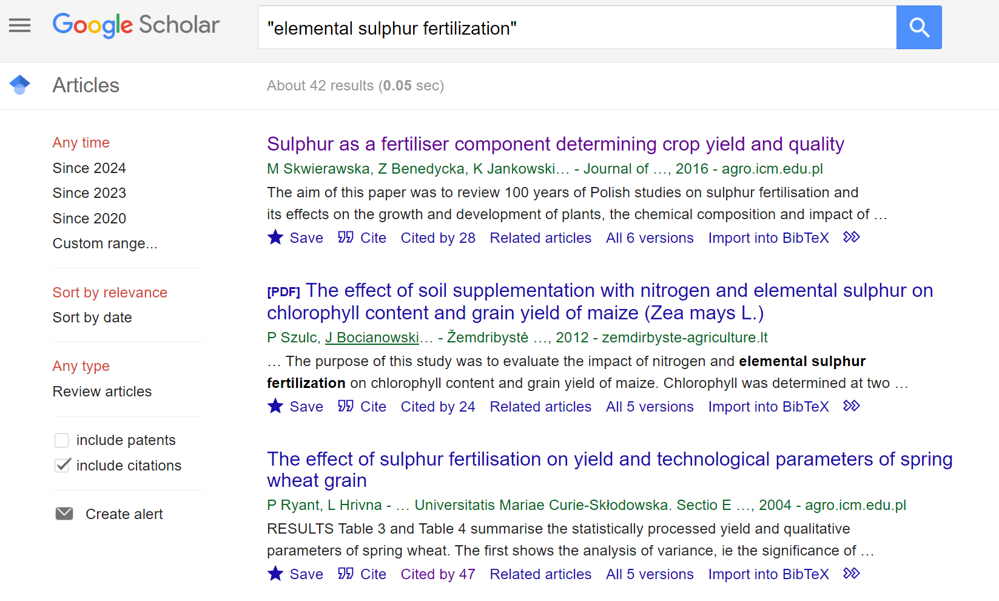
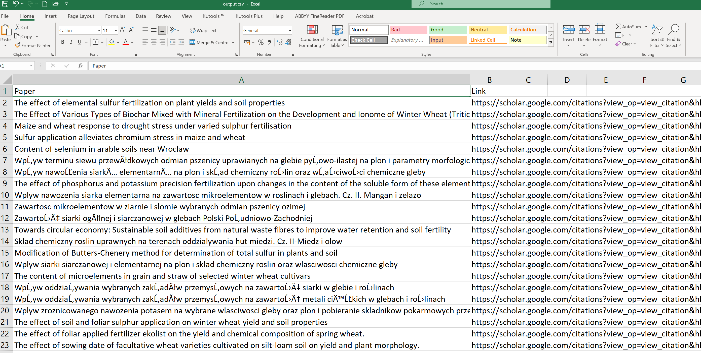

# Wyniki badań i analiz

## Baza danych Google Scholar (GS)

Przeszukiwanie bazy w tradycyjny sposób odbywa się poprzez wyszukiwarkę strony [Google Scholar](https://scholar.google.com).

```{r echo=TRUE}

library(webshot2)
webshot("https://scholar.google.com", 
        "Rysunki/wyszykiwarka_google_scholar.png")
```

Przeszukiwanie zasobów GS różni się pod kilkoma względami od przeszukiwania innych baz. Baza ta posiada własną listę operatorów, które nie występują w żadnej innej bazie danych. Stosować można podczas wyszukiwania niektóre popularne operatory ograniczające lub rozszerzające wyszukiwanie (takie jak cudzysłów lub gwiazdka), natomiast z innych jak operatora wyszukiwania logicznego NOT nie można skorzystać. Google używa znaku minus zamiast powszechnie używanego terminu NOT. GS używają niejawnego AND - a nie logicznego AND, czyli kiedy operator ten jest wprowadzane do zapytania wyszukiwania, Google traktuje je jako słowo w zapytaniu wyszukiwania i nie rozpoznaje go jako operatora wyszukiwania. GS ignoruje popularne słowa, takie jak a, and, the i tak dalej, z wyjątkiem gdy umieszczone są w cudzysłowie.

**Wybrane operatory wyszukiwania Google Scholar:**

**publikacja:** Wyniki będą zawierać tylko publikacje zawierające określone terminy. Na przykład wyszukiwanie "publication:computers in libraries" będzie zawierać tylko wyniki z publikacji Computers in Libraries.

**autor:** Lista wyników będzie zawierać tylko publikacje wskazanego autora, na przykład, autor: G Kulczycki

**define:** używany tylko w Google, gdy oczekuje się szybkich definicji, na przykład, "define:word"

**cudzysłów (" ")** używany do łączenia dokładnej frazy, może być również używany do zapewnienia, że określone słowo zostanie uwzględnione.

**Uniwersalne operatory logiczne i logika wyszukiwania:**

**OR** - znany również jako suma logiczna, operator OR "rozszerza wyszukiwanie poprzez uwzględnienie synonimów i powiązanych terminów w zapytaniu"

**znak minus (-)** główną funkcją znaku minus jest wykluczenie terminu, GS używa znaku minus zamiast powszechnie używanego terminu NOT.

**gwiazdka (\*)** używana jako operator wieloznaczny

Przykład wyszukiwania w basie GS dla frazy "elemental sulphur fertilization" w wyniku wyszukiwania uzyskuje się 42 pozycje publikacji (rys. \ref{GS_elemental}).

{width="100%"}

[Polityka firmy Google](https://policies.google.com/terms/archive/20190122?hl=en&gl=GB) określa, że dostęp do zasobów GS powinien odbywać poprzez interfejs ich wyszukiwarki i instrukcji podanych przez firmę. GS nie zapewnia API (Application Programming Interface), a dostęp do zasobów jest wyszczególniony poprzez plik robot.txt.

```{r echo=TRUE}

library(webshot2)
webshot("https://scholar.google.com/robots.txt", "Rysunki/robots.png") 

```

**Baza Google Scholar zezwala na dostęp do:**

-   profili użytkowników: Allow: /citations?user=

(np. [https://scholar.google.pl/citations?user=RNDE9-wAAAAJ&hl](https://scholar.google.pl/citations?user=RNDE9-wAAAAJ&hl=pl))

-   zestawienia bbszarów dziedzin badawczych: Allow: /citations?view_op=list_classic_articles

(np. <https://scholar.google.com/citations?view_op=list_classic_articles&hl=en&by=2006>)

-   Zeztawienia kategorii czasopism: Allow: /citations?view_op=metrics_intro

(np. <https://scholar.google.com//citations?view_op=metrics_intro>)

### Analiza wskaźników biblometrycznych dla wybranych naukowców

W ramach dozwolonego przez GS dostępu do bazy przeprowadzono analizę wskaźników bibliometrycznych dla wybranych naukowców za pomocą biblioteki [scholar](https://cran.r-project.org/web/packages/scholar/index.html).

### Analiza ilości publikacji


```{r echo=TRUE}

#wymagane bibloteki
library(scholar)
library(tidyverse)
library(ggplot2)

# id  użytkowników
Kulczycki <- "RNDE9-wAAAAJ&hl"  
Sacala <- "jkj3pCQAAAAJ&hl" 
Lejcus <- "XNRUNHsAAAAJ&hl" 
Pietr <- "L6MYKCQAAAAJ&hl" 

# Ile artykułów opublikowali?
Kulczycki.num <- get_num_articles(Kulczycki)
Sacala.num <- get_num_articles(Sacala)
Lejcus.num <- get_num_articles(Lejcus)
Pietr.num <- get_num_articles(Pietr)

# utworzenie ramki danych
num <- data.frame (Ilosc = c(Kulczycki.num, 
                              Sacala.num, 
                              Lejcus.num, 
                              Pietr.num),
                  Osoba= c("Kulczycki", "Sacala", "Lejcus", "Pietr"))

# wizualizacja ilości cytowań
ggplot(num, aes(x=Osoba, y=Ilosc, col = Ilosc, fill = Osoba)) + 
geom_col()+
theme_bw() + 
scale_fill_brewer(palette = "BrBG")+
geom_text(aes(label=Ilosc),position=position_stack(vjust=1.1),size=8)+
theme( plot.title = element_text(size=14, hjust = 0.5),
       legend.position='none',
       axis.title.x=element_blank(),
       axis.text.x = element_text(face="bold", color="#993333", size=14),
       axis.text.y = element_text(size = 14),
       axis.title.y = element_text(size = 14))

```

Współprace publikacyjną dla wybranego naukowca przedstawiono z wykorzystaniem funkcji get_coauthors.

```{r echo=TRUE, warning=FALSE}

library(scholar)
kulczycki_wspolautorzy <- get_coauthors('RNDE9-wAAAAJ&hl')
plot_coauthors(kulczycki_wspolautorzy)

```

### Porównanie ilości cytowań dla wybranych naukowców w latach


```{r echo=TRUE}
library(scholar)
library(tidyverse)
library(ggplot2)
# id  użytkowników
ids <- c("RNDE9-wAAAAJ&hl", "jkj3pCQAAAAJ&hl",
         "L6MYKCQAAAAJ&hl","XNRUNHsAAAAJ&hl")
#utworzenie ramki danych
df <- compare_scholars(ids)
#usuniecie brakujących danych
df <- na.omit(df)
# wizualizacja ilości cytowań
p <- ggplot(df, aes(x=year, y=total, group = name)) + 
  geom_line(aes(colour = name)) +
  scale_fill_brewer(palette = "BrBG")+
  geom_text(aes(label=total), size = 2.5)+
  labs(y="Ilość cytowań")+
  labs(x="Lata")+
  theme_bw() + 
  theme( plot.title = element_text(size=14, hjust = 0.5),
   legend.position="top",
   legend.title = element_text(colour="black", size=7.5, face="bold"),
   legend.text = element_text(colour="black", size=10,face="bold"),
   axis.text.x = element_text(face="bold", color="#993333", size=14),
   axis.title.x = element_text(size = 12),
   axis.text.y = element_text(size = 12),
   axis.title.y = element_text(size = 12))
p + guides(size = FALSE)

```

### Analiza dynamiki rozwoju publikacyjnego wybranych naukowców w latach na podstawie ilości skumulowanych cytowań.


```{r}
library(scholar)
library(plyr)
library(ggplot2)

ids <- c("RNDE9-wAAAAJ&hl", "jkj3pCQAAAAJ&hl","L6MYKCQAAAAJ&hl" , "XNRUNHsAAAAJ&hl")
df_3 <- compare_scholar_careers(ids)

## Add cumulative citation
df_3 <- ddply(.data = df_3,
            .variables = c("id"),
            .fun = transform,
            cumulative_cites = cumsum(cites))
## Plot
p <- ggplot(df_3, aes(x = career_year, y = cumulative_cites)) +
  geom_line(aes(colour = name)) +
  scale_fill_brewer(palette = "BrBG")+
  geom_text(aes(label=cumulative_cites), size=3)+
  labs(y="Skumulowane cytowania")+
  labs(x="Lata pracy")+
  theme_bw()+
  theme( plot.title = element_text(size=14, hjust = 0.5),
         legend.position="top",
         legend.title = element_text(colour="black", size=8, face="bold"),
         legend.text = element_text(colour="black", size=8,face="bold"),
         axis.text.x = element_text(face="bold", color="#993333", size=14),
         axis.title.x = element_text(size = 12),
         axis.text.y = element_text(size = 12),
         axis.title.y = element_text(size = 12))
p + guides(size = FALSE)

```

### Przeszukiwanie bazy Google Scholar z wykorzystaniem metody web scraping

Metody te nie są dozwolone na tej bazie danych, ale dla celów szkoleniowych i prywatnych wykorzystano bibliotekę [BeautifulSoup](https://pypi.org/project/beautifulsoup4/) do uzyskania tytułów publikacji i linków do nich dla profilu własnego (id = RNDE9-wAAAAJ&hl) w GS.


```{python echo=TRUE}
# wymagane biblioteki
import pandas as pd
import requests
from bs4 import BeautifulSoup as bs
from tqdm import tqdm
from tabulate import tabulate

pd.set_option('display.max_columns', None)
pd.set_option('display.max_colwidth', 40)

big_df = pd.DataFrame()
headers = {
'accept-language': 'en-US,en;q=0.9, pl-PL',
'x-requested-with': 'XHR',
'User-Agent':
'Mozilla/5.0(Windows NT 10.0; Win64; x64),like Gecko)Chrome/105.0.0.0 Safari/537.36'
}
s = requests.Session()
s.headers.update(headers)

payload = {'json': '1'}

for x in tqdm(range(0, 500, 100)):
# zdefiniowanie linku strony dla profilu naukowca
  url=f'https://scholar.google.com/citations?hl=en&user=RNDE9-wAAAAJ&hl&cstart={x}&pagesize=100'
  r = s.post(url, data=payload)
  soup = bs(r.json()['B'], 'html.parser')
  works = [(x.get_text(), 'https://scholar.google.com' + x.get('href')) 
  for x in soup.select('a') if 'javascript:void(0)' not in x.get('href') 
  and len(x.get_text())> 7]
  df = pd.DataFrame(works, columns = ['Paper', 'Link'])
  big_df = pd.concat([big_df, df], axis=0, ignore_index=True)

# ograniczenie wyników na konsoli do 10
limited_df = big_df.head(10)

print(tabulate(limited_df, showindex=False, headers=big_df.columns))

# zapisanie wyników do pliku csv
csv_file_path = 'output.csv'
big_df.to_csv(csv_file_path, index=False, encoding='utf-8')
print(f"DataFrame successfully saved to {csv_file_path}")

```

Wynik wyszukiwania zapisywany jest do pliku csv (rys. \ref{zestawienie_profil_pub}), dane z tego pliku można wykorzystać do dalszych analiz i wizualizacji.

{width="100%"}


## Baza danych Semantic Scholar (SS)

Przykład wyszukania tytułu publikacji poprzez jej DOI (Digital Object Identifier), czyli unikalny identyfikator:


##############################################################################################################################


```{python echo=TRUE}

# from semanticscholar import SemanticScholar
# sch = SemanticScholar()
# paper = sch.get_paper('10.1016/j.jafr.2024.101013')
# paper.title

```

Przykład wyszukania autora publikacji poprzez jego numer identyfikujący:

```{python}

# from semanticscholar import SemanticScholar
# sch = SemanticScholar()
# author = sch.get_author(113275711)
# author.name

```

Wyszukanie autora publikacji poprzez jego dane Imię i Nazwisko:

```{python echo=TRUE}

# from semanticscholar import SemanticScholar
# sch = SemanticScholar()
# results = sch.search_author('Grzegorz Kulczycki')
# print(f'{results.total} results.', f'First occurrence: {results[0].name}.')


```

```{r echo=TRUE}

# library(reticulate)
# 
# # Import and run a Python file
# py_run_file("Skrypty/test_skryptu.py")

```
