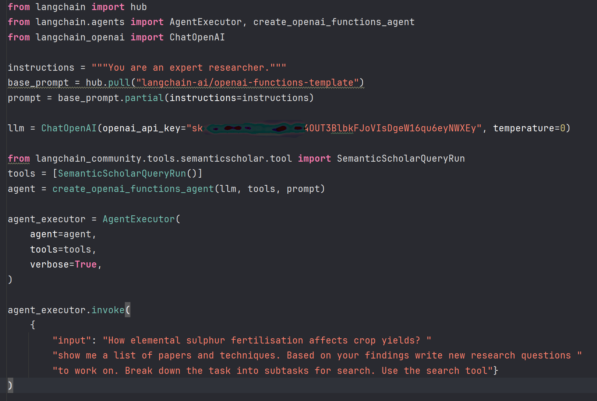
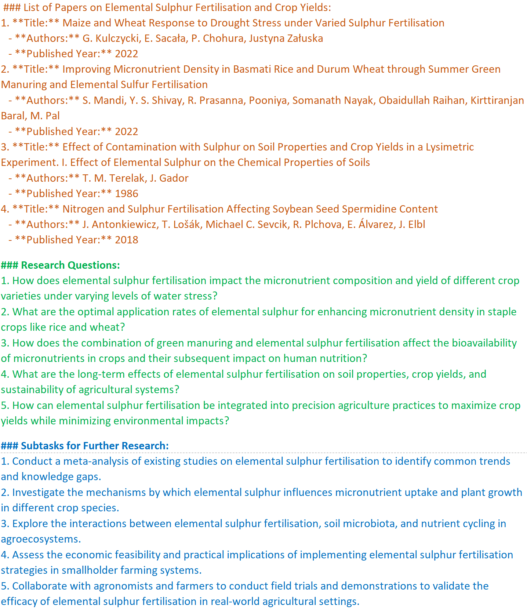

# Wyniki badań i analiz

## Baza danych Google Scholar (GS)

Przeszukiwanie bazy w tradycyjny sposób odbywa się poprzez wyszukiwarkę strony [Google Scholar](https://scholar.google.com).

```{r echo=TRUE}

library(webshot2)
webshot("https://scholar.google.com", 
        "Rysunki/wyszykiwarka_google_scholar.png")
```

Przeszukiwanie zasobów GS różni się pod kilkoma względami od przeszukiwania innych baz. Baza ta posiada własną listę operatorów, które nie występują w żadnej innej bazie danych. Stosować można podczas wyszukiwania niektóre popularne operatory ograniczające lub rozszerzające wyszukiwanie (takie jak cudzysłów lub gwiazdka), natomiast z innych jak operatora wyszukiwania logicznego NOT nie można skorzystać. Google używa znaku minus zamiast powszechnie używanego terminu NOT. GS używają niejawnego AND - a nie logicznego AND, czyli kiedy operator ten jest wprowadzane do zapytania wyszukiwania, Google traktuje je jako słowo w zapytaniu wyszukiwania i nie rozpoznaje go jako operatora wyszukiwania. GS ignoruje popularne słowa, takie jak a, and, the i tak dalej, z wyjątkiem gdy umieszczone są w cudzysłowie.

**Wybrane operatory wyszukiwania Google Scholar:**

**publikacja:** Wyniki będą zawierać tylko publikacje zawierające określone terminy. Na przykład wyszukiwanie "publication:computers in libraries" będzie zawierać tylko wyniki z publikacji Computers in Libraries.

**autor:** Lista wyników będzie zawierać tylko publikacje wskazanego autora, na przykład, autor: G Kulczycki

**define:** używany tylko w Google, gdy oczekuje się szybkich definicji, na przykład, "define:word"

**cudzysłów (" ")** używany do łączenia dokładnej frazy, może być również używany do zapewnienia, że określone słowo zostanie uwzględnione.

**Uniwersalne operatory logiczne i logika wyszukiwania:**

**OR** - znany również jako suma logiczna, operator OR "rozszerza wyszukiwanie poprzez uwzględnienie synonimów i powiązanych terminów w zapytaniu"

**znak minus (-)** główną funkcją znaku minus jest wykluczenie terminu, GS używa znaku minus zamiast powszechnie używanego terminu NOT.

**gwiazdka (\*)** używana jako operator wieloznaczny

Przykład wyszukiwania w basie GS dla frazy "elemental sulphur fertilization" w wyniku wyszukiwania uzyskuje się 42 pozycje publikacji (rys. \ref{GS_elemental}).

{width="100%"}


[Polityka firmy Google](https://policies.google.com/terms/archive/20190122?hl=en&gl=GB) określa, że dostęp do zasobów GS powinien odbywać poprzez interfejs ich wyszukiwarki i instrukcji podanych przez firmę. GS nie zapewnia API (Application Programming Interface), a dostęp do zasobów jest wyszczególniony poprzez plik robot.txt.

```{r echo=TRUE}

library(webshot2)
webshot("https://scholar.google.com/robots.txt", "Rysunki/robots.png") 

```

**Baza Google Scholar zezwala na dostęp do:**

-   profili użytkowników: Allow: /citations?user=

(np. [https://scholar.google.pl/citations?user=RNDE9-wAAAAJ&hl](https://scholar.google.pl/citations?user=RNDE9-wAAAAJ&hl=pl))

-   zestawienia bbszarów dziedzin badawczych: Allow: /citations?view_op=list_classic_articles

(np. <https://scholar.google.com/citations?view_op=list_classic_articles&hl=en&by=2006>)

-   Zeztawienia kategorii czasopism: Allow: /citations?view_op=metrics_intro

(np. <https://scholar.google.com//citations?view_op=metrics_intro>)

### Analiza wskaźników biblometrycznych dla wybranych naukowców

W ramach dozwolonego przez GS dostępu do bazy przeprowadzono analizę wskaźników bibliometrycznych dla wybranych naukowców za pomocą biblioteki [scholar](https://cran.r-project.org/web/packages/scholar/index.html).

### Analiza ilości publikacji

```{r echo=TRUE}

#wymagane bibloteki
library(scholar)
library(tidyverse)
library(ggplot2)

# id  użytkowników
Kulczycki <- "RNDE9-wAAAAJ&hl"  
Sacala <- "jkj3pCQAAAAJ&hl" 
Lejcus <- "XNRUNHsAAAAJ&hl" 
Pietr <- "L6MYKCQAAAAJ&hl" 

# Ile artykułów opublikowali?
Kulczycki.num <- get_num_articles(Kulczycki)
Sacala.num <- get_num_articles(Sacala)
Lejcus.num <- get_num_articles(Lejcus)
Pietr.num <- get_num_articles(Pietr)

# utworzenie ramki danych
num <- data.frame (Ilosc = c(Kulczycki.num, 
                              Sacala.num, 
                              Lejcus.num, 
                              Pietr.num),
                  Osoba= c("Kulczycki", "Sacala", "Lejcus", "Pietr"))

# wizualizacja ilości cytowań
ggplot(num, aes(x=Osoba, y=Ilosc, fill = Osoba)) + 
geom_col()+
theme_bw() + 
scale_fill_brewer(palette = "BrBG")+
geom_text(aes(label=Ilosc),position=position_stack(vjust=1.1),size=6)+
theme( plot.title = element_text(size=14, hjust = 0.5),
       legend.position='none',
       axis.title.x=element_blank(),
       axis.text.x = element_text(face="bold", color="#993333", size=14),
       axis.text.y = element_text(size = 14),
       axis.title.y = element_text(size = 14))

```

Współprace publikacyjną dla wybranego naukowca przedstawiono z wykorzystaniem funkcji get_coauthors.

```{r echo=TRUE, warning=FALSE}

library(scholar)
kulczycki_wspolautorzy <- get_coauthors('RNDE9-wAAAAJ&hl')
plot_coauthors(kulczycki_wspolautorzy)

```

### Analiza porównujaca ilości cytowań dla publikacji napisanych przez naukowców w kolejnych latach ich pracy

```{r echo=TRUE}
library(scholar)
library(tidyverse)
library(ggplot2)
# id  użytkowników
ids <- c("RNDE9-wAAAAJ&hl", "jkj3pCQAAAAJ&hl",
         "L6MYKCQAAAAJ&hl","XNRUNHsAAAAJ&hl")
#utworzenie ramki danych
df <- compare_scholars(ids)
#usuniecie brakujących danych
df <- na.omit(df)
# wizualizacja ilości cytowań
p <- ggplot(df, aes(x=year, y=total, group = name)) + 
  geom_line(aes(colour = name)) +
  scale_fill_brewer(palette = "BrBG")+
  geom_text(aes(label=total), size = 2.5)+
  labs(y="Ilość cytowań")+
  labs(x="Lata")+
  theme_bw() + 
  theme( plot.title = element_text(size=14, hjust = 0.5),
   legend.position="top",
   legend.title = element_text(colour="black", size=8, face="bold"),
   legend.text = element_text(colour="black", size=8,face="bold"),
   axis.text.x = element_text(face="bold", color="#993333", size=14),
   axis.title.x = element_text(size = 12),
   axis.text.y = element_text(size = 12),
   axis.title.y = element_text(size = 12))
p + guides(size = FALSE)

```

### Analiza dynamiki rozwoju publikacyjnego wybranych naukowców na podstawie ilości skumulowanych cytowań w zalezności od długości stażu pracy

```{r}
library(scholar)
library(plyr)
library(ggplot2)

ids <- c("RNDE9-wAAAAJ&hl", "jkj3pCQAAAAJ&hl","L6MYKCQAAAAJ&hl" , "XNRUNHsAAAAJ&hl")
df_3 <- compare_scholar_careers(ids)

## Add cumulative citation
df_3 <- ddply(.data = df_3,
            .variables = c("id"),
            .fun = transform,
            cumulative_cites = cumsum(cites))
## Plot
p <- ggplot(df_3, aes(x = career_year, y = cumulative_cites)) +
  geom_line(aes(colour = name)) +
  scale_fill_brewer(palette = "BrBG")+
  geom_text(aes(label=cumulative_cites), size=3)+
  labs(y="Skumulowane cytowania")+
  labs(x="Lata pracy")+
  theme_bw()+
  theme( plot.title = element_text(size=14, hjust = 0.5),
         legend.position="top",
         legend.title = element_text(colour="black", size=8, face="bold"),
         legend.text = element_text(colour="black", size=8,face="bold"),
         axis.text.x = element_text(face="bold", color="#993333", size=14),
         axis.title.x = element_text(size = 12),
         axis.text.y = element_text(size = 12),
         axis.title.y = element_text(size = 12))
p + guides(size = FALSE)

```

### Google Scholar - metody web scraping

Metody te nie są dozwolone na tej bazie danych, ale dla celów dydaktycznych w projekcie wykorzystano bibliotekę [BeautifulSoup](https://pypi.org/project/beautifulsoup4/) do uzyskania tytułów publikacji i linków dla profilu własnego (id = RNDE9-wAAAAJ&hl) w GS. Moduł BeautifulSoup wykorzystuje się do parsowania i przeszukiwania dokumentów HTML.

```{python echo=TRUE}
# import modułów
import pandas as pd #biblioteka do pracy z danymi tabelarycznymi
import requests #biblioteka do wykonywania zapytań HTTP
from bs4 import BeautifulSoup as bs #przetwarzania dokumentów HTML
from tabulate import tabulate #wyświetlania danych w postaci tabel
from rich.console import Console

pd.set_option('display.max_columns', None) #kolumny w ramkach danych pandas
pd.set_option('display.max_colwidth', 65) #maksymalnej szerokości kolumny
big_df = pd.DataFrame()# inicjalizacja pustej ramki danych
# definicja nagłówków i sesji HTTP
headers = {
    'accept-language': 'en-US,en;q=0.9, pl-PL',
    'x-requested-with': 'XHR',
    'User-Agent':
    'Mozilla/5.0(Windows NT 10.0; Win64; x64),like Gecko)Chrome/105.0.0.0 Safari/537.36'
}
s = requests.Session()
s.headers.update(headers)
payload = {'json': '1'}
for x in range(0, 500, 100): # iteracja x po zakresie od 0 do 500 z krokiem 100
    # zdefiniowanie linku strony dla profilu naukowca
    url = f'https://scholar.google.com/citations?hl=en&user=RNDE9-wAAAAJ&hl&cstart={x}&pagesize=100'
    r = s.post(url, data=payload)
    # zastosowanie parsera html
    soup = bs(r.json()['B'], 'html.parser') #analiza strony przy użyciu BeautifulSoup
    works = [(x.get_text(), 'https://scholar.google.com' + x.get('href'))
             for x in soup.select('a') if 'javascript:void(0)' not in x.get('href')
             and len(x.get_text()) > 7] #pobranie informacji dla elementów HTML
# utworzenie ramki danych z pobranych informacji
    df = pd.DataFrame(works, columns=['Paper', 'Link'])
    big_df = pd.concat([big_df, df], axis=0, ignore_index=True)
# zapisanie wyników do pliku csv
csv_file_path = 'output.csv'
big_df.to_csv(csv_file_path, index=False, encoding='utf-8')
# ograniczenie wyników na konsoli do 10
limited_df = big_df.head(10)
# wyświetlenie wyników w postaci tabeli
print(limited_df)
```

Wynik wyszukiwania zapisywany jest do pliku csv (rys. \ref{zestawienie_profil_pub}), dane z tego pliku można wykorzystać do dalszych analiz i wizualizacji.

{width="100%"} Z otrzymanego pliku csv wyodrębniono tytuły publikacji jako plik txt w celu wykonania chmury wyrazów.

```{r echo=TRUE, warning=FALSE}
library(tm)
library(SnowballC)
library(wordcloud)
library(RColorBrewer)

filePath <- "siarka.txt"
text <- readLines(filePath)
docs <- Corpus(VectorSource(text))
toSpace <- content_transformer(function (x , pattern ) gsub(pattern, " ", x))
docs <- tm_map(docs, toSpace, "/")
docs <- tm_map(docs, toSpace, "@")
docs <- tm_map(docs, toSpace, "\\|")
docs <- tm_map(docs, content_transformer(tolower))
docs <- tm_map(docs, removeNumbers)
docs <- tm_map(docs, removeWords, stopwords("english"))
docs <- tm_map(docs, removeWords, c("blabla1", "blabla2")) 
docs <- tm_map(docs, removePunctuation)
docs <- tm_map(docs, stripWhitespace)
dtm <- TermDocumentMatrix(docs)
m <- as.matrix(dtm)
v <- sort(rowSums(m),decreasing=TRUE)
d <- data.frame(word = names(v),freq=v)
head(d, 10)
set.seed(1234)
wordcloud(words = d$word, freq = d$freq, min.freq = 1,
          max.words=200, random.order=FALSE, rot.per=0.35, 
          colors=brewer.pal(8, "Dark2"))
```

## Baza danych Semantic Scholar (SS)

W przypadku bazy Semantic Scholar przy przeszukiwaniu istnieje możliwość korzystania z interfejsu API REST (ang. Representational State Transfer). Kluczową cechą API REST jest wykorzystanie protokołu HTTP (Hypertext Transfer Protocol) do komunikacji między klientem a serwerem oraz stosowanie standardowych metod HTTP, takich jak GET, POST, PUT, DELETE, itp., do manipulowania zasobami. Ogólnie jest to technika, która pozwala na automatyczny dostęp i pobieranie informacji między różnymi maszynami.

Interfejs API umożliwia wyszukiwanie i eksplorowanie danych publikacji naukowych dotyczących autorów, artykułów, czy cytowań. [Semantic Scholar API](https://www.semanticscholar.org/product/api) umożliwia skorzystanie z następujących usług :

-   **Academic Graph:** Zapewnia dane o autorach, artykułach, cytowaniach, miejscach, osadzeniach SPECTER2 i innych, które umożliwiają bezpośrednie połączenie z odpowiednią stroną na semanticscholar.org, aby uzyskać więcej informacji.

-   **Rekomendacje:** Zawiera rekomendowane artykuły podobne do danego artykułu.

-   **Datasets:** Udostępnia linki do pobrania zbiorów danych na wykresie akademickim.

-   **Conference Peer Review:** Zapewnia narzędzia pomagające organizatorom konferencji z problemem przypisywania recenzentów do zgłoszeń konferencyjnych. Obejmuje wykrywanie konfliktu interesów w oparciu o relacje między współautorami oraz obliczanie wyniku dopasowania między recenzentem a tematem zgłoszenia w oparciu o historię publikacji recenzenta.

Użytkownik bazy Semantic Scholar możne złożyć wniosek o przyznanie klucza API, dzięki czemu uzyskuje następujące parametry połączenia:

-   Limit szybkości: - 1 żądanie na sekundę dla następujących punktów końcowych:

/paper/batch

/paper/search

/rekomendacje

-   10 żądań na sekundę dla wszystkich innych połączeń

Dostęp do dużych ilości danych za pośrednictwem interfejsów API jest istotny ze względu na przeprowadzenie lepszych i głębszych analiz, które mogą wydobyć ukrytą wiedzę i znaleźć nowe wzorce zachowań [@velez-estevez2023] 

Poniżej przedstawiono przeszukiwanie bazy danych Semantic Scholar przy wykorzystaniu własnego klucza API otrzymanego po zaakceptowaniu wniosku przez dostawcę usług. 

### Analiza publikacji dla 2 autorów za pomocą biblioteki [PyS2: Python Library for the Semantic Scholar API](https://github.com/mirandrom/PyS2).


```{python echo=TRUE}

import s2
from requests import Session
session = Session()
session.headers = {'x-api-key': "prvXStDFku731CaJlUdWXa0aJtFKCOCU1FbdGCMs"}
# Pobranie pierwszego autora
author1 = s2.api.get_author(authorId="113275711")
#print("Author 1:")
#print("Name:", author1.name)
paperIds1 = [p.paperId for p in author1.papers]
print("\nPapers for Author 1:")
papers_author1 = []
for pid in paperIds1:
    paper = s2.api.get_paper(
        paperId=pid,
        retries=2,
        wait=150,
        params=dict(include_unknown_references=True))
    papers_author1.append(paper)
for i, paper in enumerate(papers_author1[:5]):  # Wyświetlenie tylko 5 pierwszych rekordów dla autora 1
    print(f"  {i+1}. Title:", paper.title)
    print("     Authors:", ", ".join(author.name for author in paper.authors))
    print()
# Pobranie drugiego autora
author2 = s2.api.get_author(authorId="12961311")
# print("\nAuthor 2:")
# print("Name:", author2.name)
paperIds2 = [p.paperId for p in author2.papers]
print("\nPapers for Author 2:")
papers_author2 = []
for pid in paperIds2:
    paper = s2.api.get_paper(
        paperId=pid,
        retries=2,
        wait=150,
        params=dict(include_unknown_references=True))
    papers_author2.append(paper)
for i, paper in enumerate(papers_author2[:5]):  # Wyświetlenie tylko 5 pierwszych rekordów dla autora 2
    print(f"  {i+1}. Title:", paper.title)
    print("     Authors:", ", ".join(author.name for author in paper.authors))
    print()
print("Liczba wszystkich publikacji dla Author 1:", len(papers_author1))
print("Liczba wszystkich publikacji dla Author 2:", len(papers_author2))

```

### Przykład przeszukiwanie bazy danych za pomocą słów kluczowych z pomoca biblioteki [semanticscholar](https://pypi.org/project/semanticscholar/).

```{python echo=TRUE}
from semanticscholar import SemanticScholar
# Ustaw klucz API
api_key = "prvXStDFku731CaJlUdWXa0aJtFKCOCU1FbdGCMs"
# Utwórz obiekt SemanticScholar z użyciem klucza API
sch = SemanticScholar(api_key=api_key)
# Zdefiniuj zapytanie
query = 'elemental sulphur fertilizer'
# Przeszukaj bazę danych Semantic Scholar
results = sch.search_paper(query)
# Wyświetl pierwsze 5 wyników
print(f'{results.total} results.')
print("First 5 occurrences:")
if results.total > 0:
    for i, paper in enumerate(results[:5], 1):
        authors = [author.name for author in paper.authors]
        print(f"{i}. Title: {paper.title}")
        print(f"    Authors: {', '.join(authors)}")
        print(f"    Year: {paper.year}")
```

### Przeszukiwanie bazy danych z wykorzystaniem [ChatOpenAI](https://platform.openai.com/apps) z pomocą [Semantic Scholar API Tool](https://python.langchain.com/docs/integrations/tools/semanticscholar) 

Na rysunku \ref{langchain_cod} przedstawiono skrypt wykorzystujący ChatGPT do przeszukiwania i uzyskiwania odpowiedzi na zadawane pytania z bazy Semantic Scholar. W skrypcie zastosowano własny klucz API wygenerowany na stronie [OpenAI](https://platform.openai.com/api-keys).


{width="100%"}

Przykład uzyskanych wyników dla  zadawanych pytań poprzez skrypt Semantic Scholar API Tool rys. \ref{langchain_output}

{width="100%"}


