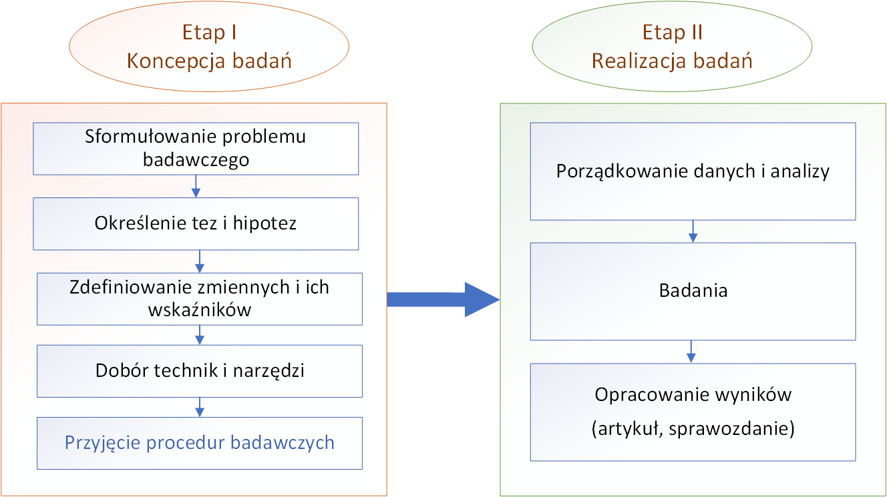
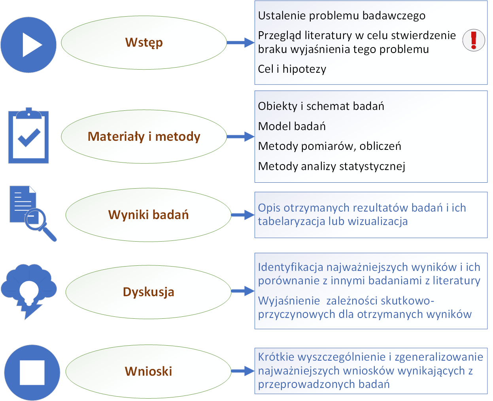
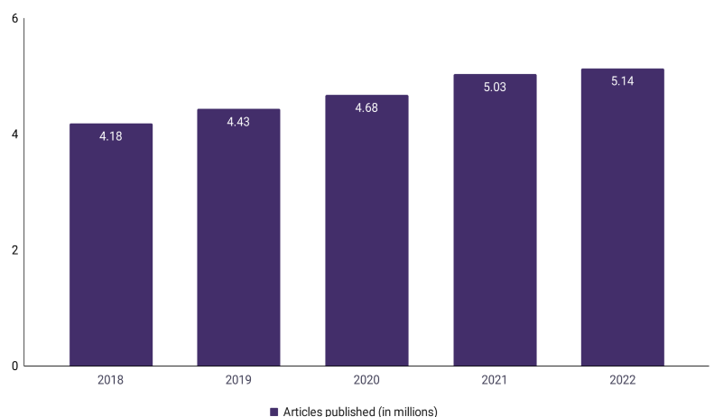
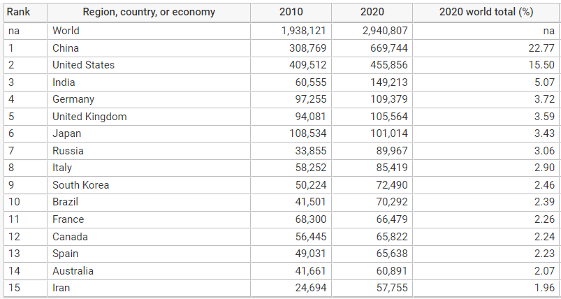
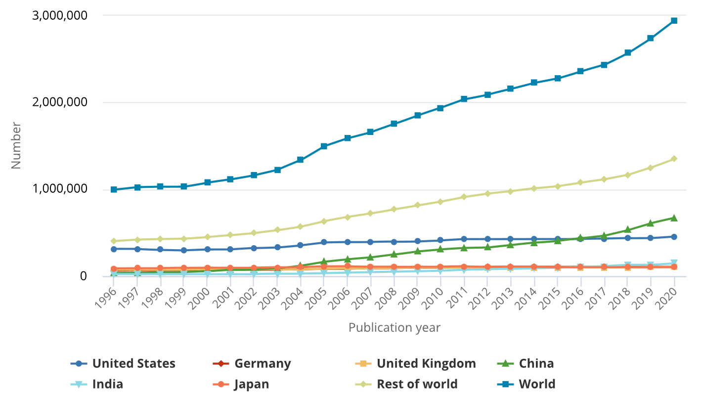
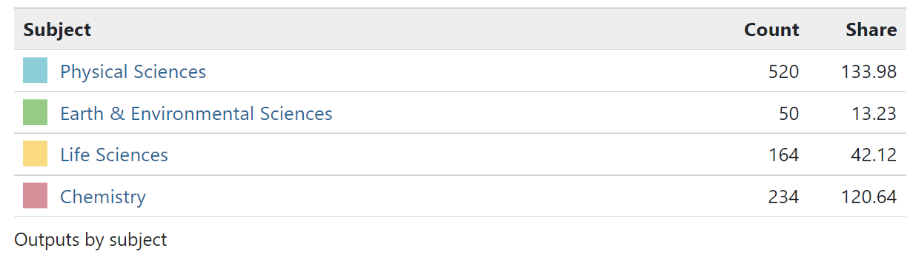

# Opis problemu badań\label{label1}

**Organizacja i etapy badań naukowych**

Podczas prowadzenia badań naukowych wyróżnia się szereg etapów, które stanowią określoną logiczną procedurę badawczą. Etapy te należny traktować jako elastyczne elementy postępowania badawczego, jednak układ ich powinien być zawsze ścisły i racjonalny \ref{etapy_badan}(modyfikacja własna za [@apanowicz2005]).

{width="100%"}

Efektem udokumentowania przeprowadzonych badań najczęściej jest napisanie artykułu naukowego. Uniwersalny schemat często wykorzystywany podczas realizacji publikacji naukowej przedstawiono na rysunku \ref{struktura_pub}.

{width="100%"}

Po ustaleniu problemu badawczego i tematu pracy, rozpoczyna się zwykle etap pracy związany z poszukiwaniem literatury przedmiotu. Celem tego etapu pracy jest stwierdzenie stanu wiedzy przeszłej i aktualnej związanej z podjętym tematem badań, określenie brakujących luk i możliwości ich wypełnienia oraz zasadności poszerzenia wiedzy z danego obszaru badań [@cooper1986] .

Przegląd literatury dotyczy najczęściej publikacji naukowych, które w obowiązującym obecnie prawie [@dz.u.2019] w rozumieniu ewaluacji [@pbn2020] określane są jako: - artykuł naukowy, - monografię naukową, - rozdział w monografii naukowej.

Słownik Polskiej Bibliografii Naukowej [@pbn2020] podaje następujące definicje publikacji naukowych:

1.  Artykuł naukowy jest to recenzowany artykuł opublikowany w czasopiśmie naukowym albo w recenzowanych materiałach z międzynarodowych konferencji naukowych:

-   przedstawiający określone zagadnienie naukowe w sposób oryginalny i twórczy, problemowy albo przekrojowy;
-   opatrzony przypisami, bibliografią lub innym właściwym dla danej dyscypliny naukowej aparatem naukowym.

Artykułem naukowym jest również artykuł recenzyjny opublikowany w czasopiśmie naukowym zamieszczonym w wykazie czasopism.

Artykułem naukowym nie jest: edytorial, abstrakt, rozszerzony abstrakt, list, errata oraz nota redakcyjna.

2.  Monografia naukowa jest to recenzowana publikacja książkowa:

-   przedstawiająca określone zagadnienie naukowe w sposób oryginalny i twórczy;
-   opatrzona przypisami, bibliografią lub innym właściwym dla danej dyscypliny naukowej aparatem naukowym.

Monografią naukową jest również:

-   recenzowany i opatrzony przypisami, bibliografią lub innym właściwym dla danej dyscypliny naukowej aparatem naukowym przekład na język polski dzieła istotnego dla nauki lub kultury albo na inny język nowożytny dzieła istotnego dla nauki lub kultury, wydanego w języku polskim;
-   edycja naukowa tekstów źródłowych.

Oceny poziomu naukowego prowadzonej działalności naukowej w zakresie badań naukowych i prac rozwojowych dokonuje się z uwzględnieniem następujących rodzajów osiągnięć naukowych [@dz.u.2019]:

1.  artykułów naukowych opublikowanych w czasopismach naukowych i w recenzowanych materiałach z międzynarodowych konferencji naukowych, zamieszczonych w wykazie tych czasopism i materiałów sporządzonym zgodnie z przepisami wydanymi na podstawie art. 267 ust. 2 pkt 2 ustawy, zwanym dalej „wykazem czasopism";

2.  artykułów naukowych opublikowanych w czasopismach naukowych niezamieszczonych w wykazie czasopism;

3.  monografii naukowych wydanych przez wydawnictwa zamieszczone w wykazie tych wydawnictw sporządzonym zgodnie z przepisami wydanymi na podstawie art. 267 ust. 2 pkt 2 ustawy, zwanym dalej „wykazem wydawnictw";

4.  monografii naukowych wydanych przez wydawnictwa niezamieszczone w wykazie wydawnictw, redakcji naukowych takich monografii i autorstwa rozdziałów w takich monografiach;

5.  przyznanych patentów na wynalazki, praw ochronnych na wzory użytkowe i wyłącznych praw hodowców do odmian roślin.

Proces publikowania wyników badań obecnie ulega ciągłej modyfikacji i przyspieszeniu związanym z coraz większym dostępem do Internetu oraz szybszemu procesowi przyjmowania i recenzji publikacji poprzez strony własne Wydawnictw.

Szacuje się, że od 1996 roku opublikowano co najmniej 64 miliony artykułów naukowych, a tempo wzrostu liczby nowo opublikowanych artykułów \ref{Ilosc_publikacji} ciągle ma tendencje wzrostową [@curcic2023].

{width="100%"}

Z raportu [S&E - Science and Engineering Indicators](https://ncses.nsf.gov/indicators) wynika, że roczny przyrost ilości publikacji na świecie artykułów naukowo-technicznych wyniósł 4% w latach 2010-2020 [@curcic2023]. Na rysunku \ref{Ilosc_publikacji} zestawiono ilość artykułów naukowo-technicznych opublikowanych ze wszystkich obszarów nauki na świecie oraz w 15 największych krajach w latach 2010 i 2020.

{width="100%"}

Graficzny obraz przyrostu publikowanych artykułów naukowo-technicznych od roku 1996 przedstawiono na rysunku \ref{grafika_pub_nauk_tech} . Uwidacznia się na nim wyraźne ogólna tendencja przyrostu publikacji na świecie, a z pośród analizowanych krajów szczególnie jest to widoczne w Chinach.

{width="100%"}

W Polsce opublikowano w tym okresie z tego obszaru badań 906 artykułów naukowych z pośród których 296 były napisane ze współautorami z innych krajów. Udział publikacji w poszczególnych obszarach badań przedstawiono na rysunku \ref{polska_subject}.

