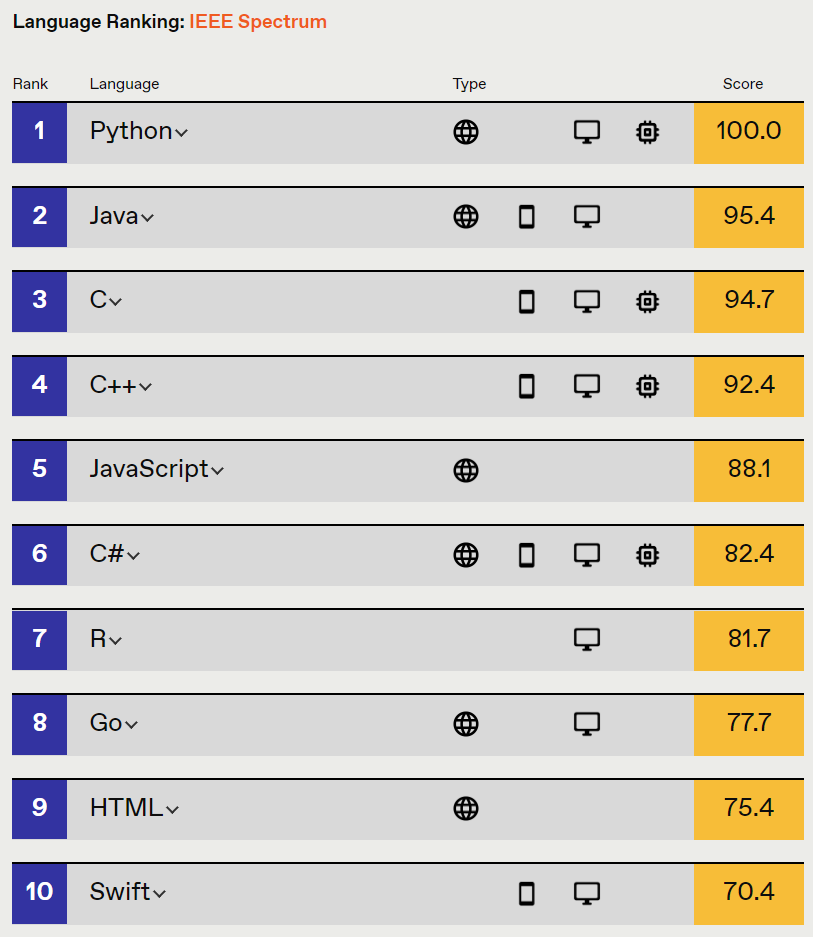
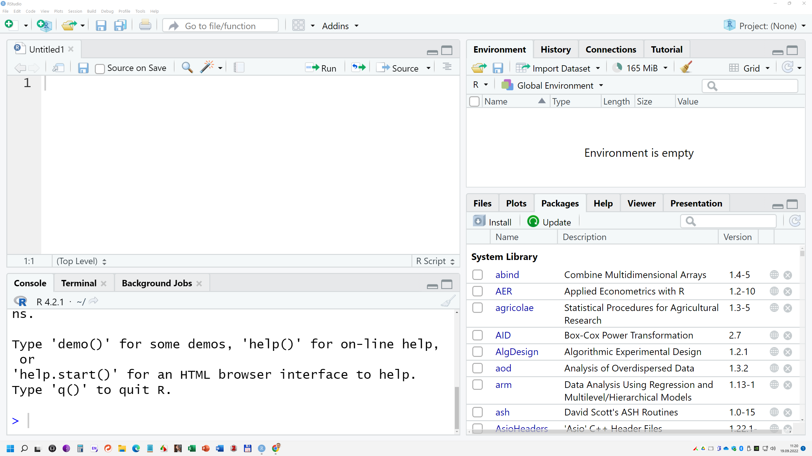
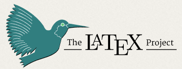

# Metody badań

Do realizacji celu pracy użyto następujących narzędzi:

-   Program R
-   RStudio
-   R Markdown
-   LaTeX
-   Zotero.

## Program R [r-project.org](https://www.r-project.org/)

R jest oprogramowaniem o otwartym kodzie źródłowym, dostępnym w Uniksie, Linuksie, a także systemach macOS i Windows [@wickham2018].

Logo tego programu przedstawiono na rysunku \ref{r_logo.svg}.

{width="20%"}

Pierwsza wersja R została napisana w roku 1991 przez Roberta Gentlemana i Rossa Ihake˛ (znanych jako R&R), pracujących na Wydziale Statystyki Uniwersytetu w Auckland. Program R jest projektem GNU opartym na licencji GNU GPL, co oznacza, iż jest zupełnie darmowy zarówno do zastosowań edukacyjnych, jak i biznesowych [@biecek2017].

Język R jest językiem interpretowanym, a nie kompilowanym, oznacza to, że program w nim napisany nie będzie tak szybki jak np. program napisany w C++. Język R ma elastyczną składnię i pozwala użytkownikom na definiowanie własnych, dowolnie złożonych, funkcji [@górecki2011].

Obecnie R zajmuje 7 miejsce (rys. \ref{IEEE_ranking}) w rankingu najpopularniejszych języków przygotowywanym przez IEEE (Institute of Electrical and Electronics Engineers) [spectrum.ieee.org](https://spectrum.ieee.org/top-programming-languages/#toggle-gdpr).

{hight="20px" width="60%"}

R wykorzystuje się do obliczeń statystyczno-matematycznych, umożliwia on również tworzenie zaawansowanych wykresów.

Po zainstalowaniu podstawowego środowiska R mamy już dostęp do wielu użytecznych funkcjonalności, jednak możliwości pracy w R zwiększają się bardzo po zainstalowaniu dodatkowych pakietów (package). Szacuje się, że 2020 roku dostępnych ich było około 16 tysięcy [wikipedia.org](https://en.wikipedia.org/wiki/R_package).

## RStudio [rstudio.com](https://www.rstudio.com)

Istnieje kilka graficznych interfejsów dla programu R, wśród nich najbardziej popularnym jest RStudio (rys. \ref{rstudio}).

RStudio określa się jako zintegrowane środowisko programistyczne (IDE) dla języka R.

{width="30%"}

RStudio zawiera konsolę, edytor podświetlający składnię i obsługuje bezpośrednie wykonywanie kodu, a także narzędzia do tworzenia wykresów, historii, debugowania i zarządzania przestrzenią roboczą (rys. \ref{rstudio_edytor}).

## R Markdown [rmarkdown.com](https://rmarkdown.rstudio.com/)

Rmarkdown to narzędzie do tworzenia dynamicznych dokumentów i zestawień. Język znaczników, którego celem jest jak największe uproszczenie tworzenia i formatowania tekstu [wikipedia.org](https://en.wikipedia.org/wiki/Markdown).

{width="40%"}

Biblioteka rmarkdown wraz z formatem R Markdown pozwala na przygotowanie estetycznie wyglądających raportów, a dokumenty otrzymywane w wyniku ich tworzenia są dynamiczne ponieważ istnieje w nich możliwość zagnieżdżania języka R [@strus2017].

## LaTeX [latex-project.org](https://www.latex-project.org/)

LaTeX to oprogramowanie do zautomatyzowanego składu tekstu, a także związany z nim język znaczników, służący do formatowania dokumentów tekstowych i tekstowo-graficznych [wikipedia.org](https://pl.wikipedia.org/wiki/LaTeX).

{width="40%"}

Oprogramowanie to określane jest także jako zestaw makropoleceń stanowiących nadbudowę nad systemem składu TEX, automatyzujących wiele czynności związanych z procesem poprawnego składania tekstu [@ziemkiewicz2013].

LATeX w swojej naturze odpowiada metodologii WYSIWYM, gdzie autor określa jedynie strukturę logiczną i treść dokumentu, pozostawiając w rękach automatycznego systemu zagadnienia dotyczące wyglądu i odpowiedniego rozmieszczenia elementów na stronie [@borkowski2015].
