# Wyniki badań i dyskusja

## Przygotowanie środowiska do pracy w R

### Instalacja R

Rozpoczęcie pracy z R związane jest z zainstalowaniem tego programu. Jest to darmowe środowisko programistyczne, które kompiluje się i działa na wielu różnych platformach UNIX, Windows i MacOSa. Najlepszą opcją jest pobranie tego programu z oficjalnej strony projektu - [r-project.org](https://www.r-project.org/) (rys. \ref{strona_r}).

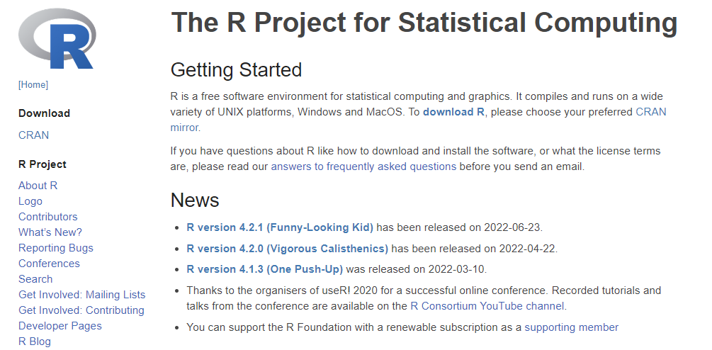

### Instalacja Rstudio

Po instalacji R można zainstalować graficzny interfejs dla programu R w postaci programu Rstudio. Na oficjalnej stronie [Rstudio](https://www.rstudio.com) można pobrać darmową wersję tego programu (rys. \ref{pobieranie_rstudio}).

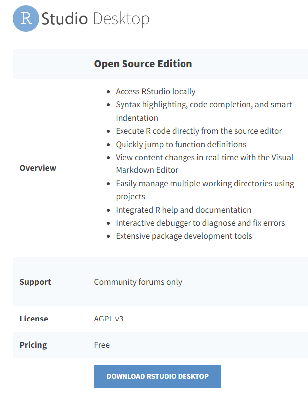{width="60%"}

### Instalacja pakietu **rmarkdown**

Oficjalnym źródłem dokumentacji dla pakietów do języka R jest [CRAN](https://cran.r-project.org/web/packages/available_packages_by_name.html) ( Comprehensive R Archive Network), gdzie jest umieszczony spis dostępnych pakietów.

Pakiety w Rstudio można instalować zarówno z poziomu konsoli poprzez użycie właściwej komendy. Poniżej zapisano przykładową funkcję instalacyjną dla pakietu rmarkdown :

`install.packages("rmarkdown")`

Możliwe jest także zainstalowanie pakietów poprzez panel z zakładką pakiety. Pliki R Markdown to pliki tekstowe, które zazwyczaj mają rozszerzenie `.Rmd`.

Pakiet R `rmarkdown` jest biblioteką, która przetwarza i konwertuje pliki `.Rmd` do wielu różnych formatów.

W pakiecie rmarkdown domyślnie zawarty jest także program pandoc służący do konwertowania dokumentów z formatów znaczników do wielu innych formatów, takich jak `.docx`, `.pdf` itd. Pandoc dodaje także funkcjonalność w języku bazowym markdown umożliwiajacą obsługę bardziej złożonych wyjść.

### Instalowanie LaTeX (TinyTeX) dla tworzenia PDF

Przy tworzeniu dokumentów formatu pdf niezbędne jest zainstalowanie LaTeXa. Dostępnych jest kilka opcji zainstalowania osobnych programów obsługujących składnie LaTeXa jak MiKTeX, MacTeX i TeX Live, jednak zalecane jest, żeby przy używaniu pakietu rmardown zainstalować pakiet tinytex:

`install.packages("tinytex")`

### Instalacja pakietu **knitr**

Narzędzie to przeznaczone jest do dynamicznego generowania raportów w R przy użyciu technik Literate Programming. (ang. programowanie piśmienne) [@xie2022].

{width="27%"}

Jak wskazuje logo pakietu knitr (rys. \ref{knit_logo}) jest to narzędzie do spajania i generowania dynamicznych raportów w R. Knitr pozwala na proste łączenie kodów R oraz ich opisów. Takie połączenie może być wykorzystane zarówno do dokumentowania kodu, do zapewnienia powtarzalności analiz jak i do automatycznego generowania raportów [@xie2015].

@strus2017 określa rolę pakietu knitr jako silnika do generowania dynamicznych raportów w R, który egzekwuje kod i tworzy nowy dokument markdown. MD, który zawiera kod i wynik działania samego kodu.

## Tworzenie pliku R Mardown w RStudio

Po otwarciu programu RStudio uwidacznia się układ panelowy (rys. \ref{panele_rstudio} ), gdzie rozmieszczenie poszczególnych paneli można ustawiać w globalnych opcjach programu (rys. \ref{uklad_paneli}).

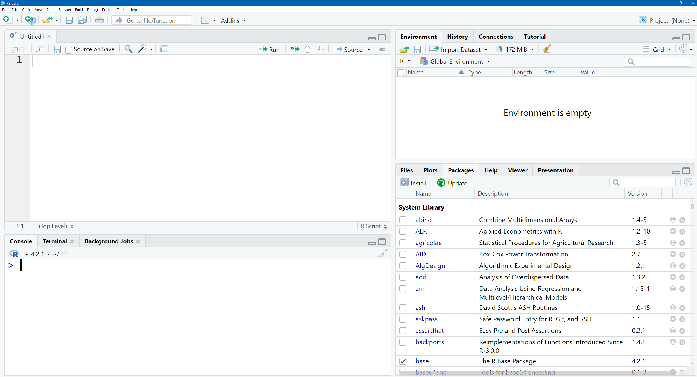{width="80%"}

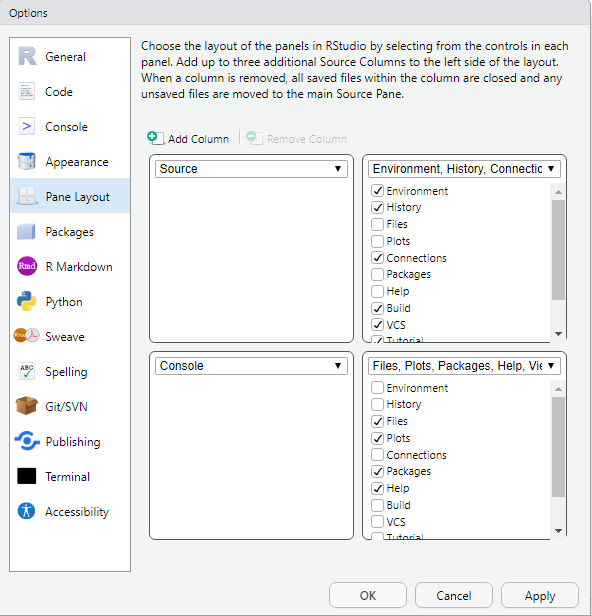{width="40%"}

W panelu edycji plików istnieje możliwość utworzenie pliku .Rmd, poprzez otwarcie w menu File → New File → R Markdown (rys. \ref{plik_Rmd}).

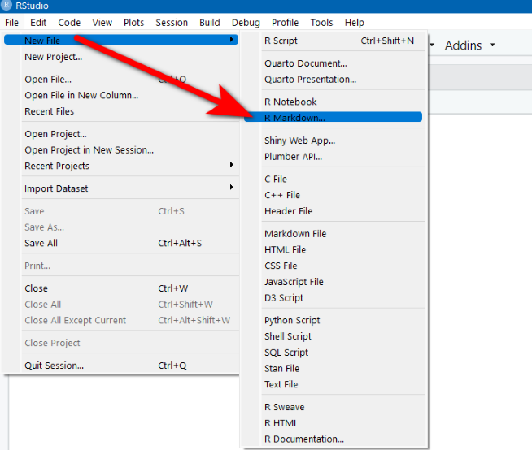{width="65%"}

Zalecaną dobrą praktyką jest jednak utworzenie nowego projektu gdzie w katalogu tego projektu zamieszczane są wszystkie pliki związane z wykonywanym projektem (rys. \ref{nowy_projekt}, \ref{nowy_projekt_okno}, \ref{nowy_projekt_katalog}).

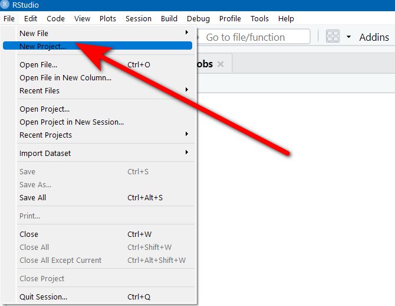{width="65%"}

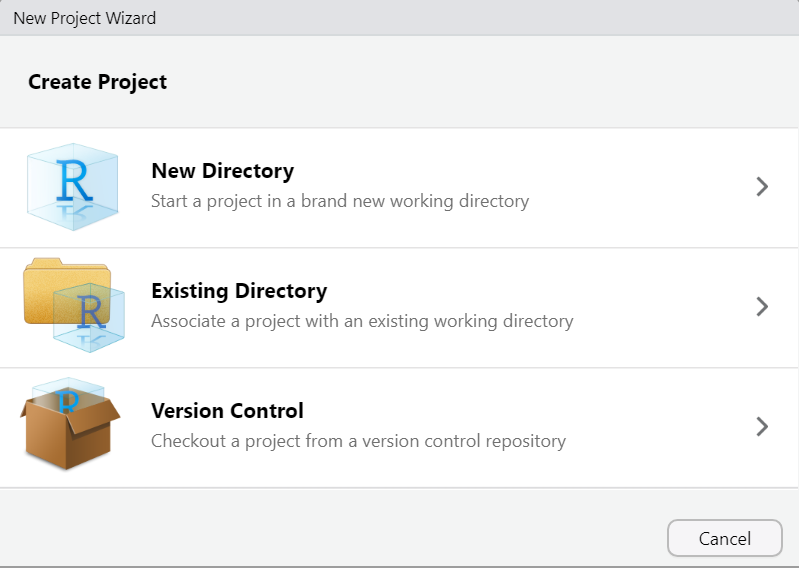{width="60%"}

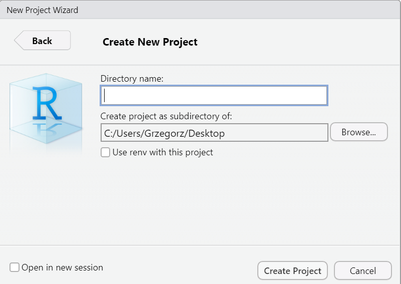{width="60%"}

W strukturze układu projektu możliwe jest tworzenie różnego rodzaju plików w tym także plików .Rmd (rys. \ref{nowy_projekt_rmd}).

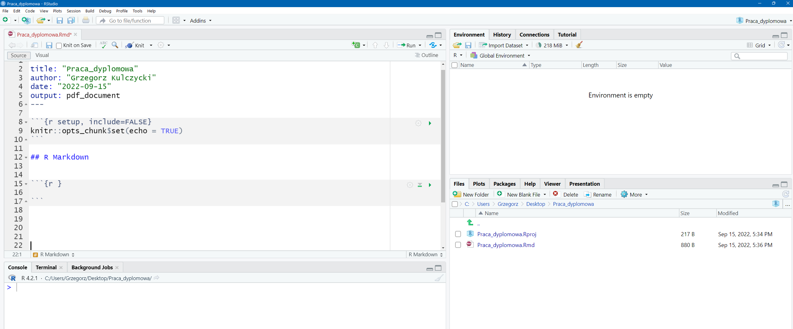

### Szablony (templatki) plików .Rmd

Pliki `.Rmd` można tworzyć na domyślnych szablonach RStudio, bądź na szablonach, które dostarczane są wraz z dedykowanymi bibliotekami. Przykładowo pakiet rticles [@allairexiedervieuxrfoundationwickhamjournalofstatisticalsoftwarevaidyanathanassociationforcomputingmachineryboettigerelsevierbromanmuellerquastpruimmarwickwickhamkeyesyuemaasitonkelinxgasparinidesautelsleutnantmdpitaylorandfrancisogredenhancenustuvestencampitellimuschellihayeskamvarrosscannoodtluguernkaplankreutzerwanghesselberthhyndman2022] dostarcza zestaw niestandardowych formatów R Markdown i szablonów do tworzenia artykułów w czasopismach i zgłoszeń na konferencje. Inne pakiety zawierające szablony artykułów naukowych to: stevetemplates [@miller2021], pagedown [@xielesurthornetan2022], papaja [@austbarth2022], papeR [@hofner2021], czy thesisdown [@ismaysolomon2022].

## Renderowanie (kompilowanie)

Utworzone pliki `.Rmd` możemy edytować z wykorzystaniem języka Markdown i osadzać w nich kody R.

Tworzenie dynamicznego dokumentu następuje w w procesie renderowania. Proces ten polega na przedstawieniu informacji zapisanych w pliku w określonej przez użytkownika formie (np. HTML, PDF, DOCX). Proces ten możemy rozpocząć poprzez naciśniecie przycisku .

W trakcie kompilacji (rys. \ref{konwersja_Rmd}) pakiet knitr jest używany do przetworzenia wstawek kodu na czysty tekst w tymczasowym dokumencie Markdown. Następnie względem tego pośredniego dokumentu wywoływany jest program pandoc w celu przekonwertowania go na dokument wyjściowy [@lander2018].

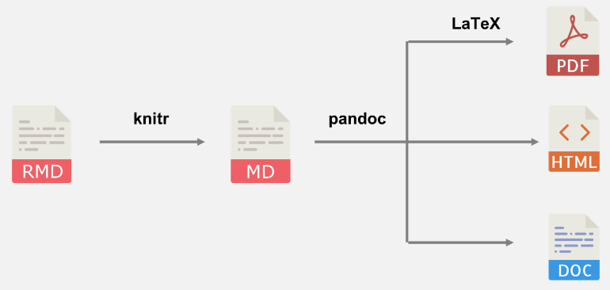{width="70%"}

Wynikiem renderowania są pliki o określonym wcześniej formacie który został zapisany w ustawieniach (nagłówek YAML). Oficjalna strona [R Markdown](https://rmarkdown.rstudio.com/index.html) dla RStudio podaje szereg możliwych plików wynikowych (output) rys. \ref {output_Rmd} ).

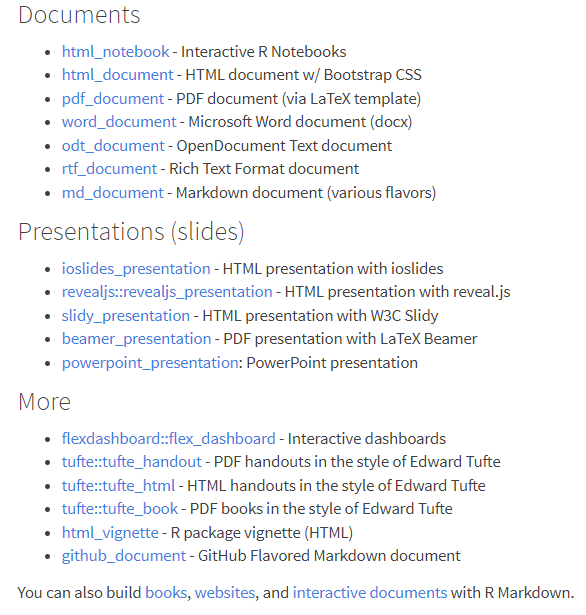{width="58%"}

## Ustawienia dokumentu R Markdown

### Nagłówek YAML

Metadane YAML (zwane również nagłówkiem YAML) umieszczane są na samym początku dokumentu zawierają szczegóły dotyczące całego dokumentu . Nagłówek yaml (rys. \ref{naglowek_yaml}) jest wydzielany wierszami zawierającymi po trzy dywizy przed i po nagłówku [@lander2018; @xieallairegrolemund2018].

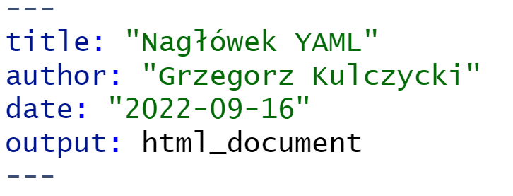{width="35%"}

Każdy wiersz nagłówka ma postać pary klucz-wartość, specyfikującej argumenty dla dokumentu, takie jak title, author, date lub output (typ dokumentu wyjściowego)[@lander2018].

Metadane YAML są bardzo wrażliwe na błędy dlatego warto zapoznać się z dokumentacją dotyczącą ich użycia. Na stronie [CRAN](https://cran.r-project.org/web/packages/ymlthis/vignettes/yaml-overview.html) (The Comprehensive R Archive Network) projektu R przedstawiona jest podstawowa składnia YAML.

W nagłówku YAML można także zdefiniować tworzenie pliku tex (rys.\ref{keep_tex}), który można edytować z użyciem edytorów LaTex.

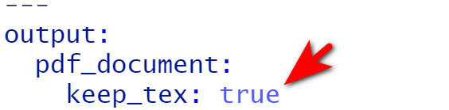{width="37%"}

Wydawnictwa naukowe często preferują wykorzystanie LaTeX przy składzie tekstu, gdyż wytworzenie tego pliku umożliwia szybkie nanoszenie poprawek np. po recenzjach w procesie wydawniczym artykułu naukowego.

### Składnia R Markdown

Markdown to język prostych znaczników, który powstał w celu uproszczenia formatowania i przyspieszenia pracy nad dokumentami tekstowymi. Zaletą składni R Markdown jest to, że dokumenty powstałe dzięki użyciu tego języka są w pełni powtarzalne.

Na stronie [R Markdown dla RStudio](https://rmarkdown.rstudio.com/authoring_basics.html) zamieszczona jest podstawowa i najczęściej używana składnia R Markdown.

W RStudio w panelu edycyjnym w zakładce Help → Cheat Sheets (rys. \ref {help_rmarkdown} zamieszczone zostały odnośniki do materiałów syntetycznie przedstawiających składnię R Markdown (rys. \ref{cheat_rmarkdown}).

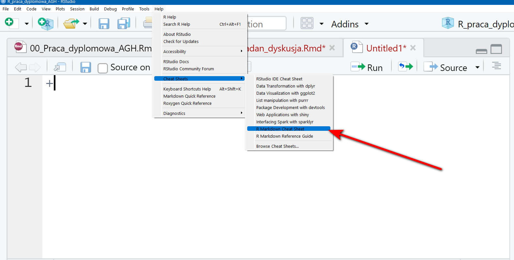

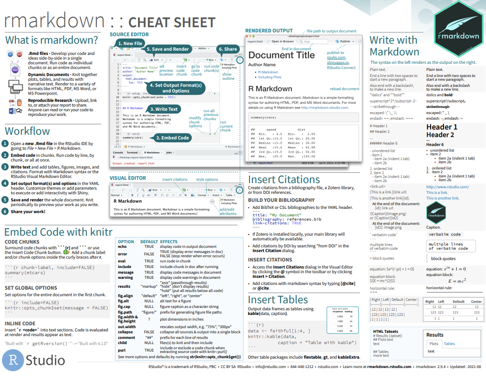{width="100%"}

### Wstawki kodu w Markdown

W R Markdown istnieje możliwość osadzania kodów najważniejszych języków programowania oraz baz danych np. R, Bash, D3, Python, Rcpp, SQL, Stan.

Osadzenie języków w R Markdown odbywa się z wykorzystaniem wstawki kodu (chunks) (rys. \ref{wstawka_kodu}).

Początek wstawki jest oznaczany ```` ```{r} i kończy się znakami``` ````, kod wewnątrz wstawki traktowany jako kod w języku R [@lander2018].

![Osadzenie języków w R Markdown [@strus2017]. \label{wstawka_kodu}](Rysunki/wstawka_kodu.png){width="60%"}

### Kod R w linii tekstu

Funkcjonalnym rozwiązaniem wstawiania kodu R jest także możliwość jego umieszczania w linii tekstu (inline kod). Kod inline wyświetli wyniki, ale nie ujawniając składni samego kodu (rys. \ref{inline_kod}).

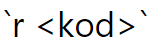{width="10%"}

## Cytowanie literatury w R Markdown

Pisanie publikacji naukowych nierozerwalnie związane jest z cytowaniami prac innych autorów, którzy wykonywali podobne badania.

W celu identyfikacji publikacji naukowej i odróżnienia jej od innych wykorzystuje się opis bibliograficzny, czyli uporządkowany zespół danych cech dokumentu. Opis bibliograficzny publikacji zamieszczony na stronach wydawnictw naukowych może być dostępny w rożnych formatach w zależności od menadżera bibliografii. Obecnie dostępnych jest dla użytkownika kilka menadżerów publikacji zarówno komercyjnych, jak i darmowych. Najbardziej popularne to Citavi, Mendeley, EndNote, Zotero, RefWorks i Papers.

W pracy z plikami R Markdown zalecanym menadżerem cytowań jest [Zotero](https://www.zotero.org/). Dobrym rozwiązaniem podczas pracy z tym menadżerem jest wykorzystanie dodatku (plugin) [Better BibTeX (BBT)](https://retorque.re/zotero-better-bibtex/), który automatycznie generuje klucze cytatów.

Większość wydawnictw umożliwia pobranie cytowania danej publikacji w formacie BibTeX (rys. \ref{format_bibtex}) lub pobranie cytowania przez dodatki do przeglądarek np. [Zotero Connector](https://chrome.google.com/webstore/detail/zotero-connector/ekhagklcjbdpajgpjgmbionohlpdbjgc?hl=pl) dla przegladarki Chrome.

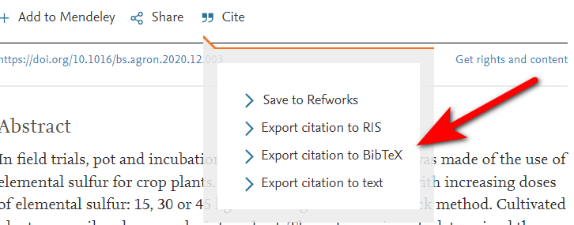{width="80%"}

### Współpraca Zotero w RStudio

Pracując z plikami `.Rmd` istnieje możliwość edycji pliku w trybie skryptowym (Source) oraz wizualnego edytora (Visual) (rys. \ref{tryb_visual}).

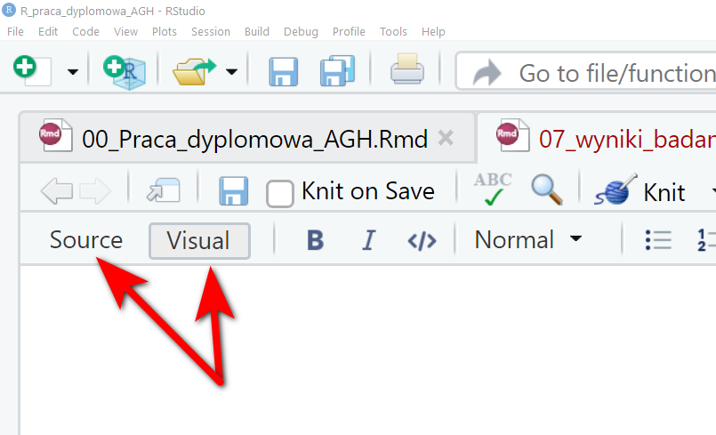{width="50%"}

W domyślnych ustawieniach RStudio: Tools→ Global Options→R Markdown → Citations wstawienie cytowania odbywa się w trybie pracy z wizualnym edytorem z wykorzystaniem menadżera publikacji Zotero (rys. \ref{zotero_ustawienia}). Korzystając w Zotero z rozszerzenia Better BibTex można także wybrać opcję korzystania z klucza cytowań generowanego przez ten dodatek.

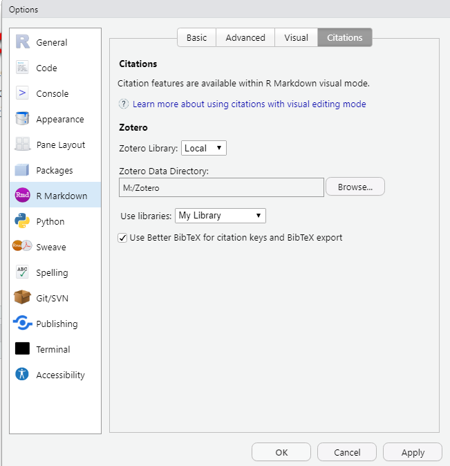{width="60%"}

W trybie pracy skryptowym, żeby wstawiać cytowania trzeba zainstalować określone biblioteki. Aktualnie jest możliwość skorzystania z pakietów rbbt [@dunningtonwiernik2022] oraz citr [@aust2019]. Oba te pakiety obecnie nie są umieszczone w dokumentacji CRAN, dlatego instalacja ich odbywa się z wykorzystaniem [GitHub](https://github.com/).

Polecenia do instalacji pakietów do cytowania i ich uruchamiania wyszczególniono na rys. \ref{cytowanie_pakiety}.

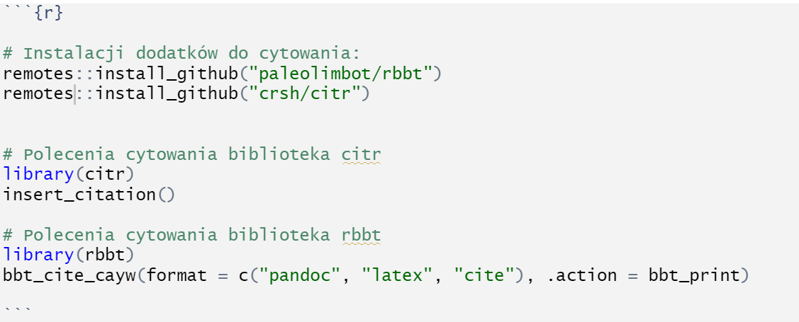

Wygodniejszą opcją jest zdefiniowanie dla tych dodatków skrótów klawiszowych poprzez Tools → Modify Keyboard Shortcut (rys. \ref{Keyboard_Shortcut}).

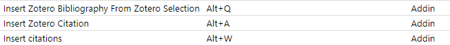

### Definiowanie opcji bibliograficznych w pliku .Rmd

W nagłówku YAML metadanych wymagane jest wskazanie ścieżki do pliku bibliograficznego i miejsca jego umieszczenia. Poniżej umieszczono przykładowe wskazanie pliku bibliograficznego (rys. \ref{bib_plik}), czyli pliku tekstowego z rozszerzeniem `.bib`, w którym zamieszczane są wpisy bibliograficzne w formie BiBTex (rys. \ref{BibTex}):

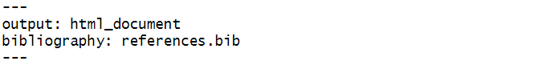{width="80%"}

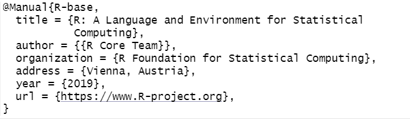{width="75%"}

W nagłówku YAML metadanych można także określić styl cytowania, czyli wstawić ścieżki do pliku z rozszerzeniem `.csl`. Domyślnie Pandoc używa formatu Chicago author-date dla cytatów i spisu literatury. Aby użyć innego stylu, należy podać plik CSL (Citation Style Language) w polu metadanych [@xie2021].

### Składnia cytowania

Składnia cytowania służy do odwoływania się do dokumentów i opiera się na kluczach cytatów, a podstawowym blokiem konstrukcyjnym jest \@citationkey (rys. \ref{skladnia}).

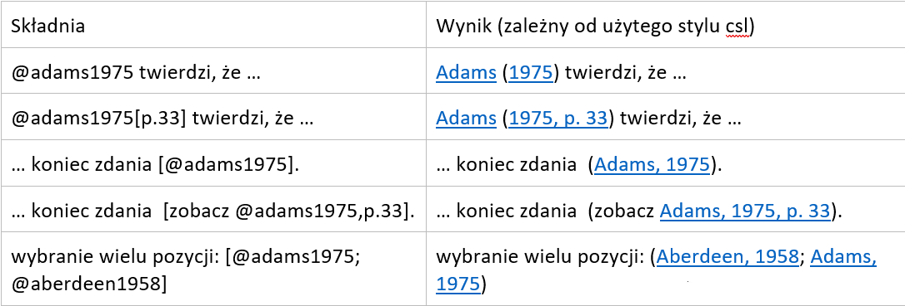{width="80%"}

### Zamieszczenie spisu literatury

Domyślnie, bibliografia umieszczona jest na końcu dokumentu. Spis literatury można zamieścić w innym miejscu poprzez użycie składni jak na rysunku \ref{spis_literatury}.

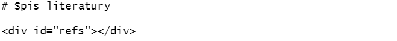{width="60%"}

## Studium przypadku (case study)

Praktyczne wykorzystanie omawianych powyżej narzędzi umożliwiających stworzenie publikacji naukowej w R Markdown w środowisku RStudio zostanie omówione na przykładzie przyjętej do druku publikacji 

Publikacja została stworzona z wykorzystaniem szablonu dla wydawnictwa MDPI z pakietu rticles. Sekcja YAML dla szablonu MDPI (rys. \ref{rticles_MDPI}) zawiera także odwołanie do formatowania w LaTeX, dzięki czemu można opcjonalnie używać LaTeXa do tworzenia rysunków i tabel.

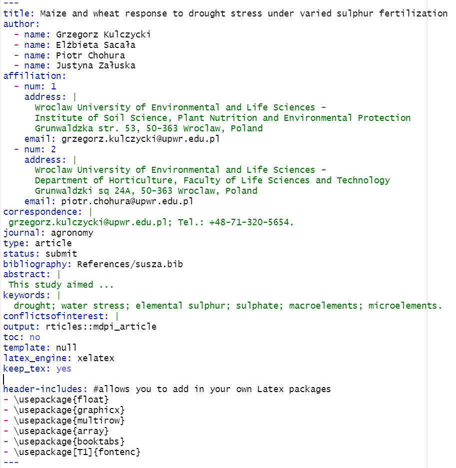{width="80%"}

Wszystkie analizy statystyczne zostały wykonane w pliku `.R`, natomiast w pliku szablonu `.Rmd` umieszczono odwołanie we wstawce kodu do tego pliku (rys. \ref{odwolanie_do_R}).

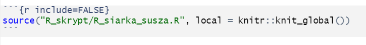{width="70%"}

W szablonie w poszczególnych rozdziałach umieszczano tekst publikacji, natomiast we wstawkach kodu R odnośniki do tabel oraz rysunków.

Przykład wstawki kodu dla rysunku 4 w publikacji (rys. \ref{rysunek_4} wraz z wynikiem (output) w publikacji (rys. \ref{figura_4}}.

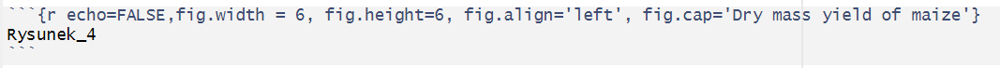

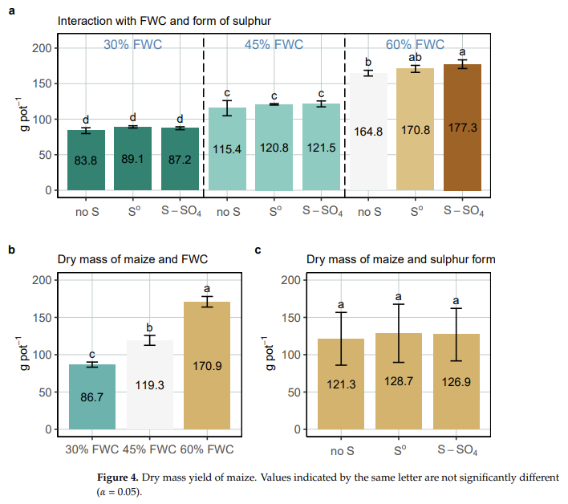{width="80%"}

Wszystkie cytowania w artykule wykonano poprzez wstawianie \@citationkey z programu Zotero (rys. \ref{cytowania}).

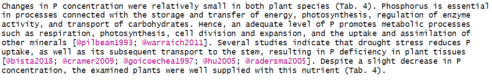

Po procesie renderowania otrzymano artykuł (rys. \ref{artykul}) zgodny z wymaganiami wydawnictwa za pomocą zautomatyzowanego procesu jego wytwarzania.

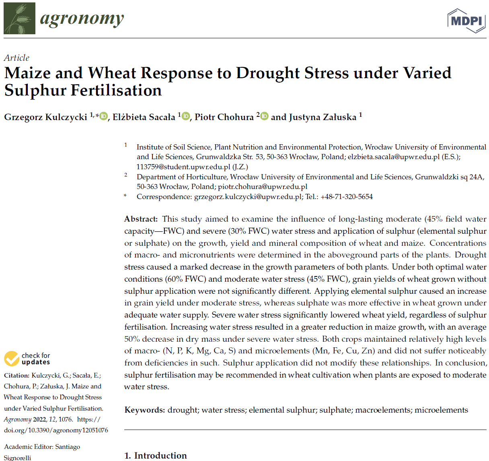{width="80%"}

## Dyskusja wyników

@fomelclaerbout2009 zaproponowali pojęcie powtarzalności badań określając, że produktem końcowym badań jest nie tylko sama praca, ale także pełne środowisko obliczeniowe użyte do wytworzenia końcowych wyników, takich jak kod i dane niezbędne do odtworzenia wyników [@xie2015].

Schemat ideowy badań naukowych z ich końcowym etapem w postaci napisania publikacji przedstawiono na rysunku \ref{schemat_odtwarzania} (modyfikacja własna za [@pebesma2016]).

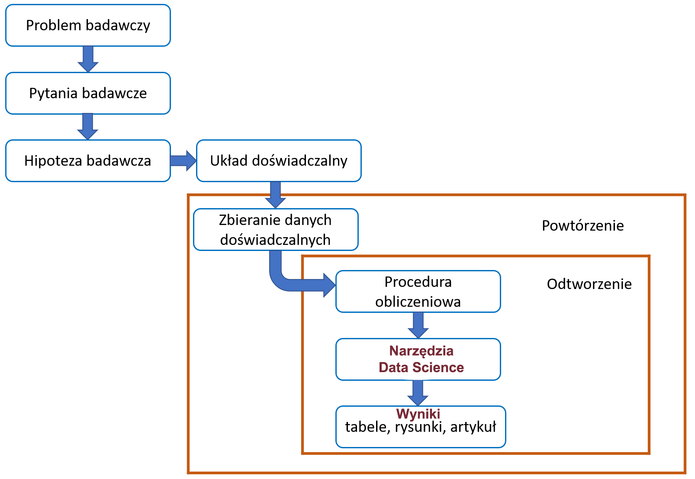{width="90%"}

Zaletą użycia metod odtwarzalnych wyników jest także zdolność do powtórzenia obliczeń z dokładnie takim samym wynikiem jak pierwotnie otrzymane, czyli wysoka powtarzalność (reproducibility).

O wysokiej odtwarzalności wyników badań mówi się wtedy gdy uzyskane wyniki z eksperymentu lub w analizie statystycznej z zestawu danych są ponownie osiągnięte z wysokim stopniem powtarzalności, gdy badania są replikowane.

@king1995 stwierdza, że wyniki badań są powtarzalne, jeśli dostępne są wystarczające informacje, aby niezależni badacze mogli dokonać tych samych ustaleń przy użyciu tych samych procedur.

Zakłada się, że skuteczne dostarczenie wyników analizy może być równie istotne, jak sama analiza, dlatego ważne jest żeby otrzymywać rezultaty pracy w efektywny sposób [@lander2018].

@peng2016a wskazuje na elementy odtwarzalności które są wymagane, aby wyniki były powtarzalne:

-   dane analityczne dostępne dla innych, będące kluczowe do wykonania analizy danych.

-   kod analityczny użyty do uzyskania wyników z danych analitycznych.

-   dokumentacja kodu i danych

-   dystrybucja tak aby wszystkie dane w kodzie były łatwo dostępne.

Korzyścią zastosowania odtwarzalnych metod jest możliwość skupienia się na pisaniu pracy bez konieczności zajmowania się edycyjnymi zagadnieniami jak podziały na strony, układ strony, czcionki, numeracje rysunków czy tabel.

Użycie narzędzi do badań odtwarzalnych stwarza możliwości wydajniejszej pracy, a po nabraniu doświadczenia i umiejętności w użyciu tych narzędzi praca możne się okazać szybsza i łatwiejsza do wykonania.

Do zalet korzystania z metody powtarzalnych badań można także zaliczyć [@brookerachelnicholas2022]:

-   szybką orientację w wykonanej pracy po upływie dłuższego czasu od jej ukończenia,

-   łatwość wprowadzenia poprawek do kodu lub danych, nawet na wczesnym etapie procesu, i ponowne przeprowadzenie całej analizy,

-   możliwość podzielenia się swoją pracą z innymi wykorzystując np. GitHub.

Zaletą pisania powtarzalnych dokumentów w R Markdown jest to, że mamy możliwość dostarczyć tę samą informację w wielu formatach wyjściowych np. PDF, DOCX, HTML [@racine2017].

Oczywiście, należy mieć świadomość barier które mogą wystąpić w okresie poznawania narzędzi badawczych. Bariery te związane są głównie z dodatkowym nakładem pracy, gdyż przyjmuje się, że początkowy nakład pracy jest duży w porównaniu do osiąganych efektów. Jednak trend ten po pewnym czasie ulega odwróceniu i nakład pracy, który został poniesiony na początku w dalszej perspektywie przynosi duży wzrost efektywności pracy (rys. \ref{r_first_then})

) \label{r_first_then}](Rysunki/r_first_then.png){width="65%"}
