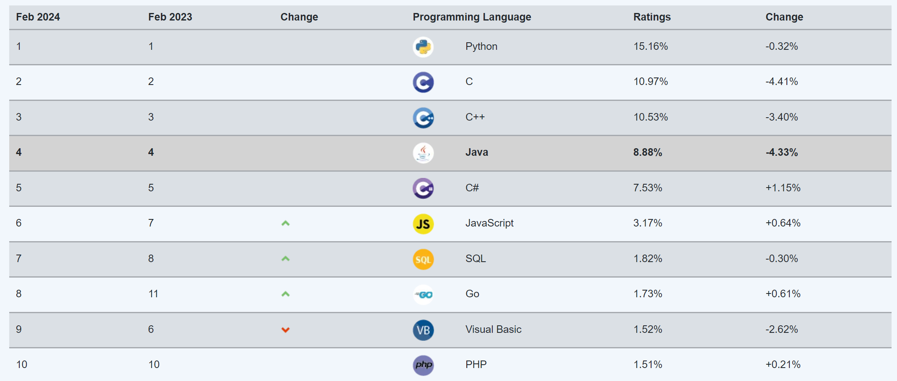
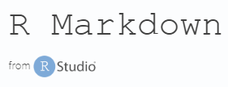
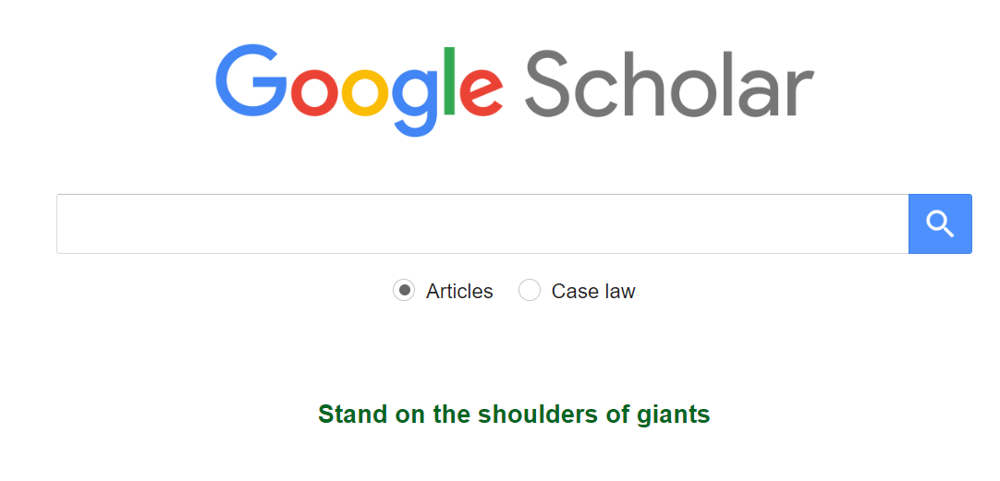
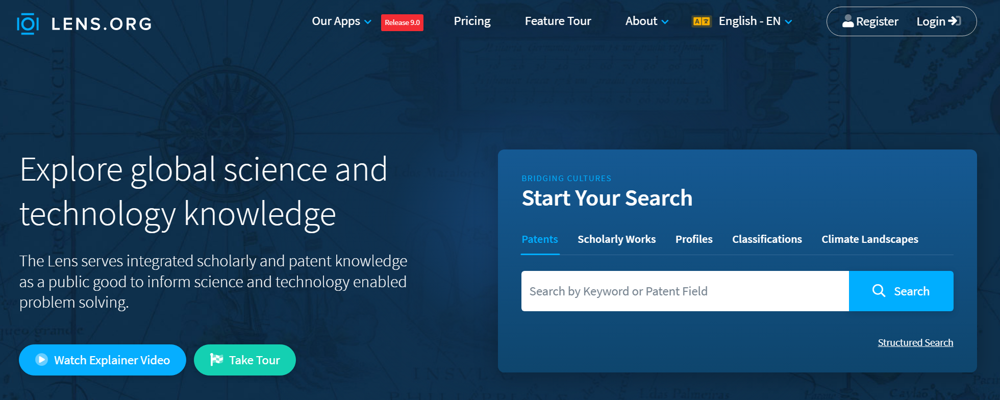

# Metody badań

W pracy własnej wykorzystano narzędzia z obszaru dziedziny Data Science, dlatego poniżej zdefiniowano ten obszar wiedzy. Data Science (polska nazwa - danologia) to interdyscyplinarna dziedzina generalnie zajmująca się analizą danych (pozyskiwaniem, eksploracją, wizualizowaniem i wyciąganiem z takich analiz wniosków. W szeroko rozumianym obszarze Data Science wykorzystuje się metody oparte na programowaniu, analizie statystycznej, uczeniu maszynowym (Machine Learning), sztucznej inteligencji, sieci neuronowych, czy analizie dużych baz danych (Big Data).

## Narzędzia Data Science wykorzystane w pracy

-   Program Python
-   Program R
-   RStudio
-   R Markdown
-   LaTeX
-   Zotero.

### Program Python [python.org](https://www.python.org)

Python określany jest jako wysoko poziomowy, dynamiczny językiem ogólnego przeznaczenia rys. \ref{python}. 

{width="80%"}

Obecnie jest najbardziej popularnym i najszybciej rozwijającym się językiem programowania na świecie według portalu [TIOBE Index](https://www.tiobe.com/tiobe-index/) rys. \ref{ranking_prog}.

{width="100%"}

Pierwsza wersja Pythona ukazała się na początku 1991 roku i zaliczany jest do kategorii oprogramowania Open Source. Do głównych zalet Pythona zalicza się nowoczesną składnię języka z opcją wyboru różnych paradygmatów programowania (funkcyjnego, obiektowego, reaktywnego), dużą i przyjazną społeczność, bogaty zbiór wbudowanych i przenośnych opcji, sprawną komunikację z innymi częściami aplikacji, współpracę pomiędzy najważniejszymi platformami - Windowsa oraz Linuxa [@comarch2023].

### Program R [r-project.org](https://www.r-project.org)

R jest oprogramowaniem o otwartym kodzie źródłowym, dostępnym w Uniksie, Linuksie, a także systemach macOS i Windows [@wickham2018].

Logo tego programu przedstawiono na rysunku \ref{r_logo.svg}.

{width="20%"}

Pierwsza wersja R została napisana w roku 1991 przez Roberta Gentlemana i Rossa Ihake˛ (znanych jako R&R), pracujących na Wydziale Statystyki Uniwersytetu w Auckland. Program R jest projektem GNU opartym na licencji GNU GPL, co oznacza, iż jest zupełnie darmowy zarówno do zastosowań edukacyjnych, jak i biznesowych [@biecek2017].

Język R jest językiem interpretowanym, a nie kompilowanym, oznacza to, że program w nim napisany nie będzie tak szybki jak np. program napisany w C++. Język R ma elastyczną składnię i pozwala użytkownikom na definiowanie własnych, dowolnie złożonych, funkcji [@górecki2011].

R wykorzystuje się do obliczeń statystyczno-matematycznych, umożliwia on również tworzenie zaawansowanych wykresów.

Po zainstalowaniu podstawowego środowiska R mamy już dostęp do wielu użytecznych funkcjonalności, jednak możliwości pracy w R zwiększają się bardzo po zainstalowaniu dodatkowych pakietów (package). Szacuje się, że 2020 roku dostępnych ich było około 16 tysięcy [wikipedia.org](https://en.wikipedia.org/wiki/R_package).

### RStudio [rstudio.com](https://www.rstudio.com)

Istnieje kilka graficznych interfejsów dla programu R, wśród nich najbardziej popularnym jest RStudio (rys. \ref{rstudio}).

RStudio określa się jako zintegrowane środowisko programistyczne (IDE) dla języka R.

{width="30%"}

RStudio zawiera konsolę, edytor podświetlający składnię i obsługuje bezpośrednie wykonywanie kodu, a także narzędzia do tworzenia wykresów, historii, debugowania i zarządzania przestrzenią roboczą (rys. \ref{rstudio_edytor}).

### R Markdown [rmarkdown.com](https://rmarkdown.rstudio.com/)

Rmarkdown to narzędzie do tworzenia dynamicznych dokumentów i zestawień. Język znaczników, którego celem jest jak największe uproszczenie tworzenia i formatowania tekstu [wikipedia.org](https://en.wikipedia.org/wiki/Markdown).

{width="40%"}

Biblioteka rmarkdown wraz z formatem R Markdown pozwala na przygotowanie estetycznie wyglądających raportów, a dokumenty otrzymywane w wyniku ich tworzenia są dynamiczne ponieważ istnieje w nich możliwość zagnieżdżania języka R [@strus2017].

### LaTeX [latex-project.org](https://www.latex-project.org/)

LaTeX to oprogramowanie do zautomatyzowanego składu tekstu, a także związany z nim język znaczników, służący do formatowania dokumentów tekstowych i tekstowo-graficznych [wikipedia.org](https://pl.wikipedia.org/wiki/LaTeX).

{width="40%"}

Oprogramowanie to określane jest także jako zestaw makropoleceń stanowiących nadbudowę nad systemem składu TEX, automatyzujących wiele czynności związanych z procesem poprawnego składania tekstu [@ziemkiewicz2013].

LATeX w swojej naturze odpowiada metodologii WYSIWYM, gdzie autor określa jedynie strukturę logiczną i treść dokumentu, pozostawiając w rękach automatycznego systemu zagadnienia dotyczące wyglądu i odpowiedniego rozmieszczenia elementów na stronie [@borkowski2015].

## Bazy danych indeksujące publikacje naukowe

Obecnie pracownicy nauki korzystają najczęściej z baz danych, takich jak Google Scholar, Lens, Semantic Scholar, Scopus, Web of Science i ResearchGate w celu uzyskania dostępu i ocenienia literatury naukowej. Pomiedzy tymi bazami zauważa się pewne podobieństwa istnieją jednak również istotne różnice pod względem ich zasięgu, zakresu, możliwości wyszukiwania i wskaźników cytowań.

Poniżej przedstawiono krótka charakterystykę wymienionych baz indeksujących.

[Google Scholar](scholar.google.com) najpopularniejsze narzędzie ze względu na to, że jest szybkie, bezpłatne i wszechstronne. Usługę tą rozpoczęto w listopadzie 2004 r. Kataloguje piśmiennictwo akademickie z różnych dziedzin i źródeł, takich jak książki, prace dyplomowe, artykuły z czasopism, materiały konferencyjne i preprinty rys. \ref{gogle_scholar}. Obejmuje ona szeroki zakres publikacji, w tym takie, które mogą nie być indeksowane przez inne bazy danych.

{width="100%"}

[Lens](lens.org) darmowy i otwarty zasób służący do wyszukiwania, analizowania i zarządzania danymi patentowymi i naukowymi rys. \ref{lens}. Umożliwia użytkownikom wyszukiwanie i dostęp do ponad 200 milionów dokumentów patentowych i 100 milionów publikacji akademickich z różnych źródeł.

{width="100%"}
