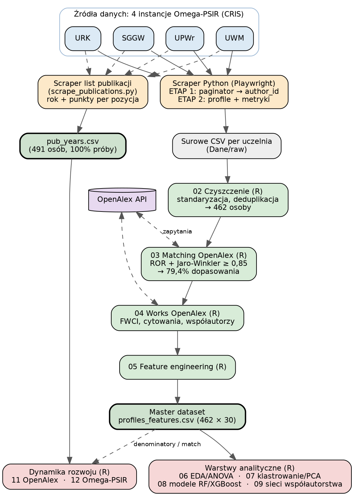
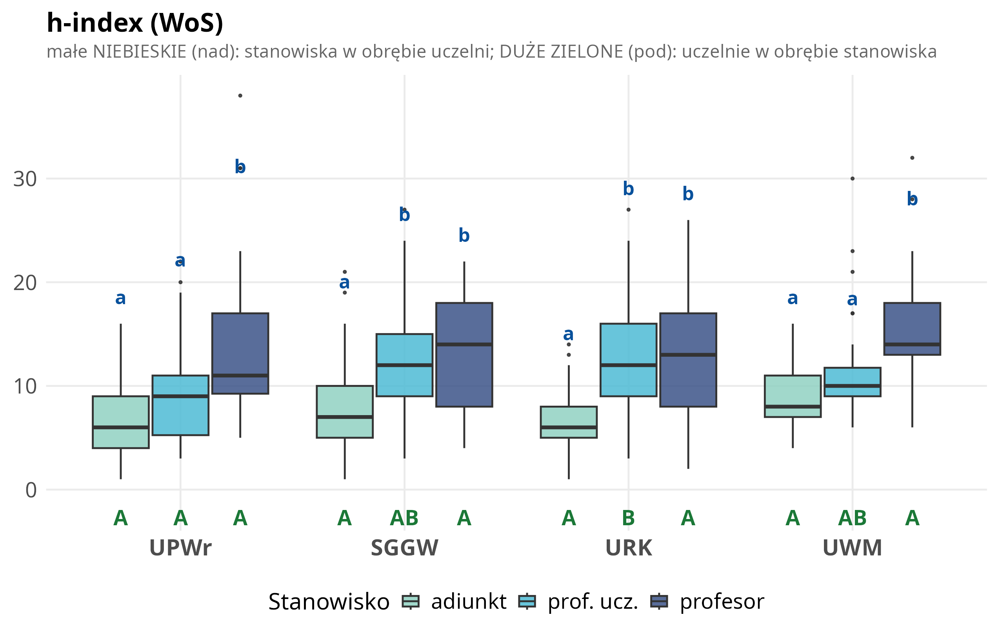
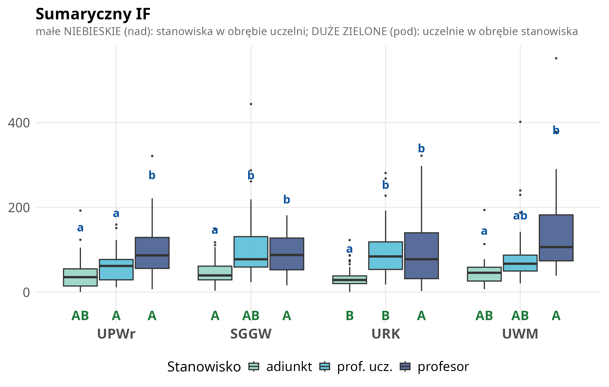
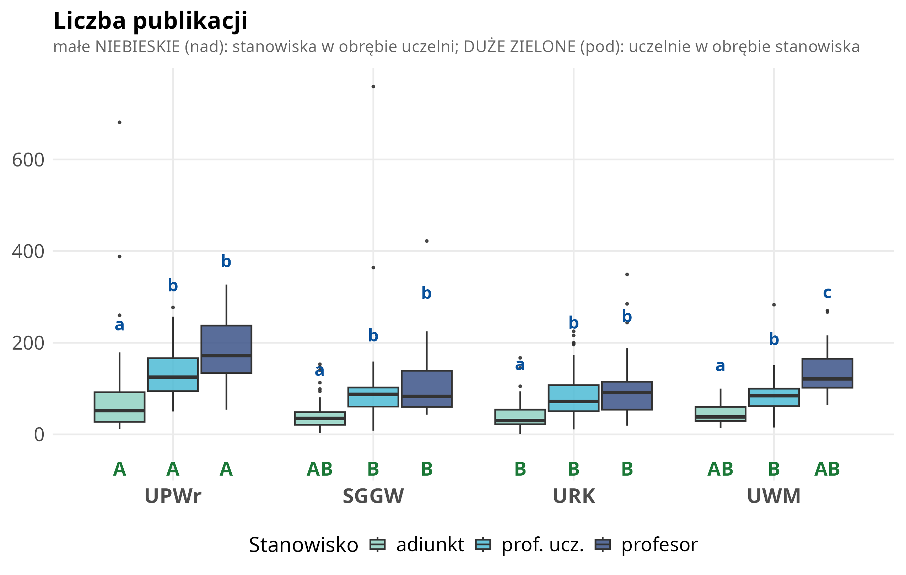
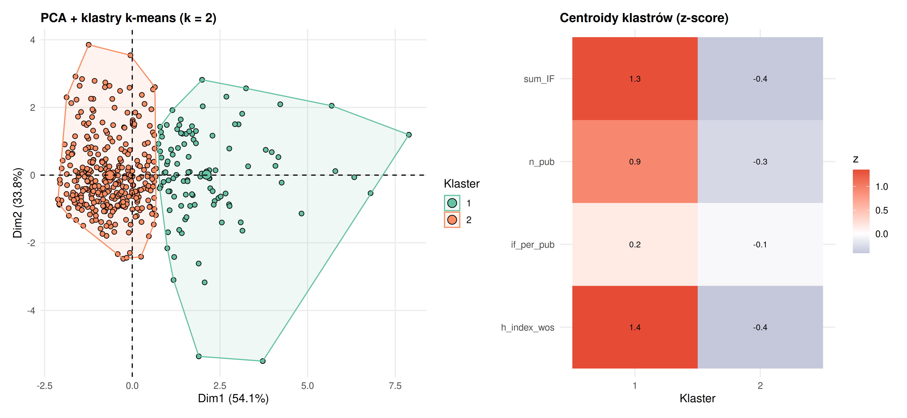
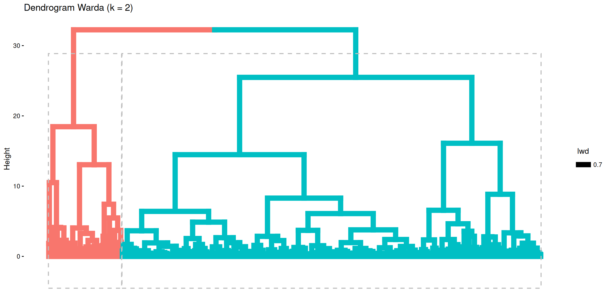
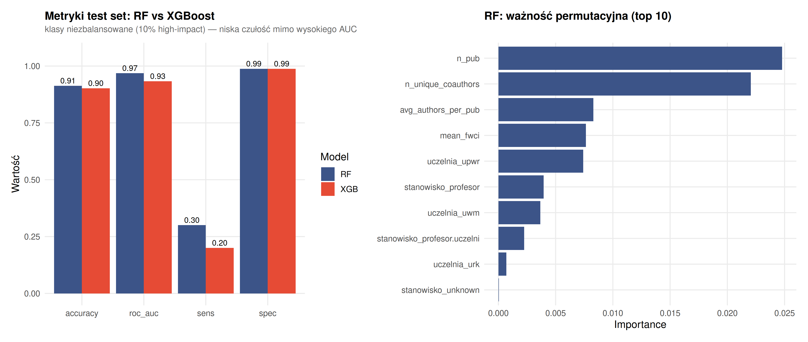
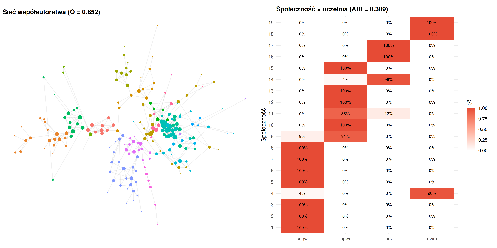
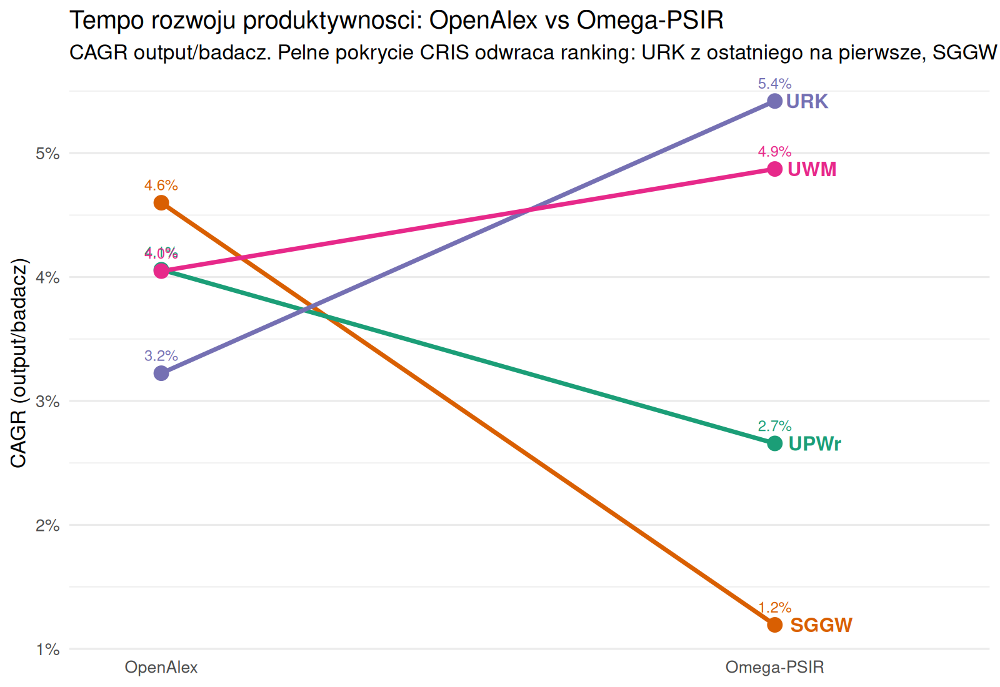

```{r setup, include=FALSE}
knitr::opts_chunk$set(
  echo = FALSE, warning = FALSE, message = FALSE,
  fig.align = "center", out.width = "100%", dpi = 200
)
library(dplyr)
library(tidyr)
library(ggplot2)
library(knitr)
library(here)
library(flextable)

# Jednolity styl tabel pracy. Czcionka zgodna z dokumentem:
# PDF -> Latin Modern Roman (szeryfowa), DOCX -> Aptos.
ft_praca <- function(df, fsize = 10) {
  tbl_font <- if (knitr::is_latex_output()) "Latin Modern Roman" else "Aptos"
  ft <- flextable(df)
  ft <- font(ft, fontname = tbl_font, part = "all")
  ft <- fontsize(ft, size = fsize, part = "all")
  ft <- align(ft, align = "center", part = "header")
  ft <- valign(ft, valign = "center", part = "header")
  ft <- align(ft, j = 1, align = "left", part = "body")
  if (ncol(df) >= 2) ft <- align(ft, j = seq(2, ncol(df)), align = "center", part = "body")
  set_table_properties(ft, layout = "autofit", width = 1)
}
```

# Streszczenie {.unnumbered}

Praca analizuje dorobek publikacyjny 462 pracowników z dyscypliny *rolnictwo i ogrodnictwo* z czterech polskich uczelni przyrodniczych: UPWr, SGGW, URK i UWM. Wykorzystano dane z systemu Omega-PSIR, a następnie uzupełniono je informacjami z bazy OpenAlex, między innymi o wskaźnik wpływu publikacji i dane o współautorstwie.

Analiza obejmowała cztery części: porównanie wyników między uczelniami i stanowiskami, podział pracowników na podobne profile publikacyjne, przewidywanie wysokiego wpływu naukowego oraz badanie sieci współpracy między autorami.

Badania wykazały, że dorobek indywidualny i współpraca naukowa zależą od różnych czynników. **Indywidualne osiągnięcia publikacyjne zależą głównie od etapu kariery**: im wyższe stanowisko, tym większy dorobek, i widać to podobnie na wszystkich uczelniach. Natomiast **współpraca między autorami zależy głównie od uczelni**: badacze najczęściej współpracują w ramach swojej afiliacji, a nie według stanowiska. Wysoki impact można dość dobrze przewidzieć na podstawie cech badacza. Najważniejsze są produktywność i pozycja w sieci współpracy, a nie samo stanowisko formalne. Model rozróżnia osoby o wysokim i niższym impakcie skumulowanym bardzo skutecznie, osiągając AUC około 0,97, przy czym ten cel jest po części pochodną liczby publikacji. Gdy celem jest jakość niekumulatywna (intensywność cytowań niezależna od dorobku), predykcja jest wyraźnie trudniejsza (AUC około 0,81) i zależy nie od stażu, lecz od struktury współpracy. Wyniki potwierdzają także, że jednorodność i kompletność danych są warunkiem wiarygodnego wnioskowania, ważniejszym niż wygoda gotowych indeksów globalnych: ten sam wskaźnik tempa rozwoju prowadzi do przeciwnych wniosków, gdy dane są niepełne. W polskim szkolnictwie wyższym systemy klasy CRIS, takie jak Omega-PSIR, są więc bezpieczniejszą podstawą porównań międzyuczelnianych niż bazy globalne.

**Słowa kluczowe:** bibliometria, naukometria, Omega-PSIR, OpenAlex, rolnictwo i ogrodnictwo, ewaluacja nauki, klastrowanie, sieci współautorstwa, uczenie maszynowe.

# Wprowadzenie

## Kontekst: ewaluacja jakości działalności naukowej w Polsce

Polski system oceny nauki opiera się na okresowej **ewaluacji jakości działalności naukowej**, przeprowadzanej co cztery lata przez Komisję Ewaluacji Nauki na podstawie danych zgromadzonych w systemie POL-on [@rozp_ewaluacja2022]. Ewaluacja nie ocenia pojedynczych naukowców, lecz **podmioty (uczelnie, instytuty) w obrębie poszczególnych dyscyplin naukowych**, nadając każdej parze podmiot–dyscyplina kategorię naukową (A+, A, B+, B lub C). Kategoria przekłada się bezpośrednio na uprawnienia jednostki, m.in. prawo do nadawania stopni naukowych oraz wysokość finansowania.

Punktem odniesienia dla całego systemu jest urzędowa **klasyfikacja dziedzin i dyscyplin naukowych**; analizowana w niniejszej pracy dyscyplina *rolnictwo i ogrodnictwo* należy do dziedziny nauk rolniczych [@rozp_dyscypliny2025]. Ocena w ewaluacji opiera się na trzech kryteriach: (I) poziomie naukowym prowadzonej działalności, mierzonym punktacją ministerialną publikacji i patentów, (II) efektach finansowych badań naukowych oraz (III) wpływie działalności naukowej na funkcjonowanie społeczeństwa i gospodarki. Wagi kryteriów różnią się między dziedzinami; dla nauk rolniczych Kryterium I waży 50 %, Kryterium II 35 %, a Kryterium III 15 % oceny [@rozp_ewaluacja2022; @rozp_ewaluacja_nowela2025]. Kryterium I, dominujące w naukach rolniczych, ma charakter bibliometryczny: liczbę punktów wyznacza się z udziałów jednostkowych autorów w publikacjach, w ramach limitu slotów publikacyjnych proporcjonalnego do liczby pracowników danej dyscypliny (liczby N).

Ponieważ ewaluacja nauki w dużej mierze opiera się na wskaźnikach bibliometrycznych, takich jak punktacja ministerialna, cytowania i liczba publikacji, indywidualne profile dorobku naukowców są ważnym przedmiotem analizy. Niniejsza praca nie odtwarza oficjalnego algorytmu ewaluacji, który działa na poziomie uczelni i dyscypliny. Analizuje natomiast zróżnicowanie indywidualnych profili bibliometrycznych pracowników prowadzących działalność naukową w tej samej dyscyplinie, a kategorię naukową uczelni traktuje jako zmienną opisową.

## Cel pracy

Niniejsza praca analizuje dorobek bibliometryczny pracowników naukowych dyscypliny **rolnictwo i ogrodnictwo** w czterech polskich uczelniach przyrodniczych: Uniwersytecie Przyrodniczym we Wrocławiu (UPWr, kategoria A), Szkole Głównej Gospodarstwa Wiejskiego w Warszawie (SGGW, A), Uniwersytecie Rolniczym im. Hugona Kołłątaja w Krakowie (URK, A) oraz Uniwersytecie Warmińsko-Mazurskim w Olsztynie (UWM, B+). Wszystkie te uczelnie korzystają z systemu Omega-PSIR jako Bazy Wiedzy.

Omega-PSIR jest systemem klasy CRIS (*Current Research Information System*), opracowanym na Politechnice Warszawskiej w ramach prac nad Bazą Wiedzy PW. System powstał w zespole Politechniki Warszawskiej w ramach projektu SYNAT (finansowanego przez NCBiR), którego celem było zbudowanie otwartej infrastruktury repozytoryjno-informacyjnej dla polskiej nauki; pierwsze wdrożenie produkcyjne uruchomiono na PW w 2012 roku [@koperwas2015omega]. Pełni funkcję repozytorium instytucjonalnego oraz narzędzia wspierającego zarządzanie informacją o działalności naukowej uczelni: gromadzi dane o publikacjach, projektach, patentach, raportach, rozprawach doktorskich, metrykach bibliometrycznych i afiliacjach pracowników. Jest to jeden z najczęściej stosowanych systemów tego typu w polskim szkolnictwie wyższym, dostosowany do krajowego systemu ewaluacji nauki. Jego znaczenie dla niniejszej pracy polega na tym, że udostępnia porównywalne, uczelniane agregaty dorobku naukowego w jednolitej strukturze danych [@omegapsir2024].

Kryterium doboru próby jest **jednolitość systemu informacji o nauce**: wszystkie cztery uczelnie korzystają z polskiego CRIS-u Omega-PSIR, co zapewnia identyczną procedurę pozyskania danych, te same kategorie pól bibliometrycznych i porównywalność wskaźników. W doborze próby ważniejsza od jednorodności kategorii ewaluacyjnej była porównywalność samego źródła danych. Różne systemy CRIS mogą mieć odmienne zasady gromadzenia publikacji, co może prowadzić do nieporównywalnych metryk. Pokazał to test kompletności wykonany na etapie projektowania badania: DSpace-CRIS Uniwersytetu Przyrodniczego w Poznaniu obejmował tylko około 10–15 % dorobku widocznego w systemach Omega-PSIR.
Kategorii ewaluacyjnej MEiN nie analizowano jako osobnej zmiennej, ponieważ w tej próbie jest ona **idealnie współliniowa z uczelnią**: tylko UWM ma kategorię B+, a pozostałe trzy uczelnie mają kategorię A. Nie można więc rozstrzygnąć, czy ewentualne różnice wynikają z kategorii, czy ze specyfiki danej uczelni. Z tego powodu kategorię MEiN potraktowano **wyłącznie opisowo**, a wynikające z tego ograniczenie omówiono w rozdziale Dyskusja.

Pominięto Uniwersytet Przyrodniczy w Poznaniu (kategoria A, DSpace) z powodu niekompletności jego CRIS-u oraz Zachodniopomorski Uniwersytet Technologiczny w Szczecinie (kategoria A) ze względu na brak publicznie dostępnego CRIS-u. Uniwersytet Przyrodniczy w Lublinie (B+) został pominięty ze względu na własny system OpenUP o asymetrycznej metodyce ekstrakcji.

## Pytania badawcze

**1.** Czy badani naukowcy tworzą odrębne typy profili bibliometrycznych?

**2.** W jakim stopniu stanowisko naukowe i uczelnia różnicują ich wskaźniki bibliometryczne?

**3.** Czy wysoki impact można przewidywać na podstawie cech strukturalnych, takich jak stanowisko, uczelnia, liczba publikacji i współpraca naukowa?

**4.** Czy sieć współautorstwa ma charakter głównie wewnątrzuczelniany, czy widoczne są także wspólnoty międzyuczelniane?

# Materiał i metodyka

## Źródła danych

- **Omega-PSIR (4 instancje uczelniane)** [@omegapsir2024], źródło podstawowe: agregaty bibliometryczne per autor (h-index WoS/Scopus [@hirsch2005], sumaryczny IF [@garfield2006], SNIP [@moed2010snip], punktacja MEiN/ministerialna, liczba publikacji), dane afiliacyjne (jednostka, wydział, stanowisko), identyfikatory ORCID.

- **OpenAlex API** [@openalex2022], źródło uzupełniające, dostarcza danych, których nie ma w Omega-PSIR: FWCI (Field-Weighted Citation Impact), czyli liczbę cytowań pracy porównaną ze światową średnią w jej dziedzinie, której nie da się policzyć z danych jednej uczelni [@waltman2016review]; liczbę cytowań publikacji; listę współautorów potrzebną do analizy sieci współpracy; oraz niezależne porównanie (kontrolę jakości) metryk pobranych z Omega-PSIR.

W pracy analizowano zagregowane wskaźniki bibliometryczne przypisane do poszczególnych autorów, takie jak sumaryczny IF, sumaryczna punktacja MEiN, h-index i liczba publikacji.

Należy zaznaczyć, że wskaźniki te służą jako przybliżenie indywidualnego dorobku naukowego, a nie jako odtworzenie oficjalnej ewaluacji jakości działalności naukowej. Oficjalna ewaluacja prowadzona jest na poziomie uczelni i dyscypliny, uwzględnia udziały jednostkowe autorów oraz limity slotów publikacyjnych (3-krotność liczby N), a jej podstawą nie jest Impact Factor, lecz punktacja ministerialna czasopism [@rozp_ewaluacja2022].

Wskaźniki wykorzystane w tej pracy wybrano dlatego, że są dostępne w porównywalnej formie dla badanych uczelni i pozwalają opisać profil bibliometryczny naukowca.

## Procedura pozyskania danych

Pozyskanie i przygotowanie danych przeprowadzono według jednolitej procedury (@fig-pipeline). Dane bibliometryczne pobrano z czterech uczelnianych instancji systemu Omega-PSIR za pomocą autorskiego scrapera napisanego w Pythonie, wykorzystującego bibliotekę Playwright i przeglądarkę Chromium.

Wyboru tego narzędzia wymagała architektura portali: strony Omega-PSIR (oparte na frameworku PrimeFaces) ładują część treści dynamicznie, więc zwykłe pobranie kodu HTML nie wystarczało do poprawnej ekstrakcji danych. Sterowanie pełną przeglądarką pozwala poczekać, aż profil autora oraz lista wyników w pełni się załadują, i dopiero wtedy odczytać dane.

Scraper działał w dwóch etapach. W pierwszym etapie przechodził przez listę pracowników odfiltrowaną do dyscypliny *rolnictwo i ogrodnictwo* i zbierał identyfikatory autorów. W drugim etapie otwierał profil każdego autora i pobierał dane bibliometryczne, afiliacyjne oraz identyfikator ORCID.

Szczególnym problemem była paginacja listy autorów. Kolejne strony wyników nie miały stabilnych adresów URL, dlatego scraper przechodził przez nie tak, jak użytkownik: programowo klikając przycisk „następna strona". Dzięki temu możliwe było zebranie identyfikatorów wszystkich autorów z wybranej dyscypliny.

Kod scrapera podzielono na część wspólną i konfiguracje dla poszczególnych uczelni. Część wspólna odpowiadała za nawigację, oczekiwanie na załadowanie strony i ekstrakcję danych, natomiast konfiguracje uczelniane uwzględniały drobne różnice między instancjami Omega-PSIR, takie jak nazwy pól czy czas ładowania profilu. Proces zabezpieczono autozapisem postępu, możliwością wznowienia pracy po przerwaniu oraz ponawianiem nieudanych prób pobrania danych.

Dla każdej uczelni zapisano osobny plik CSV. Następnie dane zostały ujednolicone, oczyszczone z duplikatów oraz pozbawione rekordów osób, które nie były pracownikami naukowymi. Po tym etapie końcowa próba analityczna liczyła 462 osoby.

Po oczyszczeniu danych z Omega-PSIR uzupełniono je informacjami z OpenAlex. Najpierw dopasowano autorów z badanej próby do rekordów w OpenAlex, wykorzystując identyfikator instytucji ROR oraz podobieństwo imienia i nazwiska. Następnie dla dopasowanych autorów pobrano informacje o publikacjach, cytowaniach, wskaźniku FWCI oraz współautorach. Zapytania do OpenAlex wykonywano z ograniczeniem tempa i identyfikacją użytkownika, zgodnie z zasadami korzystania z API.

Dane z Omega-PSIR i OpenAlex połączono w jeden zbiór analityczny (`profiles_features.csv`). Osobno, na potrzeby analizy dynamiki publikacyjnej, pobrano pełne listy publikacji z systemu Omega-PSIR dla wszystkich zeskrapowanych osób (491, przed odsianiem), wraz z rokiem publikacji i punktacją. Dane między skryptami Python i R przekazywano w formacie CSV.

{#fig-pipeline width=100%}

## Metody analityczne

- *Analiza opisowa i statystyczna:* obejmowała porównanie wskaźników między uczelniami i stanowiskami. Założenia parametryczne sprawdzono testami Shapiro-Wilka (normalność reszt modelu w układzie dwuczynnikowym) i Levene'a (jednorodność wariancji); ponieważ dla wszystkich sześciu metryk zostały one naruszone, zastosowano **ścieżkę nieparametryczną**: ogólny test Kruskala-Wallisa dla 12 grup utworzonych przez połączenie uczelni i stanowisk, a następnie, dla metryk z istotnym wynikiem tego testu, post-hoc Dunna z korektą Bonferroniego. Należy zaznaczyć, że Kruskal-Wallis na komórkach porównuje 12 grup łącznie i nie rozdziela formalnie efektów głównych od interakcji. Grupy jednorodne (compact letter display) wyznaczano metodą `multcompLetters` na macierzy istotności porównań parami. Pomocniczo, na potrzeby ryciny rozkładów, ten sam test Dunna z korektą Bonferroniego przeprowadzono w dwóch symetrycznych wariantach jednoczynnikowych: w obrębie każdej uczelni osobno (porównanie stanowisk, małe litery CLD) oraz w obrębie każdego stanowiska osobno (porównanie uczelni, duże litery CLD); każdy wariant kontroluje drugi czynnik, ilustrując różnice między stanowiskami i między uczelniami niezależnie od siebie. Poziom *asystent* (n = 26, nieobecny w UWM i UPWr) wykluczono z analizy interakcji. Metryki oparte na punktacji MEiN analizowano na trzech uczelniach (SGGW nie eksponuje sum_MEiN w API, 100 % braków danych).
- *Analiza PCA i klastrowanie k-means:* podział naukowców na grupy o podobnych profilach bibliometrycznych. Cechy o pełnym pokryciu czterech uczelni (h-index WoS, sumaryczny IF, IF na publikację, liczba publikacji), z pominięciem metryk MEiN, które wykluczyłyby całą próbę SGGW. Obok rozwiązania głównego (k z sylwetki) zbadano wariant eksploracyjny k = 3.
- *Modelowanie predykcyjne:* do przewidywania wysokiego impactu zastosowano modele Random Forest [@breiman2001] i XGBoost [@chen2016]. Ich jakość oceniono w 5-krotnej walidacji krzyżowej, a znaczenie cech opisano za pomocą wartości SHAP [@lundberg2017]. Zbudowano dwa modele o rozłącznych celach: **ilościowy** (wysoki sumaryczny impact, kumulatywny) oraz **jakościowy** (wysoka intensywność cytowań niezależna od dorobku: FWCI > 1, czyli powyżej światowej średniej w dziedzinie). W modelu jakościowym dołączono jawnie cechę **wieku akademickiego** (lata od pierwszej publikacji wg OpenAlex), by sprawdzić, czy jakość daje się sprowadzić do stażu.
- *Analiza sieci współautorstwa:* sprawdzono, którzy badacze publikują razem i czy tworzą większe grupy współpracy. Do wykrycia takich grup zastosowano algorytm Louvain [@blondel2008], a modularność [@newman2006] wykorzystano do oceny, jak wyraźnie sieć dzieli się na wspólnoty. Dzięki temu można było sprawdzić, czy współpraca przebiega głównie w obrębie jednej uczelni, czy także między uczelniami.

## Narzędzia i środowisko obliczeniowe

Pozyskanie, przetwarzanie i analizę danych zrealizowano w dwóch językach programowania. W Pythonie wykonano scraping czterech instancji Omega-PSIR oraz komunikację z API OpenAlex (biblioteki Playwright, BeautifulSoup, pandas). Analizy statystyczne, modelowanie, klastrowanie, analizę sieci oraz wizualizacje wykonano w języku R, z wykorzystaniem pakietów z ekosystemów tidyverse i tidymodels oraz igraph, ggraph i ggplot2. Odtwarzalność środowiska R zapewniono pakietem renv, rejestrującym dokładne wersje użytych pakietów. Całość prac programistycznych prowadzono w zintegrowanym środowisku programistycznym Positron, obsługującym zarówno język R, jak i Python.

W pracy pomocniczo wykorzystano duże modele językowe (LLM): Claude (Anthropic), Codex (OpenAI) oraz Gemini (Google). Posłużyły one jako narzędzia wsparcia technicznego i redakcyjnego: do przeglądu i porządkowania kodu, wykrywania niespójności w tekście i danych, redakcyjnego dopracowania języka oraz krytycznej rewizji fragmentów pracy. Modele nie były źródłem danych empirycznych ani nie prowadziły samodzielnego wnioskowania statystycznego; wszystkie obliczenia, decyzje metodyczne i interpretacje wyników pozostają autorskie i wykonano je opisanymi skryptami Python i R. Informacja odnosi się do stanu z okresu przygotowania pracy (2026); wykorzystano model Claude Opus 4.8 (środowisko Claude Code), Codex oparty na modelu GPT-5.5 (OpenAI) oraz model gemini-3-flash-preview (Gemini CLI w wersji 0.46.0, Google).

# Wyniki

## Charakterystyka próby

Po scrapingu czterech instancji Omega-PSIR i czyszczeniu danych (usunięcie rekordów niebędących pracownikami naukowymi) próba liczyła **462 osoby**: UPWr 118, SGGW 112, URK 162, UWM 70. Dopasowanie do bazy OpenAlex (po identyfikatorze ROR uczelni i nazwisku, dopasowanie rozmyte miarą Jaro-Winklera ≥ 0,85 [@winkler1990]) powiodło się dla **367 osób (79,4 %)**: UPWr 79,7 %, SGGW 89,3 %, URK 77,8 %, UWM 67,1 %. Dopasowanie wymagało normalizacji nazw uwzględniającej charakterystyczny dla URK sufiks afiliacyjny po przecinku (np. „Jan Kowalski, prof. URK"), którego nieusunięcie zaniżało początkowo dopasowanie tej uczelni do 47,5 %; po korekcie poziom URK zrównał się z pozostałymi. Najsłabiej dopasowany pozostaje UWM (67,1 %), co przekłada się na lekkie niedoreprezentowanie tej uczelni w analizach opartych na metrykach OpenAlex (FWCI, sieci współautorstwa).

Zbiorczą charakterystykę próby przedstawia @tbl-proba: liczebność, kategorię ewaluacyjną MEiN, rozkład stanowisk, odsetek dopasowania do OpenAlex oraz mediany liczby publikacji, sumarycznego Impact Factor i h-index WoS, liczone na pełnej liczebności każdej uczelni. Stanowisko nieprzypisane dla 16 osób (UPWr 13, URK 3) ujęto wyłącznie w kolumnie n.

```{r}
#| label: tbl-proba
#| tbl-cap: "Charakterystyka próby w podziale na uczelnie."
dat <- data.frame(
  Uczelnia   = c("UPWr", "SGGW", "URK", "UWM", "Razem"),
  Kat        = c("A", "A", "A", "B+", "A+B+"),
  n          = c("118", "112", "162", "70", "462"),
  Adiunkt    = c("47", "59", "47", "17", "170"),
  ProfUcz    = c("30", "30", "59", "34", "153"),
  Profesor   = c("27", "13", "38", "19", "97"),
  Asystent   = c("1", "10", "15", "0", "26"),
  MatchOA    = c("79,7 %", "89,3 %", "77,8 %", "67,1 %", "79,4 %"),
  LiczbaPubl = c("99", "46", "54", "82", "62"),
  SumIF      = c("46,1", "50,2", "46,1", "68,8", "49,0"),
  hindex     = c("8", "8", "9", "10", "9"),
  check.names = FALSE, stringsAsFactors = FALSE
)
ft <- ft_praca(dat, fsize = 8)
ft <- set_header_labels(ft,
  Kat = "Kat.", ProfUcz = "Prof. ucz.", MatchOA = "Dopasow. OpenAlex",
  LiczbaPubl = "Liczba publ.*", SumIF = "Sum. IF*", hindex = "h-index*")
ft <- add_footer_lines(ft, values = c(
  "Dopasow. OpenAlex = odsetek osób uczelni powiązanych z rekordem autora w bazie OpenAlex (po identyfikatorze ROR i nazwisku).",
  "* wartości podane jako mediany (na pełnej liczebności uczelni); h-index wg WoS."))
# add_footer_lines dodaje wiersze PO ft_praca, wiec nie dziedzicza rodziny czcionki:
# nakladamy ja ponownie, by stopka byla spojna z tekstem glownym.
ft <- font(ft, fontname = if (knitr::is_latex_output()) "Latin Modern Roman" else "Aptos", part = "footer")
ft <- fontsize(ft, size = 7, part = "footer")
ft <- width(ft, width = c(0.60, 0.42, 0.32, 0.56, 0.56, 0.56, 0.56, 0.74, 0.62, 0.50, 0.56))
ft <- set_table_properties(ft, layout = "fixed")
ft
```

W analizie 2-czynnikowej uwzględniono 420 osób posiadających określone stanowisko z trzech kategorii (adiunkt, profesor uczelni, profesor); rozkład w układzie uczelnia × stanowisko przedstawia @tbl-proba, a najmniejsza komórka liczy 13 osób, co umożliwia estymację członu interakcji.

## Struktura korelacyjna wskaźników (pytanie 2)

Wskaźniki bibliometryczne układają się wzdłuż dwóch słabo skorelowanych osi, których strukturę przedstawia @fig-korelacje. Pierwszą jest **wielkość dorobku**, w obrębie której najściślej powiązane są trzy metryki skumulowanego impactu: h-index WoS, sumaryczny IF i punktacja MEiN (wzajemne korelacje 0,82–0,95). Korelacja sumarycznego IF z punktacją MEiN wynosi r = 0,95; punktacja ministerialna jest niemal liniową funkcją sumarycznego IF, co potwierdza, że oba wskaźniki mierzą zbliżony konstrukt. **Liczba publikacji** należy do tej samej osi wielkości, lecz wiąże się z metrykami impactu jedynie umiarkowanie (r = 0,36–0,44), odzwierciedla bowiem objętość dorobku, a nie jego skumulowane oddziaływanie. Drugą, w przybliżeniu ortogonalną osią jest **intensywność jakościowa** (IF na publikację), słabo skorelowana z metrykami wielkości; jej ujemny związek z liczbą publikacji (r = -0,37) wskazuje na klasyczny kompromis ilość–jakość: naukowcy o największej produktywności mają przeciętnie niższy IF przypadający na pojedynczą pracę.

{#fig-korelacje width=100%}

## Różnice we wskaźnikach bibliometrycznych według uczelni i stanowiska (pytanie 2)

Dla sześciu analizowanych wskaźników sprawdzono, czy można zastosować klasyczne testy parametryczne. Testy Shapiro-Wilka i Levene'a pokazały jednak, że dane nie spełniają ich założeń: rozkłady nie są normalne, a wariancje w grupach nie są równe. Z tego powodu zastosowano testy nieparametryczne: test Kruskala-Wallisa oraz, w przypadku istotnych różnic, test post-hoc Dunna z korektą Bonferroniego.

Decyzję tę uzasadnia także kształt rozkładów pokazany na @fig-rozklady. Większość wskaźników bibliometrycznych ma rozkłady silnie prawoskośne: wiele osób ma niskie lub umiarkowane wartości, a niewielka grupa osiąga bardzo wysokie wyniki. Wyjątkiem jest wskaźnik IF / MEiN, którego rozkład jest bardziej symetryczny, ale także dla niego testy wykazały naruszenie założeń testów parametrycznych.

{#fig-rozklady width=100%}

Wyniki tego porównania dla trzech metryk o pełnym pokryciu pokazano na @fig-hindex, @fig-sumif i @fig-npub jako wykresy pudełkowe z oznaczeniami grup jednorodnych. Na każdym z nich naniesiono dwa niezależne zestawy grup jednorodnych (CLD): **małe niebieskie litery** nad pudełkami porównują stanowiska w obrębie każdej uczelni, a **DUŻE zielone litery** pod pudełkami porównują uczelnie w obrębie każdego stanowiska (czyta się je, zestawiając pudełka tego samego koloru między uczelniami); wspólna litera oznacza brak istotnej różnicy.

{#fig-hindex width=100%}

{#fig-sumif width=100%}

{#fig-npub width=100%}

Wyniki pokazują, że wskaźniki bibliometryczne są silniej związane ze stanowiskiem niż z uczelnią. We wszystkich czterech uczelniach widoczny jest podobny układ: najniższe wartości mają adiunkci, wyższe profesorowie uczelni, a najwyższe profesorowie.

Porównania post-hoc wykonane osobno w obrębie każdej uczelni pokazują, że adiunkci najczęściej różnią się istotnie od obu grup profesorskich. Natomiast profesorowie uczelni i profesorowie zwyczajni różnią się między sobą rzadziej.

Porównania między uczelniami w obrębie tego samego stanowiska dają słabsze różnice. Oznacza to, że osoby na podobnym stanowisku mają zwykle podobne wskaźniki niezależnie od uczelni. Nieliczne różnice między uczelniami dotyczą głównie liczby publikacji, która była najniższa w UPWr.

Analizę przeprowadzono w dwóch krokach. Najpierw zastosowano test Kruskala-Wallisa dla układu uczelnia × stanowisko, a następnie, tam gdzie różnice były istotne, wykonano test post-hoc Dunna z korektą Bonferroniego. Test ogólny był istotny dla pięciu z sześciu analizowanych metryk. Jedynym wyjątkiem był wskaźnik IF / MEiN, dla którego nie stwierdzono istotnych różnic (p = 0,075). Pełne wyniki przedstawia @tbl-roznicowanie.

```{r}
#| label: tbl-roznicowanie
#| tbl-cap: "Ogólny test Kruskala-Wallisa i grupy jednorodne z post-hoc (Dunn-Bonferroni) dla różnic w układzie uczelnia × stanowisko."
df <- data.frame(
  Metryka = c("Liczba publikacji", "IF na publikację", "Sumaryczna punktacja MEiN (3 uczelnie)",
              "h-index (WoS)", "Sumaryczny IF", "IF / MEiN"),
  chi2 = c("169,6 (11)", "54,7 (11)", "108,6 (8)", "118,6 (11)", "108,8 (11)", "14,3 (8)"),
  p   = c("< 0,001", "< 0,001", "< 0,001", "< 0,001", "< 0,001", "0,075"),
  CLD = c("8", "5", "6", "6", "6", "1"),
  Roznicowanie = c("istotne", "istotne", "istotne", "istotne", "istotne",
                   "brak różnic"),
  check.names = FALSE, stringsAsFactors = FALSE
)
ft <- ft_praca(df, fsize = 9)
ft <- set_header_labels(ft, chi2 = "H (df)*", p = "p (Kruskal-Wallis)",
  CLD = "Grupy jednorodne", Roznicowanie = "Istotność testu")
ft <- align(ft, j = 5, align = "left", part = "body")
ft <- add_footer_lines(ft, values =
  "* H to statystyka Kruskala-Wallisa (rozkład chi-kwadrat o df stopniach swobody).")
# add_footer_lines dodaje wiersz PO ft_praca, wiec nie dziedziczy rodziny czcionki:
ft <- font(ft, fontname = if (knitr::is_latex_output()) "Latin Modern Roman" else "Aptos", part = "footer")
ft <- fontsize(ft, size = 8, part = "footer")
ft <- width(ft, width = c(1.85, 0.95, 0.85, 1.10, 1.05))
ft <- set_table_properties(ft, layout = "fixed")
ft
```

Najwięcej różnic między grupami widać dla liczby publikacji. Ta metryka podzieliła badanych na 8 grup jednorodnych, czyli najlepiej odróżniała poszczególne kombinacje uczelni i stanowiska. Wyraźne różnice wystąpiły także dla h-index, sumarycznego IF i punktacji MEiN.

Jedynym wskaźnikiem, dla którego nie stwierdzono istotnych różnic, był IF / MEiN (p = 0,075). Wynika to z jego konstrukcji: jako iloraz dwóch silnie skorelowanych wielkości znosi on efekt skali dorobku, więc nie różnicuje wyraźnie badanych grup.

Podsumowując, wraz z wyższym stanowiskiem rosną wartości większości wskaźników bibliometrycznych. Zależność ta była istotna statystycznie dla pięciu z sześciu analizowanych metryk.


## Typy profili bibliometrycznych badaczy (pytanie 1)

Analiza głównych składowych na czterech standaryzowanych cechach pełnego pokrycia (h-index WoS, sumaryczny IF, IF na publikację, liczba publikacji; n = 449) wykazała, że dwie pierwsze składowe wyjaśniają **87,9 % wariancji** (PC1: 54,1 %, PC2: 33,8 %). Liczbę klastrów dobrano metodą sylwetki, która dla każdego obiektu mierzy, jak dobrze pasuje on do własnego klastra w porównaniu z najbliższym sąsiednim; jako optymalną wybiera się liczbę klastrów o najwyższym średnim dopasowaniu. Wskazała ona rozwiązanie **dwuklastrowe**.

{#fig-klastry width=95%}

Otrzymane klastry mają jednoznaczną interpretację jako podział na **rdzeń wysokoproduktywny** i **pozostałą populację** (@tbl-klastry2):

```{r}
#| label: tbl-klastry2
#| tbl-cap: "Średnie metryki dwóch klastrów k-means (rozwiązanie główne)."
df <- data.frame(
  Klaster = c("1: wysoki dorobek", "2: pozostali"),
  n = c("104", "345"),
  `h-index WoS` = c("17,8", "7,4"),
  `Sumaryczny IF` = c("163,1", "44,8"),
  `IF / publikację` = c("1,38", "1,17"),
  `Liczba publikacji` = c("160,7", "61,8"),
  check.names = FALSE, stringsAsFactors = FALSE
)
ft_praca(df)
```

Walidacja zewnętrzna typologii dała wynik kluczowy dla całej pracy: przynależność do klastra jest **niezależna od uczelni** (χ² test niezależności p = 0,19; Craméra V = 0,10), natomiast **silnie powiązana ze stanowiskiem** (p < 0,001; Craméra V = 0,45). Typologia profilu bibliometrycznego odzwierciedla zatem oś senioralności/produktywności, która przebiega jednorodnie przez wszystkie cztery uczelnie. Zgodność klastrowania k-means z hierarchicznym (Warda) była umiarkowana (Craméra V = 0,67); dendrogram Warda (@fig-dendrogram) potwierdza jednak nadrzędny podział na dwa duże skupiska, spójny z rozwiązaniem dwuklastrowym.

{#fig-dendrogram width=85%}

Wariant eksploracyjny z wymuszonym k = 3 ujawnia, że „pozostała populacja" rozpada się na dwie jakościowo różne grupy, co wzbogaca typologię o trzeci, nieoczywisty typ profilu (@tbl-klastry3):

```{r}
#| label: tbl-klastry3
#| tbl-cap: "Profile trzech klastrów w wariancie eksploracyjnym k = 3."
df <- data.frame(
  `Klaster (k = 3)` = c("Trzon (niska intensywność)", "Rdzeń wysokoproduktywny",
                        "Profil jakościowy (mało prac, wysoki impact)"),
  n = c("266", "95", "88"),
  `Liczba publikacji` = c("74,5", "169,8", "23,8"),
  `IF / publikację` = c("0,70", "1,30", "2,68"),
  `FWCI (opisowo)` = c("1,08", "1,76", "2,32"),
  `Dominujące stanowiska` = c("adiunkt, profesor uczelni", "profesor, profesor uczelni", "asystent, adiunkt"),
  check.names = FALSE, stringsAsFactors = FALSE
)
ft <- ft_praca(df)
ft <- align(ft, j = 6, align = "left", part = "body")
ft <- width(ft, width = c(1.9, 0.4, 0.9, 0.9, 0.8, 1.4))
ft <- set_table_properties(ft, layout = "fixed")
ft
```

Trzecia grupa to **profil jakościowy**: najmniejszy dorobek ilościowy (mediana 19,5 publikacji), ale najwyższa intensywność jakościowa (IF na publikację 2,68 i FWCI 2,32, najwyższe ze wszystkich klastrów), zdominowana przez młodszą kadrę (63 z 88 osób to asystenci i adiunkci). Jej istnienie pokazuje, że obok osi senioralności/produktywności przebiega **niezależna oś jakości**, wzdłuż której wysoki impact osiągają również badacze o krótkim stażu i niewielkim dorobku. Także w wariancie k = 3 typologia pozostaje niezależna od uczelni (Craméra V = 0,10), a jej związek ze stanowiskiem jest słabszy niż przy k = 2 (V = 0,38), właśnie dlatego, że profil jakościowy przecina hierarchię akademicką.

## Predykcja wysokiego impactu (pytanie 3)

Zmienną celu zdefiniowano jako przynależność do górnego decyla sumarycznego IF w całej próbie (high-impact: 46 z 452 osób, 10,2 %). Predyktorami były cechy strukturalne (stanowisko, uczelnia, liczba publikacji) oraz cechy sieciowe/cytowaniowe z OpenAlex (liczba unikalnych współautorów, średnia liczba autorów na pracę, średni FWCI); wskaźniki h-index i sumaryczny IF wykluczono jako predyktory ze względu na tautologiczny związek ze zmienną celu. Porównano Random Forest i XGBoost (strojenie na 5-krotnej walidacji krzyżowej); metryki testowe obu modeli podaje @tbl-modele.

```{r}
#| label: tbl-modele
#| tbl-cap: "Metryki testowe modeli predykcji wysokiego impactu (próg domyślny 0,5)."
df <- data.frame(
  Model = c("Random Forest", "XGBoost"),
  `ROC AUC` = c("0,968", "0,933"),
  `Trafność` = c("0,913", "0,902"),
  `Czułość` = c("0,300", "0,200"),
  `Swoistość` = c("0,988", "0,988"),
  check.names = FALSE, stringsAsFactors = FALSE
)
ft_praca(df)
```

Oba modele osiągnęły **wysoką zdolność dyskryminacyjną** (AUC ok. 0,93–0,97), lecz przy domyślnym progu decyzyjnym 0,5 i silnie niezbalansowanej zmiennej celu (10 % klasy pozytywnej) ich **czułość jest niska (0,20–0,30)**: modele poprawnie rankują obserwacje, ale klasyfikują niemal wszystkie jako klasę większościową, przez co wysoka trafność (0,90) odpowiada w praktyce trywialnej regule „zawsze niski impact".

Problem ten dotyczy punktu pracy, nie zdolności dyskryminacyjnej. Wyznaczono zatem **próg decyzyjny optymalizujący indeks J Youdena** [@youden1950] (czułość + swoistość - 1) na predykcjach out-of-fold z walidacji krzyżowej (a więc bez strojenia na zbiorze testowym), uzyskując próg 0,054, znacznie niższy od 0,5, adekwatny do 10-procentowej prewalencji klasy pozytywnej. Po zastosowaniu tego progu do zbioru testowego model Random Forest osiąga **czułość 1,00 przy swoistości 0,74** (zbalansowana trafność 0,87), poprawnie identyfikując wszystkie obserwacje wysokiego impactu kosztem 21 fałszywie dodatnich (@tbl-prog):

```{r}
#| label: tbl-prog
#| tbl-cap: "Punkt pracy modelu Random Forest przy progu domyślnym i progu Youdena."
df <- data.frame(
  `RF: punkt pracy` = c("Próg domyślny (0,5)", "Próg Youdena (0,054)"),
  `Czułość` = c("0,30", "1,00"),
  `Swoistość` = c("0,99", "0,74"),
  `Indeks J` = c("0,29", "0,74"),
  `Zbalansowana trafność` = c("–", "0,87"),
  check.names = FALSE, stringsAsFactors = FALSE
)
ft_praca(df)
```

Analiza ważności cech (ważność permutacyjna Random Forest oraz wartości SHAP dla XGBoost; @fig-modele) wskazała **liczbę publikacji** jako predyktor dominujący, a w dalszej kolejności liczbę unikalnych współautorów oraz cechy struktury współpracy (średnia liczba autorów na pracę, średni FWCI); cechy stanowiska i uczelni miały marginalny wkład. Predykcja wysokiego impactu opiera się więc przede wszystkim na produktywności i osadzeniu w sieci współpracy, a nie na formalnej pozycji akademickiej czy afiliacji.

{#fig-modele width=95%}

### Model jakościowy: czy wysoki impact to tylko staż?

Powyższy model przewiduje cel *kumulatywny* (sumaryczny IF), który z natury rośnie z dorobkiem, więc dominacja liczby publikacji może być częściowo tautologiczna. Aby to skontrolować, zbudowano drugi model o celu *niekumulatywnym*: wysoka jakość zdefiniowana jako średni FWCI > 1 (impact powyżej światowej średniej w dziedzinie, niezależny od liczby prac; 234 z 366 osób, 63,9 %). Zestaw predyktorów rozszerzono o **wiek akademicki** (lata od pierwszej publikacji), usuwając wszystkie pochodne IF.

Wynik jest wymowny na dwa sposoby. Po pierwsze, jakość jest **znacznie trudniej przewidywalna** ze struktury niż objętość dorobku: AUC spada do ok. 0,81 (RF 0,807, XGBoost 0,810) wobec 0,97 dla modelu ilościowego. Po drugie, gdy celem jest jakość, a nie suma, **wiek akademicki przestaje dominować**: najważniejszymi predyktorami są cechy struktury współpracy (średnia liczba autorów na pracę oraz liczba unikalnych współautorów), podczas gdy wiek akademicki, liczba publikacji, stanowisko i uczelnia mają wkład marginalny. Wysoki impact w przeliczeniu na pracę wiąże się więc z osadzeniem w szerszych, wieloautorskich kolaboracjach, a nie ze stażem czy formalną pozycją. Potwierdza to obserwację z typologii (profil jakościowy młodej kadry, klaster 3 przy k = 3): istnieje oś jakości niezależna od osi senioralności.

## Sieć współautorstwa (pytanie 4)

Sieć współautorstwa zbudowano z krawędzi OpenAlex ograniczonych do współprac wewnątrz badanej kohorty (oba węzły dopasowane, waga ≥ 2 wspólne publikacje): 367 węzłów i 630 krawędzi. Największa składowa spójności obejmuje **265 węzłów (72 %)** i 595 krawędzi, o gęstości 0,017 i współczynniku gronowania (transitivity) 0,37.

{#fig-siec width=95%}

Wykrywanie wspólnot algorytmem Louvain wyodrębniło **21 społeczności przy bardzo wysokiej modularności Q = 0,856**, co świadczy o silnie zmodularyzowanej strukturze współpracy. Zgodność wykrytych społeczności ze zmiennymi opisowymi oceniono skorygowanym indeksem Randa (ARI) [@hubert1985] oraz znormalizowaną informacją wzajemną (NMI); rozstrzyga ona pytanie 4 (@tbl-spolecznosci):

```{r}
#| label: tbl-spolecznosci
#| tbl-cap: "Zgodność społeczności Louvain ze zmiennymi opisowymi (ARI, NMI)."
df <- data.frame(
  `Porównanie` = c("Społeczność vs uczelnia", "Społeczność vs stanowisko"),
  ARI = c("0,233", "0,009"),
  NMI = c("0,575", "0,092"),
  check.names = FALSE, stringsAsFactors = FALSE
)
ft_praca(df)
```

Społeczności współautorstwa pokrywają się przede wszystkim z **afiliacją uczelnianą** (NMI = 0,58), a niemal w ogóle ze stanowiskiem (NMI = 0,09). Heatmapa zgodności (@fig-siec, prawy panel) pokazuje, że większość społeczności jest jednorodna uczelniano (po 100 % członków z jednej uczelni); wspólnoty międzyuczelniane są nieliczne. Innymi słowy współpraca naukowa w badanej dyscyplinie ma charakter przede wszystkim **wewnątrzinstytucjonalny**. Najwyższą centralność stopnia osiąga profesor z URK (S. Smoleń), a tuż za nim plasuje się grupa gleboznawcza UPWr.

# Dyskusja

## Dwoistość: profil indywidualny a struktura współpracy

Najważniejszym ustaleniem pracy jest **rozbieżność osi organizujących indywidualny dorobek i zbiorową współpracę**. Z jednej strony profil bibliometryczny pojedynczego naukowca, uchwycony zarówno przez analizę 2-czynnikową (warstwa 1), jak i przez typologię klastrową (warstwa 2), porządkuje się wzdłuż **osi senioralności**: różnice między stanowiskami są monotoniczne i jednorodne dla wszystkich czterech uczelni, a przynależność do klastra wysokoproduktywnego jest silnie powiązana ze stanowiskiem (Craméra V = 0,45), lecz statystycznie niezależna od uczelni (V = 0,10). Z drugiej strony sieć współautorstwa (warstwa 4) dzieli populację wzdłuż **osi afiliacyjnej**: społeczności Louvain pokrywają się przede wszystkim z uczelnią (NMI = 0,58), a niemal w ogóle ze stanowiskiem (NMI = 0,09).

Innymi słowy: *kim* naukowiec jest pod względem bibliometrycznym zależy od etapu kariery niezależnie od macierzystej instytucji, ale *z kim* współpracuje determinuje przede wszystkim afiliacja. Współpraca w badanej dyscyplinie ma charakter wyraźnie wewnątrzinstytucjonalny: mosty międzyuczelniane są nieliczne, a wysoka modularność sieci (Q = 0,856) potwierdza silnie izolowane skupiska. Jest to spójne z naturą nauk rolniczych, gdzie znaczna część badań osadzona jest w lokalnej infrastrukturze (pola doświadczalne, stacje badawcze, lokalne uwarunkowania glebowo-klimatyczne).

## Predyktory wysokiego impactu

Modelowanie predykcyjne (warstwa 3) wzmacnia ten obraz: wysoki impact (górny decyl sumarycznego IF) daje się przewidzieć z cech strukturalnych z bardzo dobrą zdolnością dyskryminacyjną (AUC ok. 0,97), a najważniejszymi predyktorami są **liczba publikacji oraz osadzenie w sieci współpracy** (liczba unikalnych współautorów, FWCI), nie zaś formalne stanowisko czy uczelnia. Sugeruje to, że wysoki dorobek jest funkcją produktywności i kapitału sieciowego, a nie pozycji w hierarchii akademickiej per se; stanowisko jest raczej *skutkiem* skumulowanego dorobku niż jego niezależnym predyktorem. Niska czułość modelu przy progu domyślnym okazała się problemem punktu pracy, a nie modelu: po kalibracji progu na danych walidacyjnych model wiarygodnie identyfikuje całą klasę wysokiego impactu (czułość 1,00, zbalansowana trafność 0,87).

Model jakościowy uzupełnia ten obraz o istotne zastrzeżenie. Gdy celem predykcji jest jakość niekumulatywna (FWCI > 1), a nie suma dorobku, zdolność dyskryminacyjna wyraźnie spada (AUC ok. 0,81), a hierarchia predyktorów się zmienia: znaczenie tracą produktywność i wiek akademicki, a na czoło wysuwa się **struktura współpracy** (liczność i wieloautorskość kolaboracji). Innymi słowy, *ile* i *jak długo* ktoś publikuje przewiduje skumulowany impact niemal trywialnie, ale *jak dobre* są pojedyncze prace zależy przede wszystkim od osadzenia w szerokiej współpracy, nie od stażu. To bezpośrednio osłabia interpretację, w której wysoki impact byłby wyłącznie pochodną senioralności, i wskazuje na samodzielną oś jakości, widoczną też w typologii (profil jakościowy młodej kadry).

## Kategoria ewaluacyjna MEiN

Ze względu na idealną współliniowość kategorii z uczelnią (UWM jako jedyna uczelnia B+) nie sposób rozdzielić efektu kategorii od efektu instytucji. Na poziomie opisowym UWM (B+) nie odstaje systematycznie *in minus* od uczelni kategorii A, jego mediany metryk mieszczą się w zakresie pozostałych uczelni, co sugeruje, że formalna kategoria ewaluacyjna nie przekłada się wprost na różnice w indywidualnych wskaźnikach bibliometrycznych badanej kohorty. Wniosek ten należy jednak traktować ostrożnie, jako hipotezę do weryfikacji na próbie z większą liczbą uczelni B+.

## Dynamika rozwoju a wrażliwość na źródło danych

Statyczny obraz dorobku uzupełniono analizą eksploracyjną **tempa rozwoju produktywności** każdej uczelni, mierzonego rocznym wzrostem liczby publikacji na badacza (CAGR z regresji log-liniowej trajektorii 2008–2024, znormalizowanej do okresu bazowego). Analizę przeprowadzono dwukrotnie i wynik okazał się **silnie zależny od źródła danych**, co stanowi samodzielny rezultat metodyczny. Na danych OpenAlex uczelnie układały się w wąskim, praktycznie nierozróżnialnym zakresie (CAGR 4,0–4,6 %: SGGW 4,6 %, URK 4,2 %, UPWr 4,1 %, UWM 4,0 %), bez wyraźnego lidera tempa. Po powtórzeniu analizy na **pełnych listach publikacji Omega-PSIR** (100 % próby, 491 osób, pełny katalog z polskimi czasopismami i monografiami nieindeksowanymi w OpenAlex) **obraz uległ rozwarstwieniu i przestawieniu** (@fig-dynamika): najszybciej rozwijają się URK (CAGR 5,4 %; 95 % CI 0,8–10,3 %) i UWM (4,9 %; 1,6–8,2 %), podczas gdy UPWr (2,7 %; −0,6–6,0 %) i SGGW (1,2 %; −0,8–3,2 %) są praktycznie płaskie. Najbardziej wymowne jest położenie SGGW, która z pozycji formalnie najszybszej w OpenAlex (4,6 %) spada na ostatnie miejsce w danych CRIS (1,2 %). Podział ten utrzymuje się w wariancie odpornościowym ograniczonym do kadry o ustalonej karierze (pierwsza publikacja ≤ 2010 r.: URK 3,9 %, UWM 4,0 % wobec UPWr 0,7 %, SGGW −0,1 %), nie jest więc artefaktem napływu młodej kadry.

{#fig-dynamika width=80%}

Rozbieżność nie jest przypadkowa i, co istotne, nie da się jej zbyć artefaktem jakości dopasowania. Analizę OpenAlex przeprowadzono już po skorygowaniu dopasowania URK (z 47,5 % do 77,8 %, poziomu porównywalnego z pozostałymi uczelniami), a mimo to OpenAlex nadal zlewa wszystkie cztery uczelnie w jednolity pas ok. 4 %, podczas gdy kompletny katalog CRIS ujawnia realne rozwarstwienie tempa (1,2–5,4 %). Źródłem rozbieżności jest więc nie niedopasowanie autorów, lecz **niepełne pokrycie polskiego dorobku przez OpenAlex**: globalny indeks pomija znaczną część publikacji w polskich czasopismach i monografiach, a wyższe, bogatsze o lokalny dorobek poziomy bazowe w danych CRIS sprawiają, że pozorny „wzrost" widoczny w OpenAlex był po części artefaktem rosnącego w czasie pokrycia polskich publikacji przez tę bazę. Wynik ten jest bezpośrednim potwierdzeniem **centralnej tezy metodycznej pracy**, że jednorodność i kompletność systemu CRIS są dla porównań międzyuczelnianych ważniejsze niż wygoda gotowego indeksu globalnego: ten sam wskaźnik dynamiki prowadzi do przeciwnych wniosków w zależności od kompletności źródła. Same różnice tempa należy przy tym traktować ostrożnie ze względu na szerokie, częściowo nakładające się przedziały ufności; wiarygodny jest jakościowy podział na uczelnie rozwijające się (URK, UWM) i o produktywności ustabilizowanej (UPWr, SGGW), nie zaś dokładny ranking.

## Ograniczenia

- **Proxy a metodyka oficjalna.** Analiza opiera się na per-autorskich agregatach bibliometrycznych, które przybliżają indywidualny dorobek, ale nie odtwarzają algorytmu ewaluacji jakości działalności naukowej (poziom podmiotu, udziały jednostkowe, sloty, punktacja ministerialna zamiast IF) [@rozp_ewaluacja2022]. Wniosków nie należy zatem wprost przekładać na przewidywane kategorie ewaluacyjne uczelni.
- **Confounding kategoria–uczelnia.** Pojedyncza uczelnia kategorii B+ uniemożliwia oddzielenie wpływu kategorii ewaluacyjnej od idiosynkrazji instytucji; kategorię ujęto wyłącznie opisowo.
- **Niejednorodność pokrycia metryk.** SGGW nie eksponuje sumarycznej punktacji MEiN w API (100 % braków), przez co analizy oparte na MEiN ograniczono do trzech uczelni. UWM nie udostępnia SNIP. Wymusza to ostrożność w porównaniach międzyuczelnianych dla tych wskaźników.
- **Zmienność reżimu punktacji MEiN w czasie.** Sumaryczna punktacja MEiN jest wielkością kumulatywną, obejmującą publikacje oceniane w różnych, niespójnych reżimach punktowych: przed reformą 2018/2019 (osobne listy A/B/C o odmiennych skalach), w nowym systemie 20–200 punktów wprowadzonym pierwszym wykazem czasopism z 2019 r., a następnie po jego skokowej rewizji w 2023 r. Dane przekazują tę metrykę jako jedną sumę, bez rozbicia na okresy, więc nie sposób tych reżimów rozdzielić; dodatkowo wzmacnia to jej charakter proxy, a nie odwzorowania oficjalnego wyniku ewaluacyjnego.
- **Niepełne i nierówne dopasowanie do OpenAlex** (79,4 % średnio). Po skorygowaniu normalizacji nazw dopasowanie URK wzrosło z 47,5 % do 77,8 %, zbliżając się do średniej; najniższe pozostaje dla UWM (67,1 %). Metryki pochodne OpenAlex (FWCI, sieci współautorstwa) dotyczą zatem tylko zmatchowanej części próby i mogą być obciążone brakiem typu MNAR dla osób niedopasowanych.
- **Przekrojowy charakter danych.** Wskaźniki kumulatywne (h-index, sumaryczny IF, liczba publikacji) rosną ze stażem; brak kontroli wieku akademickiego oznacza, że efekt stanowiska częściowo nakłada się na efekt długości kariery. Obserwowana zależność profilu od stanowiska ma więc komponentę mechaniczną (kumulacji), której niniejsze dane nie pozwalają odseparować.
- **Mała liczność klasy pozytywnej** w modelu ilościowym (46 osób); mimo poprawnej walidacji krzyżowej i kalibracji progu wyniki predykcyjne należy traktować jako orientacyjne.
- **Ograniczenia modelu jakościowego.** Model FWCI > 1 oraz cecha wieku akademickiego (z `first_pub` OpenAlex) działają tylko na podpróbie zmatchowanej (366 osób), są więc podatne na ten sam bias pokrycia co inne metryki OpenAlex; wiek akademicki oszacowano odpornie (5. percentyl lat publikacji), ale pozostaje on przybliżeniem realnego stażu. Typologię k = 3 (profil jakościowy) potraktowano jako eksploracyjną, obok głównego rozwiązania k = 2.
- **Eksploracyjny charakter analizy dynamiki i błąd przeżywalności.** Tempo rozwoju oszacowano na trajektoriach przekrojowo zatrudnionej kadry (bez osób, które odeszły lub przeszły na emeryturę przed momentem scrapingu); analiza opisuje zatem **historię dorobku obecnej kadry, a nie historię instytucji**. Przedziały ufności CAGR są przy tym szerokie i częściowo się nakładają, dlatego wynik należy traktować jako sygnał kierunkowy, nie ścisły ranking. Wariant „kohorta ustalona" (pierwsza publikacja ≤ 2010 r.) częściowo ogranicza wpływ napływu młodej kadry, lecz nie eliminuje samego błędu przeżywalności.
- **Niepełne pokrycie OpenAlex dla polskich czasopism**, przyczyna przyjęcia Omega-PSIR jako źródła podstawowego, sprawia, że metryki pochodne OpenAlex (FWCI) są dostępne tylko dla zmatchowanej części próby.

# Wnioski

1. **Typologia (pytanie 1).** Wśród naukowców dyscypliny rolnictwo i ogrodnictwo wyróżniają się dwa odróżnialne typy profili bibliometrycznych: nieliczny rdzeń wysokoproduktywny (ok. 23 % populacji) oraz pozostała większość. Typologia ta jest jednorodna dla wszystkich czterech uczelni.
2. **Różnicowanie (pytanie 2).** Stanowisko różnicuje wskaźniki bibliometryczne monotonicznie i jednolicie międzyuczelnianie (adiunkt < profesor uczelni < profesor); uczelnia różnicuje je słabo. Po konserwatywnej korekcie wielokrotnych porównań istotność osiąga pięć z sześciu metryk (liczba publikacji, h-index, sumaryczny IF, punktacja MEiN oraz IF na publikację); jedynie złożony wskaźnik IF / MEiN nie różnicuje komórek. W obrębie każdej uczelni adiunkci stanowią grupę istotnie odrębną od obu poziomów profesorskich.
3. **Predykcja (pytanie 3).** Wysoki impact daje się przewidzieć z cech strukturalnych z wysoką zdolnością dyskryminacyjną (AUC ok. 0,97); kluczowe są produktywność i kapitał sieciowy, a nie pozycja formalna. Zdolność dyskryminacyjna jest wysoka, lecz użyteczność klasyfikacyjna zależy od doboru progu decyzyjnego, a przy zaledwie 46 przypadkach pozytywnych i pojedynczym podziale na zbiór uczący i testowy (czułość 1,00, zbalansowana trafność 0,87 po kalibracji progu Youdena) wymaga potwierdzenia na niezależnej próbie.
4. **Sieci (pytanie 4).** Sieć współautorstwa jest silnie zmodularyzowana (Q = 0,856), a wspólnoty pokrywają się głównie z afiliacją uczelnianą (NMI = 0,58), nie ze stanowiskiem. Współpraca ma charakter przede wszystkim wewnątrzinstytucjonalny; wspólnoty międzyuczelniane są nieliczne.

Łącznie wyniki rysują spójny obraz: **indywidualny dorobek organizuje senioralność, a zbiorową współpracę organizuje afiliacja**. Praca potwierdza również użyteczność metodyczną doboru próby według jednorodności systemu CRIS: spójność technologiczna Omega-PSIR umożliwiła porównywalną ekstrakcję wskaźników, których pozyskanie z niejednorodnych repozytoriów byłoby obciążone niekontrolowaną zmiennością polityki deponowania.

## Wnioski dla praktyki

Z analizy płyną pewne wskazania dla podmiotów odpowiedzialnych za systemy informacji o nauce, które ze względu na obserwacyjny i przekrojowy charakter danych (oraz częściowy bias pokrycia OpenAlex) należy traktować jako sugestie, nie jako gotowe rekomendacje polityki. Po pierwsze, **kompletność i jednorodność CRIS-u sprzyja wiarygodności porównań międzyuczelnianych**: pokazana w pracy wrażliwość wskaźnika dynamiki na źródło danych (ten sam CAGR daje przeciwny ranking na OpenAlex i na pełnym katalogu CRIS) jest ostrzeżeniem przed opieraniem ocen porównawczych wyłącznie na globalnych indeksach, które systematycznie pomijają polskie czasopisma i monografie. Po drugie, **niejednolite eksponowanie metryk w interfejsie i API utrudnia naukoznawcze wykorzystanie danych**: brak zagregowanej punktacji ministerialnej w widoku profilu SGGW oraz brak wskaźnika SNIP w UWM wymusiły zawężenie części analiz do trzech uczelni. Sugeruje to postulat pod adresem operatorów Baz Wiedzy, by komplet zagregowanych metryk (sumaryczny IF, SNIP, punktacja MEiN, h-index) udostępniać w jednolitej, maszynowo dostępnej formie, co podniosłoby porównywalność i wartość analityczną tych systemów. Po trzecie, dla **samych badaczy i jednostek** rozdzielenie osi senioralności (dorobek) od osi jakości (intensywność cytowań niezależna od stażu) sugeruje, że wczesny etap kariery nie wyklucza wysokiego impactu, a jego korelatem wydaje się osadzenie w szerokiej, wieloautorskiej współpracy; obserwacja ta wymagałaby jednak potwierdzenia projektem wzdłużnym, zanim przełożono by ją na praktykę budowania zespołów.

# Bibliografia

::: {#refs}
:::
