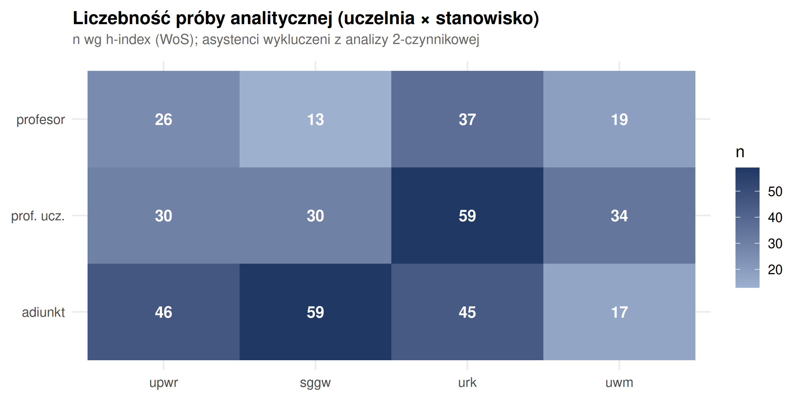
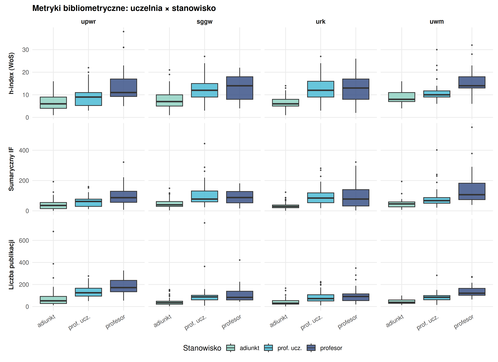

```{r setup, include=FALSE}
knitr::opts_chunk$set(
  echo = FALSE, warning = FALSE, message = FALSE,
  fig.align = "center", out.width = "100%", dpi = 200
)
library(dplyr)
library(tidyr)
library(ggplot2)
library(knitr)
library(here)
```

# Wprowadzenie

## Kontekst: ewaluacja jakości działalności naukowej w Polsce

Polski system oceny nauki opiera się na okresowej **ewaluacji jakości działalności naukowej**, przeprowadzanej co cztery lata przez Komisję Ewaluacji Nauki na podstawie danych zgromadzonych w systemie POL-on [@rozp_ewaluacja2022]. Ewaluacja nie ocenia pojedynczych naukowców, lecz **podmioty (uczelnie, instytuty) w obrębie poszczególnych dyscyplin naukowych**, nadając każdej parze podmiot–dyscyplina kategorię naukową (A+, A, B+, B lub C). Kategoria przekłada się bezpośrednio na uprawnienia jednostki — m.in. prawo do nadawania stopni naukowych oraz wysokość finansowania.

Punktem odniesienia dla całego systemu jest urzędowa **klasyfikacja dziedzin i dyscyplin naukowych**; analizowana w niniejszej pracy dyscyplina *rolnictwo i ogrodnictwo* należy do dziedziny nauk rolniczych [@rozp_dyscypliny2025]. Ocena w ewaluacji opiera się na trzech kryteriach: (I) poziomie naukowym prowadzonej działalności, mierzonym punktacją ministerialną publikacji i patentów, (II) efektach finansowych badań naukowych oraz (III) wpływie działalności naukowej na funkcjonowanie społeczeństwa i gospodarki. Wagi kryteriów różnią się między dziedzinami — dla nauk rolniczych Kryterium I waży 50 %, Kryterium II 35 %, a Kryterium III 15 % oceny [@rozp_ewaluacja2022; @rozp_ewaluacja_nowela2025]. Kryterium I, dominujące w naukach rolniczych, ma charakter bibliometryczny: liczbę punktów wyznacza się z udziałów jednostkowych autorów w publikacjach, w ramach limitu slotów publikacyjnych proporcjonalnego do liczby pracowników danej dyscypliny (liczby N).

To właśnie bibliometryczny rdzeń ewaluacji — punktacja ministerialna, wskaźniki cytowań, produktywność publikacyjna — czyni indywidualne profile dorobku naukowców interesującym przedmiotem analizy. Niniejsza praca nie odtwarza algorytmu ewaluacji (operującego na poziomie podmiotu), lecz bada **zróżnicowanie indywidualnych profili bibliometrycznych** osób prowadzących działalność naukową w ewaluowanej dyscyplinie, wykorzystując kategorię naukową uczelni jako zmienną opisową kontekstu.

## Cel pracy

Niniejsza praca dyplomowa stanowi analizę bibliometryczną pracowników naukowych dyscypliny **rolnictwo i ogrodnictwo** w czterech polskich uczelniach przyrodniczych korzystających z systemu Omega-PSIR jako Bazy Wiedzy: Uniwersytetu Przyrodniczego we Wrocławiu (UPWr, kategoria A), Szkoły Głównej Gospodarstwa Wiejskiego w Warszawie (SGGW, A), Uniwersytetu Rolniczego im. Hugona Kołłątaja w Krakowie (URK, A) oraz Uniwersytetu Warmińsko-Mazurskiego w Olsztynie (UWM, B+).

Kryterium doboru próby jest **jednolitość systemu informacji o nauce** — wszystkie cztery uczelnie korzystają z polskiego CRIS-u Omega-PSIR, co zapewnia identyczną procedurę pozyskania danych, te same kategorie pól bibliometrycznych i porównywalność wskaźników. Spójność technologiczna źródła danych jest w analizie naukoznawczej istotniejsza niż jednorodność kategorii ewaluacyjnej, ponieważ niejednorodne CRIS-y dramatycznie różnią się polityką deponowania publikacji, co ujawnił test kompletności przeprowadzony na etapie projektowania badania (DSpace-CRIS Uniwersytetu Przyrodniczego w Poznaniu pokazywał ~10–15 % rzeczywistego dorobku naukowców widocznego w Omega-PSIR). Kategoria ewaluacyjna MEiN (A vs B+) jest w badanej próbie **idealnie współliniowa z uczelnią** — UWM jest jedyną uczelnią kategorii B+, pozostałe trzy mają kategorię A. Z tego powodu kategorii nie można wprowadzić jako niezależnego czynnika modelu (byłaby aliasowana z efektem uczelni); ujęto ją zatem **wyłącznie opisowo**, a wynikające z tego ograniczenie omówiono w rozdziale Dyskusja.

Pominięto Uniwersytet Przyrodniczy w Poznaniu (kategoria A, DSpace) z powodu niekompletności jego CRIS-u oraz Zachodniopomorski Uniwersytet Technologiczny w Szczecinie (kategoria A) ze względu na brak publicznie dostępnego CRIS-u. Uniwersytet Przyrodniczy w Lublinie (B+) został pominięty ze względu na własny system OpenUP o asymetrycznej metodyce ekstrakcji.

## Pytania badawcze

- **P1.** Czy istnieją odróżnialne typy profili bibliometrycznych wśród naukowców dyscypliny rolnictwo i ogrodnictwo (klastrowanie typologiczne)?
- **P2.** Jak silnie stanowisko naukowe (adiunkt / profesor uczelni / profesor) i uczelnia różnicują wskaźniki bibliometryczne (analiza 2-czynnikowa uczelnia × stanowisko; kategoria ewaluacyjna MEiN ujęta opisowo ze względu na współliniowość z uczelnią)?
- **P3.** Czy można predykować wysoki impact (top decyl sumarycznego IF) z cech strukturalnych (stanowisko, uczelnia, liczba publikacji, sieci współpracy)?
- **P4.** Jak wygląda struktura sieci współautorstwa wśród naukowców czterech badanych uczelni — czy widoczne są wspólnoty międzyuczelniane?

# Materiał i metodyka

## Źródła danych

- **Omega-PSIR (4 instancje uczelniane)** [@omegapsir2024] — primary source: agregaty bibliometryczne per autor (h-index WoS/Scopus [@hirsch2005], sumaryczny IF [@garfield2006], SNIP [@moed2010snip], punktacja MEiN/ministerialna, liczba publikacji), dane afiliacyjne (jednostka, wydział, stanowisko), identyfikatory ORCID.
- **OpenAlex API** [@openalex2022] — uzupełnienie: FWCI (Field-Weighted Citation Impact, niepoliczalny lokalnie) [@waltman2016review], liczba cytowań (cited_by_count), lista współautorów do analizy sieci, oraz cross-check QA dla metryk lokalnych.

Analizowane wskaźniki to **per-autorskie agregaty bibliometryczne** (sumaryczny IF, sumaryczna punktacja MEiN, h-index, liczba publikacji). Należy podkreślić, że są one bibliometrycznym *proxy* indywidualnego dorobku, a **nie** rekonstrukcją oficjalnej metodyki ewaluacji: ta operuje na poziomie podmiotu, posługuje się udziałami jednostkowymi i limitem slotów (3-krotność liczby N), a Impact Factor nie jest w niej kryterium urzędowym (jest nim punktacja ministerialna czasopism) [@rozp_ewaluacja2022]. Wskaźniki te dobrano jako porównywalne i dostępne w jednolitej formie miary profilu naukowca, nie zaś jako odtworzenie wyniku ewaluacyjnego.

## Procedura pozyskania danych

(Szczegóły w rozdziale Metodyka — zob. skrypty `Skrypty/R/01_*.R` do `04_*.R`.)

## Metody analityczne

- EDA + statystyka klasyczna: analiza 2-czynnikowa uczelnia × stanowisko z automatycznym doborem testu (2-czynnikowa ANOVA + Tukey HSD przy spełnionych założeniach; Kruskal-Wallis na komórkach interakcji + test Dunna z korektą Bonferroniego przy ich naruszeniu). Poziom *asystent* (n = 26, nieobecny w UWM i UPWr) wykluczono z analizy interakcji. Metryki oparte na punktacji MEiN analizowano na trzech uczelniach (SGGW nie eksponuje sum_MEiN w API — 100 % braków danych).
- PCA + klastrowanie k-means (walidacja silhouette + gap statistic) — typologia profili bibliometrycznych. Cechy o pełnym pokryciu czterech uczelni (h-index WoS, sumaryczny IF, IF na publikację, liczba publikacji), z pominięciem metryk MEiN, które wykluczyłyby całą próbę SGGW.
- Modelowanie predykcyjne: Random Forest [@breiman2001] + XGBoost [@chen2016] (CV 5-fold + wartości SHAP [@lundberg2017] do interpretacji ważności cech).
- Analiza sieci współautorstwa: igraph + wykrywanie wspólnot algorytmem Louvain [@blondel2008] z oceną modularności [@newman2006] — mapowanie wspólnot międzyuczelnianych.

# Wyniki

## Charakterystyka próby

Po scrapingu czterech instancji Omega-PSIR i czyszczeniu danych (usunięcie rekordów niebędących pracownikami naukowymi) próba liczyła **462 osoby**: UPWr 118, SGGW 112, URK 162, UWM 70. Dopasowanie do bazy OpenAlex (po identyfikatorze ROR uczelni i nazwisku, dopasowanie rozmyte miarą Jaro-Winklera ≥ 0,85 [@winkler1990]) powiodło się dla **318 osób (68,8 %)**; dopasowanie było wyraźnie słabsze dla URK (47,5 %), co przekłada się na niedoreprezentowanie tej uczelni w analizach opartych na metrykach OpenAlex (FWCI, sieci współautorstwa).

W analizie 2-czynnikowej uwzględniono 420 osób posiadających określone stanowisko z trzech kategorii (adiunkt, profesor uczelni, profesor); liczebności komórek przedstawia @fig-proba — wszystkie wynoszą co najmniej 13, co umożliwia estymację członu interakcji.

{#fig-proba width=75%}

## Struktura korelacyjna wskaźników (P2)

Wskaźniki bibliometryczne układają się w dwa słabo skorelowane wymiary: **wielkości dorobku** (h-index WoS, sumaryczny IF, punktacja MEiN, liczba publikacji — wzajemne korelacje 0,82–0,95) oraz **intensywności jakościowej** (IF na publikację). Korelacja sumarycznego IF z punktacją MEiN wynosi r = 0,95 — punktacja ministerialna jest niemal liniową funkcją sumarycznego IF, co potwierdza, że oba wskaźniki mierzą zbliżony konstrukt. Istotny jest ujemny związek liczby publikacji z IF na publikację (r = -0,37): naukowcy o największej produktywności mają przeciętnie niższy IF przypadający na pojedynczą pracę — sygnał klasycznego kompromisu ilość–jakość.

## Różnicowanie wskaźników: uczelnia × stanowisko (P2)

Dla wszystkich sześciu analizowanych metryk testy Shapiro-Wilka i Levene'a odrzuciły założenia normalności rozkładu reszt i jednorodności wariancji (rozkłady bibliometryczne są silnie prawoskośne), wobec czego zastosowano ścieżkę nieparametryczną: **test Kruskala-Wallisa na komórkach interakcji uczelnia × stanowisko z testem post-hoc Dunna i korektą Bonferroniego**. @fig-metryki przedstawia rozkłady trzech metryk o pełnym pokryciu.

{#fig-metryki width=90%}

Stanowisko różnicuje wskaźniki monotonicznie i konsekwentnie we wszystkich czterech uczelniach — mediany rosną w sekwencji adiunkt → profesor uczelni → profesor. Po konserwatywnej korekcie Bonferroniego dla porównań wielokrotnych (12 komórek) istotne różnice między komórkami ujawniły się jednak tylko dla trzech metryk:

| Metryka | Test | Liczba grup jednorodnych (CLD) | Różnicowanie |
|---|---|---:|---|
| Liczba publikacji | Kruskal-Wallis + Dunn | 5 | istotne |
| IF na publikację | Kruskal-Wallis + Dunn | 5 | istotne |
| Sumaryczna punktacja MEiN (3 uczelnie) | Kruskal-Wallis + Dunn | 3 | istotne |
| h-index (WoS) | Kruskal-Wallis + Dunn | 1 | brak istotnych różnic między komórkami |
| Sumaryczny IF | Kruskal-Wallis + Dunn | 1 | brak istotnych różnic między komórkami |
| IF / MEiN | Kruskal-Wallis + Dunn | 1 | brak istotnych różnic między komórkami |

Brak istotnych różnic dla h-index i sumarycznego IF przy widocznym trendzie wynika z dużej rozproszenia rozkładów i konserwatywności korekty Bonferroniego na 12 komórkach — kierunkowy wzrost z rangą jest wyraźny, lecz nie osiąga istotności w porównaniach parami.

## Typologia profili bibliometrycznych (P1)

Analiza głównych składowych na czterech standaryzowanych cechach pełnego pokrycia (n = 449) wykazała, że dwie pierwsze składowe wyjaśniają **87,9 % wariancji** (PC1 — 54,1 %, PC2 — 33,8 %). Walidacja liczby klastrów metodą sylwetki wskazała rozwiązanie **dwuklastrowe**.

{#fig-klastry width=95%}

Otrzymane klastry mają jednoznaczną interpretację jako podział na **rdzeń wysokoproduktywny** i **pozostałą populację**:

| Klaster | n | h-index WoS | Sumaryczny IF | IF / publikację | Liczba publikacji |
|---|---:|---:|---:|---:|---:|
| 1 — wysoki dorobek | 104 | 17,8 | 163,1 | 1,38 | 160,7 |
| 2 — pozostali | 345 | 7,4 | 44,8 | 1,17 | 61,8 |

Walidacja zewnętrzna typologii dała wynik kluczowy dla całej pracy: przynależność do klastra jest **niezależna od uczelni** (χ² test niezależności p = 0,19; Craméra V = 0,10), natomiast **silnie powiązana ze stanowiskiem** (p < 0,001; Craméra V = 0,45). Typologia profilu bibliometrycznego odzwierciedla zatem oś senioralności/produktywności, która przebiega jednorodnie przez wszystkie cztery uczelnie. Zgodność klastrowania k-means z hierarchicznym (Warda) była umiarkowana (Craméra V = 0,67).

## Predykcja wysokiego impactu (P3)

Zmienną celu zdefiniowano jako przynależność do górnego decyla sumarycznego IF w całej próbie (high-impact: 46 z 452 osób, 10,2 %). Predyktorami były cechy strukturalne (stanowisko, uczelnia, liczba publikacji) oraz cechy sieciowe/cytowaniowe z OpenAlex (liczba unikalnych współautorów, średnia liczba autorów na pracę, średni FWCI); wskaźniki h-index i sumaryczny IF wykluczono jako predyktory ze względu na tautologiczny związek ze zmienną celu. Porównano Random Forest i XGBoost (strojenie na 5-krotnej walidacji krzyżowej).

| Model | ROC AUC | Trafność | Czułość | Swoistość |
|---|---:|---:|---:|---:|
| Random Forest | 0,953 | 0,902 | 0,200 | 0,988 |
| XGBoost | 0,931 | 0,913 | 0,200 | 1,000 |

Oba modele osiągnęły **wysoką zdolność dyskryminacyjną** (AUC ok. 0,93–0,95), lecz przy domyślnym progu decyzyjnym 0,5 i silnie niezbalansowanej zmiennej celu (10 % klasy pozytywnej) ich **czułość jest niska (0,20)** — modele poprawnie rankują obserwacje, ale klasyfikują niemal wszystkie jako klasę większościową, przez co wysoka trafność (0,90) odpowiada w praktyce trywialnej regule „zawsze niski impact".

Problem ten dotyczy punktu pracy, nie zdolności dyskryminacyjnej. Wyznaczono zatem **próg decyzyjny optymalizujący indeks J Youdena** [@youden1950] (czułość + swoistość - 1) na predykcjach out-of-fold z walidacji krzyżowej (a więc bez strojenia na zbiorze testowym), uzyskując próg 0,088 — znacznie niższy od 0,5, adekwatny do 10-procentowej prewalencji klasy pozytywnej. Po zastosowaniu tego progu do zbioru testowego model Random Forest osiąga **czułość 1,00 przy swoistości 0,82** (zbalansowana trafność 0,91), poprawnie identyfikując wszystkie obserwacje wysokiego impactu kosztem 15 fałszywie dodatnich:

| RF — punkt pracy | Czułość | Swoistość | Indeks J | Zbalansowana trafność |
|---|---:|---:|---:|---:|
| Próg domyślny (0,5) | 0,20 | 0,99 | 0,19 | — |
| Próg Youdena (0,088) | 1,00 | 0,82 | 0,82 | 0,91 |

Analiza ważności cech (ważność permutacyjna Random Forest oraz wartości SHAP dla XGBoost; @fig-modele) wskazała **liczbę publikacji** jako predyktor dominujący, a w dalszej kolejności liczbę unikalnych współautorów i średni FWCI; cechy stanowiska i uczelni miały marginalny wkład. Predykcja wysokiego impactu opiera się więc przede wszystkim na produktywności i osadzeniu w sieci współpracy, a nie na formalnej pozycji akademickiej czy afiliacji.

{#fig-modele width=95%}

## Sieć współautorstwa (P4)

Sieć współautorstwa zbudowano z krawędzi OpenAlex ograniczonych do współprac wewnątrz badanej kohorty (oba węzły dopasowane, waga ≥ 2 wspólne publikacje): 318 węzłów i 465 krawędzi. Największa składowa spójności obejmuje **210 węzłów (66 %)** i 430 krawędzi, o gęstości 0,020, współczynniku gronowania (transitivity) 0,42 i średnicy 20.

{#fig-siec width=95%}

Wykrywanie wspólnot algorytmem Louvain wyodrębniło **19 społeczności przy bardzo wysokiej modularności Q = 0,852**, co świadczy o silnie zmodularyzowanej strukturze współpracy. Zgodność wykrytych społeczności ze zmiennymi opisowymi oceniono skorygowanym indeksem Randa (ARI) [@hubert1985] oraz znormalizowaną informacją wzajemną (NMI); rozstrzyga ona pytanie P4:

| Porównanie | ARI | NMI |
|---|---:|---:|
| Społeczność vs uczelnia | 0,309 | 0,615 |
| Społeczność vs stanowisko | 0,016 | 0,125 |

Społeczności współautorstwa pokrywają się przede wszystkim z **afiliacją uczelnianą** (NMI = 0,62), a niemal w ogóle ze stanowiskiem (NMI = 0,12). Heatmapa zgodności (@fig-siec, prawy panel) pokazuje, że większość społeczności jest jednorodna uczelniano (po 100 % członków z jednej uczelni); wspólnoty międzyuczelniane są nieliczne. Innymi słowy współpraca naukowa w badanej dyscyplinie ma charakter przede wszystkim **wewnątrzinstytucjonalny**. Węzłami o najwyższej centralności stopnia są profesorowie z grupy gleboznawczej UPWr.

# Dyskusja

## Dwoistość: profil indywidualny a struktura współpracy

Najważniejszym ustaleniem pracy jest **rozbieżność osi organizujących indywidualny dorobek i zbiorową współpracę**. Z jednej strony profil bibliometryczny pojedynczego naukowca — uchwycony zarówno przez analizę 2-czynnikową (warstwa 1), jak i przez typologię klastrową (warstwa 2) — porządkuje się wzdłuż **osi senioralności**: różnice między stanowiskami są monotoniczne i jednorodne dla wszystkich czterech uczelni, a przynależność do klastra wysokoproduktywnego jest silnie powiązana ze stanowiskiem (Craméra V = 0,45), lecz statystycznie niezależna od uczelni (V = 0,10). Z drugiej strony sieć współautorstwa (warstwa 4) dzieli populację wzdłuż **osi afiliacyjnej**: społeczności Louvain pokrywają się przede wszystkim z uczelnią (NMI = 0,62), a niemal w ogóle ze stanowiskiem (NMI = 0,12).

Innymi słowy: *kim* naukowiec jest pod względem bibliometrycznym zależy od etapu kariery niezależnie od macierzystej instytucji, ale *z kim* współpracuje determinuje przede wszystkim afiliacja. Współpraca w badanej dyscyplinie ma charakter wyraźnie wewnątrzinstytucjonalny — mosty międzyuczelniane są nieliczne, a wysoka modularność sieci (Q = 0,852) potwierdza silnie izolowane skupiska. Jest to spójne z naturą nauk rolniczych, gdzie znaczna część badań osadzona jest w lokalnej infrastrukturze (pola doświadczalne, stacje badawcze, lokalne uwarunkowania glebowo-klimatyczne).

## Predyktory wysokiego impactu

Modelowanie predykcyjne (warstwa 3) wzmacnia ten obraz: wysoki impact (górny decyl sumarycznego IF) daje się przewidzieć z cech strukturalnych z bardzo dobrą zdolnością dyskryminacyjną (AUC ok. 0,95), a najważniejszymi predyktorami są **liczba publikacji oraz osadzenie w sieci współpracy** (liczba unikalnych współautorów, FWCI), nie zaś formalne stanowisko czy uczelnia. Sugeruje to, że wysoki dorobek jest funkcją produktywności i kapitału sieciowego, a nie pozycji w hierarchii akademickiej per se — stanowisko jest raczej *skutkiem* skumulowanego dorobku niż jego niezależnym predyktorem. Niska czułość modelu przy progu domyślnym okazała się problemem punktu pracy, a nie modelu: po kalibracji progu na danych walidacyjnych model wiarygodnie identyfikuje całą klasę wysokiego impactu (czułość 1,00, zbalansowana trafność 0,91).

## Kategoria ewaluacyjna MEiN

Ze względu na idealną współliniowość kategorii z uczelnią (UWM jako jedyna uczelnia B+) nie sposób rozdzielić efektu kategorii od efektu instytucji. Na poziomie opisowym UWM (B+) nie odstaje systematycznie *in minus* od uczelni kategorii A — jego mediany metryk mieszczą się w zakresie pozostałych uczelni — co sugeruje, że formalna kategoria ewaluacyjna nie przekłada się wprost na różnice w indywidualnych wskaźnikach bibliometrycznych badanej kohorty. Wniosek ten należy jednak traktować ostrożnie, jako hipotezę do weryfikacji na próbie z większą liczbą uczelni B+.

## Dynamika rozwoju a wrażliwość na źródło danych

Statyczny obraz dorobku uzupełniono analizą eksploracyjną **tempa rozwoju produktywności** każdej uczelni, mierzonego rocznym wzrostem liczby publikacji na badacza (CAGR z regresji log-liniowej trajektorii 2008–2024, znormalizowanej do okresu bazowego). Analizę przeprowadzono dwukrotnie i wynik okazał się **silnie zależny od źródła danych** — co stanowi samodzielny rezultat metodyczny. Na danych OpenAlex uczelnie układały się w wąskim, nierozróżnialnym zakresie (CAGR 3,2–4,6 %), z URK na ostatnim i SGGW na pierwszym miejscu. Po powtórzeniu analizy na **pełnych listach publikacji Omega-PSIR** (100 % próby, 491 osób, pełny katalog z polskimi czasopismami i monografiami nieindeksowanymi w OpenAlex) **ranking uległ odwróceniu** (@fig-dynamika): najszybciej rozwijają się URK (CAGR 5,4 %; 95 % CI 0,8–10,3 %) i UWM (4,9 %; 1,6–8,2 %), podczas gdy UPWr (2,7 %; −0,6–6,0 %) i SGGW (1,2 %; −0,8–3,2 %) są praktycznie płaskie. Podział ten utrzymuje się w wariancie odpornościowym ograniczonym do kadry o ustalonej karierze (pierwsza publikacja ≤ 2010 r.: URK 3,9 %, UWM 4,0 % wobec UPWr 0,7 %, SGGW −0,1 %), nie jest więc artefaktem napływu młodej kadry.

{#fig-dynamika width=80%}

Odwrócenie nie jest przypadkowe: URK — uczelnia o najsłabszym dopasowaniu do OpenAlex (47,5 %) — była przez ten niedobór pokrycia systematycznie *zaniżana* i pozornie najwolniejsza, podczas gdy w kompletnych danych CRIS okazuje się liderem tempa. Ponadto wyższe, bogatsze o lokalny dorobek poziomy bazowe w danych CRIS sprawiają, że pozorny „wzrost" widoczny w OpenAlex był po części artefaktem rosnącego w czasie pokrycia polskich publikacji przez tę bazę. Wynik ten jest bezpośrednim potwierdzeniem **centralnej tezy metodycznej pracy** — że jednorodność systemu CRIS jest dla porównań międzyuczelnianych ważniejsza niż wygoda gotowego indeksu globalnego: ten sam wskaźnik dynamiki prowadzi do przeciwnych wniosków w zależności od kompletności źródła. Same różnice tempa należy przy tym traktować ostrożnie ze względu na szerokie, częściowo nakładające się przedziały ufności; wiarygodny jest jakościowy podział na uczelnie rozwijające się (URK, UWM) i o produktywności ustabilizowanej (UPWr, SGGW), nie zaś dokładny ranking.

## Ograniczenia

- **Proxy a metodyka oficjalna.** Analiza opiera się na per-autorskich agregatach bibliometrycznych, które przybliżają indywidualny dorobek, ale nie odtwarzają algorytmu ewaluacji jakości działalności naukowej (poziom podmiotu, udziały jednostkowe, sloty, punktacja ministerialna zamiast IF) [@rozp_ewaluacja2022]. Wniosków nie należy zatem wprost przekładać na przewidywane kategorie ewaluacyjne uczelni.
- **Confounding kategoria–uczelnia.** Pojedyncza uczelnia kategorii B+ uniemożliwia oddzielenie wpływu kategorii ewaluacyjnej od idiosynkrazji instytucji; kategorię ujęto wyłącznie opisowo.
- **Niejednorodność pokrycia metryk.** SGGW nie eksponuje sumarycznej punktacji MEiN w API (100 % braków), przez co analizy oparte na MEiN ograniczono do trzech uczelni. UWM nie udostępnia SNIP. Wymusza to ostrożność w porównaniach międzyuczelnianych dla tych wskaźników.
- **Słabe dopasowanie URK do OpenAlex** (47,5 % wobec 68,8 % średnio). Uniwersytet Rolniczy w Krakowie jest niedoreprezentowany w analizach opartych na OpenAlex (FWCI, sieci współautorstwa: 77 ze 162 osób), co może zaniżać gęstość jego podsieci i obciążać metryki cytowaniowe brakiem typu MNAR.
- **Przekrojowy charakter danych.** Wskaźniki kumulatywne (h-index, sumaryczny IF, liczba publikacji) rosną ze stażem; brak kontroli wieku akademickiego oznacza, że efekt stanowiska częściowo nakłada się na efekt długości kariery. Obserwowana zależność profilu od stanowiska ma więc komponentę mechaniczną (kumulacji), której niniejsze dane nie pozwalają odseparować.
- **Mała liczność klasy pozytywnej** w modelowaniu (46 osób); mimo poprawnej walidacji krzyżowej i kalibracji progu wyniki predykcyjne należy traktować jako orientacyjne.
- **Eksploracyjny charakter analizy dynamiki.** Tempo rozwoju oszacowano na trajektoriach przekrojowo zatrudnionej kadry (survivorship — bez osób, które odeszły), a przedziały ufności CAGR są szerokie i częściowo się nakładają; analizę należy traktować jako sygnał kierunkowy, nie ścisły ranking.
- **Niepełne pokrycie OpenAlex dla polskich czasopism** — przyczyna przyjęcia Omega-PSIR jako źródła podstawowego — sprawia, że metryki pochodne OpenAlex (FWCI) są dostępne tylko dla zmatchowanej części próby.

# Wnioski

1. **P1 (typologia).** Wśród naukowców dyscypliny rolnictwo i ogrodnictwo wyróżniają się dwa odróżnialne typy profili bibliometrycznych: nieliczny rdzeń wysokoproduktywny (ok. 23 % populacji) oraz pozostała większość. Typologia ta jest jednorodna dla wszystkich czterech uczelni.
2. **P2 (różnicowanie).** Stanowisko różnicuje wskaźniki bibliometryczne monotonicznie i jednolicie międzyuczelnianie (adiunkt < profesor uczelni < profesor); uczelnia różnicuje je słabo. Po konserwatywnej korekcie wielokrotnych porównań istotność osiągają wskaźniki produktywnościowe (liczba publikacji, punktacja MEiN) i intensywność jakościowa (IF na publikację).
3. **P3 (predykcja).** Wysoki impact daje się przewidzieć z cech strukturalnych z wysoką zdolnością dyskryminacyjną (AUC ok. 0,95); kluczowe są produktywność i kapitał sieciowy, a nie pozycja formalna. Po kalibracji progu model jest praktycznie użyteczny (czułość 1,00, zbalansowana trafność 0,91).
4. **P4 (sieci).** Sieć współautorstwa jest silnie zmodularyzowana (Q = 0,852), a wspólnoty pokrywają się głównie z afiliacją uczelnianą (NMI = 0,62), nie ze stanowiskiem. Współpraca ma charakter przede wszystkim wewnątrzinstytucjonalny; wspólnoty międzyuczelniane są nieliczne.

Łącznie wyniki rysują spójny obraz: **indywidualny dorobek organizuje senioralność, a zbiorową współpracę — afiliacja**. Praca potwierdza również użyteczność metodyczną doboru próby według jednorodności systemu CRIS: spójność technologiczna Omega-PSIR umożliwiła porównywalną ekstrakcję wskaźników, których pozyskanie z niejednorodnych repozytoriów byłoby obciążone niekontrolowaną zmiennością polityki deponowania.

# Bibliografia

::: {#refs}
:::
