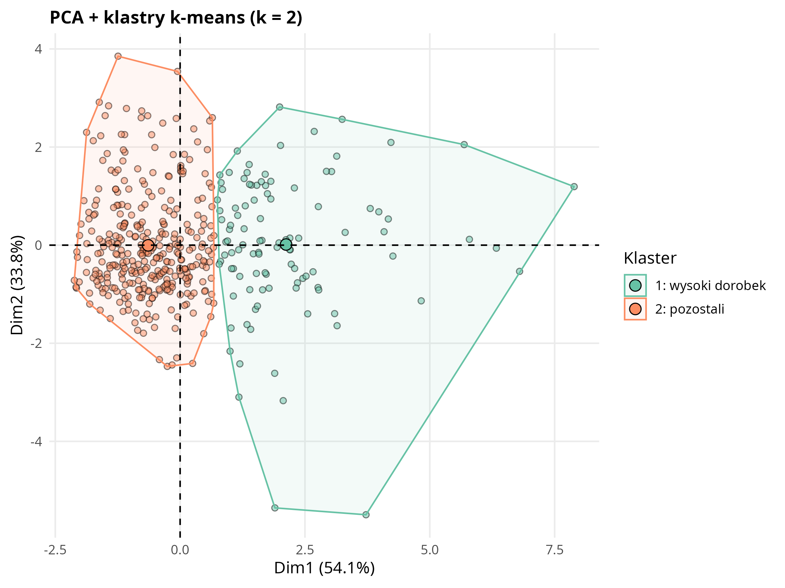
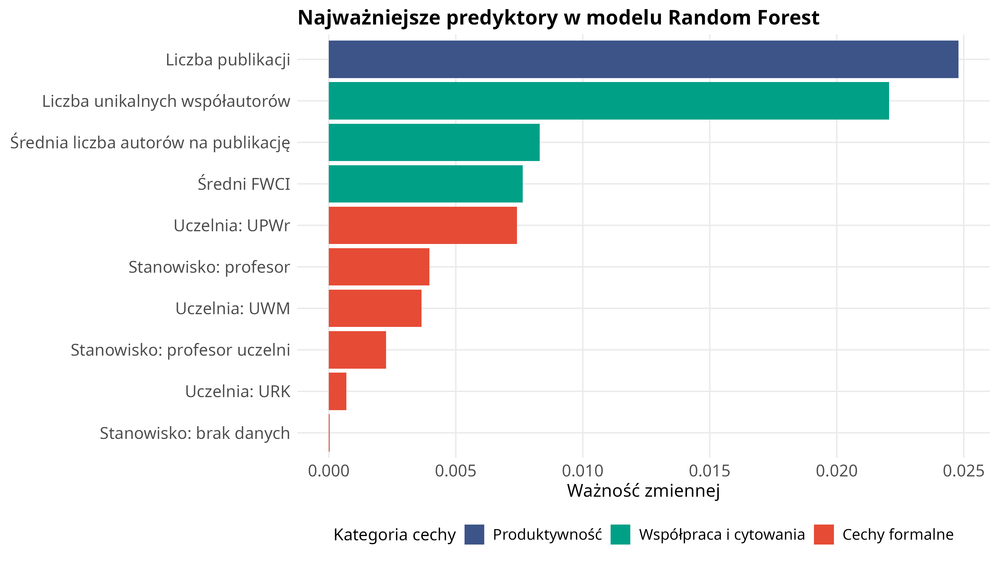
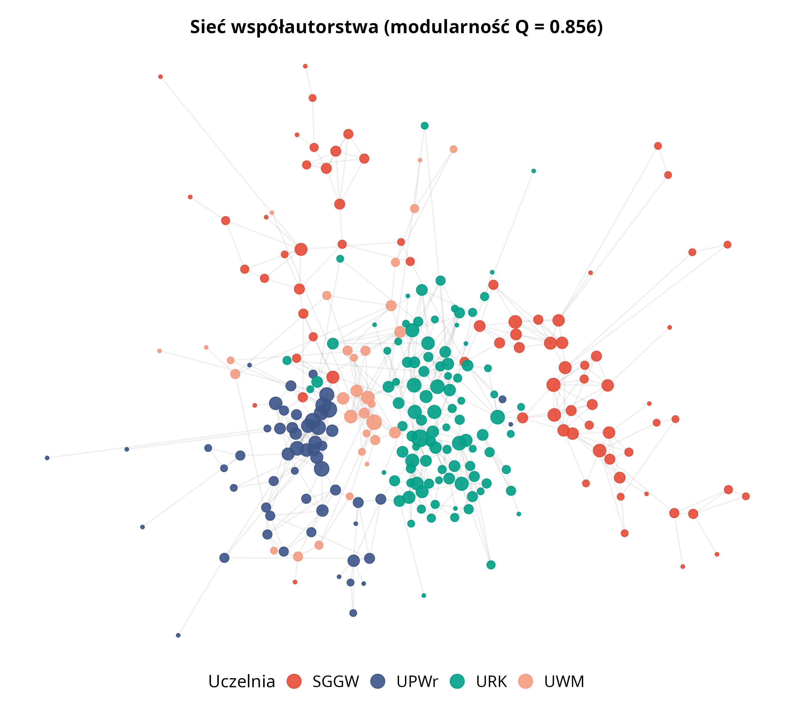

```{r setup, include=FALSE}
knitr::opts_chunk$set(
  echo = FALSE, warning = FALSE, message = FALSE,
  fig.align = "center", out.width = "100%", dpi = 200
)
library(dplyr)
library(tidyr)
library(ggplot2)
library(knitr)
library(here)
library(flextable)

# Jednolity styl tabel pracy. Czcionka zgodna z dokumentem:
# PDF -> Latin Modern Roman (szeryfowa), DOCX -> Aptos.
ft_praca <- function(df, fsize = 10) {
  tbl_font <- if (knitr::is_latex_output()) "Latin Modern Roman" else "Aptos"
  ft <- flextable(df)
  ft <- font(ft, fontname = tbl_font, part = "all")
  ft <- fontsize(ft, size = fsize, part = "all")
  ft <- align(ft, align = "center", part = "header")
  ft <- valign(ft, valign = "center", part = "header")
  ft <- align(ft, j = 1, align = "left", part = "body")
  if (ncol(df) >= 2) ft <- align(ft, j = seq(2, ncol(df)), align = "center", part = "body")
  set_table_properties(ft, layout = "autofit", width = 1)
}
```



# Streszczenie {.unnumbered}

Praca analizuje dorobek publikacyjny 462 pracowników z dyscypliny rolnictwo i ogrodnictwo z czterech polskich uczelni przyrodniczych: UPWr, SGGW, URK i UWM. Wykorzystano dane z systemu Omega-PSIR, a następnie uzupełniono je informacjami z bazy OpenAlex, między innymi o wskaźnik wpływu publikacji i dane o współautorstwie.

Analiza obejmowała cztery części: porównanie wyników między uczelniami i stanowiskami, podział pracowników na podobne profile publikacyjne, przewidywanie wysokiego wpływu naukowego oraz badanie sieci współpracy między autorami.

Badania wykazały, że dorobek indywidualny i współpraca naukowa zależą od różnych czynników. **Indywidualne osiągnięcia publikacyjne zależą głównie od etapu kariery**: im wyższe stanowisko, tym większy dorobek, i widać to podobnie na wszystkich uczelniach. Natomiast **współpraca między autorami zależy głównie od uczelni**: badacze najczęściej współpracują w ramach swojej afiliacji, a nie według stanowiska. Wysoki wpływ można dość dobrze przewidzieć na podstawie cech badacza. Najważniejsze są produktywność i pozycja w sieci współpracy, a nie samo stanowisko formalne. Model rozróżnia osoby o wysokim i niższym wpływie skumulowanym bardzo skutecznie, osiągając AUC około 0,97, przy czym ten cel jest po części pochodną liczby publikacji. Gdy celem jest jakość niekumulatywna (intensywność cytowań niezależna od dorobku), predykcja jest wyraźnie trudniejsza (AUC około 0,81) i zależy nie od stażu, lecz od struktury współpracy. Wyniki potwierdzają także, że jednorodność i kompletność danych są warunkiem wiarygodnego wnioskowania, ważniejszym niż wygoda gotowych indeksów globalnych: ten sam wskaźnik tempa rozwoju prowadzi do przeciwnych wniosków, gdy dane są niepełne. W polskim szkolnictwie wyższym systemy klasy CRIS, takie jak Omega-PSIR, są więc bezpieczniejszą podstawą porównań międzyuczelnianych niż bazy globalne.

**Słowa kluczowe:** bibliometria, naukometria, Omega-PSIR, OpenAlex, rolnictwo i ogrodnictwo, ewaluacja nauki, klastrowanie, sieci współautorstwa, uczenie maszynowe.



# Wprowadzenie

## Kontekst: ewaluacja jakości działalności naukowej w Polsce

Polski system oceny nauki opiera się na okresowej **ewaluacji jakości działalności naukowej**, przeprowadzanej co cztery lata przez Komisję Ewaluacji Nauki na podstawie danych zgromadzonych w systemie POL-on [@rozp_ewaluacja2022]. Ewaluacja nie ocenia pojedynczych naukowców, lecz **podmioty (uczelnie, instytuty) w obrębie poszczególnych dyscyplin naukowych**, nadając każdej parze podmiot–dyscyplina kategorię naukową (A+, A, B+, B lub C). Kategoria przekłada się bezpośrednio na uprawnienia jednostki, m.in. prawo do nadawania stopni naukowych oraz wysokość finansowania.

Punktem odniesienia dla całego systemu jest urzędowa **klasyfikacja dziedzin i dyscyplin naukowych**; analizowana w niniejszej pracy dyscyplina rolnictwo i ogrodnictwo należy do dziedziny nauk rolniczych [@rozp_dyscypliny2025]. Ocena w ewaluacji opiera się na trzech kryteriach: (I) poziomie naukowym prowadzonej działalności, mierzonym punktacją ministerialną publikacji i patentów, (II) efektach finansowych badań naukowych oraz (III) wpływie działalności naukowej na funkcjonowanie społeczeństwa i gospodarki. Wagi kryteriów różnią się między dziedzinami; dla nauk rolniczych Kryterium I waży 50 %, Kryterium II 35 %, a Kryterium III 15 % oceny [@rozp_ewaluacja2022; @rozp_ewaluacja_nowela2025]. Kryterium I, dominujące w naukach rolniczych, ma charakter bibliometryczny: liczbę punktów wyznacza się z udziałów jednostkowych autorów w publikacjach, w ramach limitu slotów publikacyjnych proporcjonalnego do liczby pracowników danej dyscypliny (liczby N).

Rozporządzenie klasyfikacyjne wymienia dyscypliny wyłącznie z nazwy, nie wyznaczając formalnie ich zakresu przedmiotowego [@rozp_dyscypliny2025]. Rolnictwo i ogrodnictwo jest jedną z czterech dyscyplin dziedziny nauk rolniczych (obok nauk leśnych, technologii żywności i żywienia oraz zootechniki i rybactwa) i powstało przy reformie klasyfikacji z 2018 r. ze scalenia węższych, wcześniej odrębnych dyscyplin, przede wszystkim agronomii i ogrodnictwa. Jej merytoryczny trzon stanowią nauki o roślinie uprawnej i o środowisku jej wzrostu: produkcja roślinna i agrotechnika, ogrodnictwo (warzywnictwo, sadownictwo, rośliny ozdobne), gleboznawstwo i żywienie roślin, ochrona roślin, hodowla i genetyka roślin, łąkarstwo oraz kształtowanie i ochrona agrocenoz. Poza zakresem dyscypliny pozostają produkcja zwierzęca (przypisana do zootechniki i rybactwa) oraz przetwórstwo płodów rolnych (technologia żywności i żywienia), co czyni rolnictwo i ogrodnictwo przede wszystkim roślinno-środowiskowym segmentem nauk rolniczych.

Ponieważ ewaluacja nauki w dużej mierze opiera się na wskaźnikach bibliometrycznych, takich jak punktacja ministerialna, cytowania i liczba publikacji, indywidualne profile dorobku naukowców są ważnym przedmiotem analizy. Analiza bibliometryczna jest w Polsce wykorzystywana zarówno w polityce naukowej i ewaluacji [@Drabek2012; @Kulczycki2019], jak i do oceny dorobku pracowników poszczególnych uczelni [@Grygiel2009]; polskie piśmiennictwo dysponuje też przeglądami metod bibliometrycznych stosowanych do oceny i prognozowania rozwoju dyscyplin naukowych [@Opalinski2017]. Niniejsza praca nie odtwarza oficjalnego algorytmu ewaluacji, który działa na poziomie uczelni i dyscypliny. Analizuje natomiast zróżnicowanie indywidualnych profili bibliometrycznych pracowników prowadzących działalność naukową w tej samej dyscyplinie, a kategorię naukową uczelni traktuje jako zmienną opisową.



## Cel pracy

Niniejsza praca analizuje dorobek bibliometryczny pracowników naukowych dyscypliny rolnictwo i ogrodnictwo w czterech polskich uczelniach przyrodniczych: Uniwersytecie Przyrodniczym we Wrocławiu (UPWr, kategoria A), Szkole Głównej Gospodarstwa Wiejskiego w Warszawie (SGGW, A), Uniwersytecie Rolniczym im. Hugona Kołłątaja w Krakowie (URK, A) oraz Uniwersytecie Warmińsko-Mazurskim w Olsztynie (UWM, B+). Wszystkie te uczelnie korzystają z systemu Omega-PSIR jako Bazy Wiedzy. Nazwa Omega-PSIR określa przy tym sam system informatyczny (CRIS), natomiast jego wdrożenie i publiczny portal na poszczególnych uczelniach funkcjonują pod nazwą Baza Wiedzy.

Omega-PSIR jest systemem klasy CRIS (*Current Research Information System*), opracowanym na Politechnice Warszawskiej w ramach prac nad Bazą Wiedzy PW. System powstał w zespole Politechniki Warszawskiej w ramach projektu SYNAT (finansowanego przez NCBiR), którego celem było zbudowanie otwartej infrastruktury repozytoryjno-informacyjnej dla polskiej nauki; pierwsze wdrożenia produkcyjne na Politechnice Warszawskiej uruchomiono w latach 2011–2013 (od 2013 r. system objął całą uczelnię) [@koperwas2015omega]. Pełni funkcję repozytorium instytucjonalnego oraz narzędzia wspierającego zarządzanie informacją o działalności naukowej uczelni: gromadzi dane o publikacjach, projektach, patentach, raportach, rozprawach doktorskich, metrykach bibliometrycznych i afiliacjach pracowników. Według stanu na 2018 r. system był wdrożony w kilkunastu polskich instytucjach naukowych (Politechnika Warszawska i jedenaście innych uczelni) [@rybinskiOmegaPSIRInstitutionalCRIS2018] i jest dostosowany do krajowego systemu ewaluacji nauki. Jego znaczenie dla niniejszej pracy polega na tym, że udostępnia porównywalne, uczelniane agregaty dorobku naukowego w jednolitej strukturze danych [@omegapsir2024].

Kryterium doboru próby jest **jednolitość systemu informacji o nauce**: wszystkie cztery uczelnie korzystają z polskiego CRIS-u Omega-PSIR, co zapewnia identyczną procedurę pozyskania danych, te same kategorie pól bibliometrycznych i porównywalność wskaźników. W doborze próby ważniejsza od jednorodności kategorii ewaluacyjnej była porównywalność samego źródła danych. Różne systemy CRIS mogą mieć odmienne zasady gromadzenia publikacji, co może prowadzić do nieporównywalnych metryk. Pokazał to test kompletności wykonany na etapie projektowania badania: DSpace-CRIS Uniwersytetu Przyrodniczego w Poznaniu obejmował tylko około 10–15 % dorobku widocznego w systemach Omega-PSIR.
Kategorii ewaluacyjnej MEiN nie analizowano jako osobnej zmiennej, ponieważ w tej próbie jest ona **idealnie współliniowa z uczelnią**: tylko UWM ma kategorię B+, a pozostałe trzy uczelnie mają kategorię A. Nie można więc rozstrzygnąć, czy ewentualne różnice wynikają z kategorii, czy ze specyfiki danej uczelni. Z tego powodu kategorię MEiN potraktowano **wyłącznie opisowo**, a wynikające z tego ograniczenie omówiono w rozdziale Dyskusja.

Pominięto Uniwersytet Przyrodniczy w Poznaniu (kategoria A, DSpace) z powodu niekompletności jego CRIS-u oraz Zachodniopomorski Uniwersytet Technologiczny w Szczecinie (kategoria A) ze względu na brak publicznie dostępnego CRIS-u. Uniwersytet Przyrodniczy w Lublinie (B+) został pominięty ze względu na własny system OpenUP o asymetrycznej metodyce ekstrakcji.



## Pytania badawcze

**1.** Czy badani naukowcy tworzą odrębne typy profili bibliometrycznych?

**2.** W jakim stopniu stanowisko naukowe i uczelnia różnicują ich wskaźniki bibliometryczne?

**3.** Czy da się przewidzieć wysoki wpływ dorobku naukowca na podstawie jego stanowiska, uczelni, liczby publikacji i współpracy z innymi autorami?

**4.** Czy sieć współautorstwa ma charakter głównie wewnątrzuczelniany, czy widoczne są także wspólnoty międzyuczelniane?

# Materiał i metodyka

## Źródła danych

- **Omega-PSIR (4 instancje uczelniane)** [@omegapsir2024], źródło podstawowe: agregaty bibliometryczne per autor (h-index WoS/Scopus [@hirsch2005], sumaryczny IF [@garfield2006], SNIP [@moed2010snip], punktacja MEiN/ministerialna, liczba publikacji), dane afiliacyjne (jednostka, wydział, stanowisko), identyfikatory ORCID.

- **OpenAlex API** [@openalex2022], źródło uzupełniające, dostarcza danych, których nie ma w Omega-PSIR: FWCI (Field-Weighted Citation Impact), czyli znormalizowany dziedzinowo wskaźnik cytowań odnoszący liczbę cytowań pracy do światowej średniej w jej dziedzinie (wartość 1,0 oznacza poziom średniej światowej, a wartości powyżej 1,0 wynik ją przewyższający), którego nie da się policzyć z danych jednej uczelni [@waltman2016review]; liczbę cytowań publikacji; listę współautorów potrzebną do analizy sieci współpracy; oraz niezależne porównanie (kontrolę jakości) metryk pobranych z Omega-PSIR.

Dla każdego autora analizowano podstawowe wskaźniki bibliometryczne, takie jak sumaryczny IF, punktacja MEiN, h-index i liczba publikacji.

Należy zaznaczyć, że wskaźniki te służą jako przybliżenie indywidualnego dorobku naukowego, a nie jako odtworzenie oficjalnej ewaluacji jakości działalności naukowej; ostrożność w traktowaniu pojedynczych wskaźników jako miar jakości naukowej jest zgodna z zasadami odpowiedzialnej naukometrii [@hicksBibliometricsLeidenManifesto2015]. Oficjalna ewaluacja prowadzona jest na poziomie uczelni i dyscypliny, uwzględnia udziały jednostkowe autorów oraz limity slotów publikacyjnych (3-krotność liczby N), a jej podstawą nie jest Impact Factor, lecz punktacja ministerialna czasopism [@rozp_ewaluacja2022].

Wskaźniki wykorzystane w tej pracy wybrano dlatego, że są dostępne w porównywalnej formie dla badanych uczelni i pozwalają opisać profil bibliometryczny naukowca.

## Procedura pozyskania danych

Pozyskanie i przygotowanie danych przeprowadzono według jednolitej procedury (@fig-pipeline). Dane bibliometryczne pobrano z czterech uczelnianych instancji systemu Omega-PSIR za pomocą autorskiego scrapera napisanego w Pythonie, wykorzystującego bibliotekę Playwright i przeglądarkę Chromium.

Wyboru tego narzędzia wymagała architektura portali: strony Omega-PSIR (oparte na frameworku PrimeFaces) ładują część treści dynamicznie, więc zwykłe pobranie kodu HTML nie wystarczało do poprawnej ekstrakcji danych. Sterowanie pełną przeglądarką pozwala poczekać, aż profil autora oraz lista wyników w pełni się załadują, i dopiero wtedy odczytać dane.

Scraper działał w dwóch etapach. W pierwszym etapie przechodził przez listę pracowników odfiltrowaną do dyscypliny rolnictwo i ogrodnictwo i zbierał identyfikatory autorów. W drugim etapie otwierał profil każdego autora i pobierał dane bibliometryczne, afiliacyjne oraz identyfikator ORCID.

Szczególnym problemem była paginacja listy autorów. Kolejne strony wyników nie miały stabilnych adresów URL, dlatego scraper przechodził przez nie tak, jak użytkownik: programowo klikając przycisk „następna strona”. Dzięki temu możliwe było zebranie identyfikatorów wszystkich autorów z wybranej dyscypliny.

Kod scrapera podzielono na część wspólną i konfiguracje dla poszczególnych uczelni. Część wspólna odpowiadała za nawigację, oczekiwanie na załadowanie strony i ekstrakcję danych, natomiast konfiguracje uczelniane uwzględniały drobne różnice między instancjami Omega-PSIR, takie jak nazwy pól czy czas ładowania profilu. Proces zabezpieczono autozapisem postępu, możliwością wznowienia pracy po przerwaniu oraz ponawianiem nieudanych prób pobrania danych.

Dla każdej uczelni zapisano osobny plik CSV. Następnie dane zostały ujednolicone, oczyszczone z duplikatów oraz pozbawione rekordów osób, które nie były pracownikami naukowymi. Po tym etapie końcowa próba analityczna liczyła 462 osoby.

Po oczyszczeniu danych z Omega-PSIR uzupełniono je informacjami z OpenAlex. Najpierw dopasowano autorów z badanej próby do rekordów w OpenAlex, wykorzystując identyfikator instytucji ROR oraz podobieństwo imienia i nazwiska. Oparcie powiązania na kanonicznym identyfikatorze instytucji (ROR) jest zgodne z podejściem stosowanym w dedykowanych narzędziach integracji danych OpenAlex w środowisku R [@ariaOpenalexR2024]. Następnie dla dopasowanych autorów pobrano informacje o publikacjach, cytowaniach, wskaźniku FWCI oraz współautorach. Zapytania do OpenAlex wykonywano z ograniczeniem tempa i identyfikacją użytkownika, zgodnie z zasadami korzystania z API.

Dane z Omega-PSIR i OpenAlex połączono w jeden zbiór analityczny (`profiles_features.csv`). Osobno, na potrzeby analizy dynamiki publikacyjnej, pobrano pełne listy publikacji z systemu Omega-PSIR dla wszystkich zeskrapowanych osób (491, przed odsianiem), wraz z rokiem publikacji i punktacją. Dane między skryptami Python i R przekazywano w formacie CSV.

{#fig-pipeline width=84%}

## Metody analityczne

Całość analizy zorganizowano zgodnie z typowym dla badań bibliometrycznych przepływem pracy: projektowanie badania, gromadzenie i łączenie danych, analiza, wizualizacja oraz interpretacja [@ariaBibliometrix2017]. Obliczenia zaimplementowano samodzielnie w językach Python i R (bez gotowych pakietów do mapowania nauki), korzystając z bibliotek ogólnego przeznaczenia opisanych niżej.

- *Analiza opisowa i statystyczna:* obejmowała porównanie wskaźników między uczelniami i stanowiskami. Założenia parametryczne sprawdzono testami Shapiro-Wilka (normalność reszt modelu w układzie dwuczynnikowym) i Levene'a (jednorodność wariancji); ponieważ dla wszystkich sześciu metryk zostały one naruszone, zastosowano **ścieżkę nieparametryczną**: ogólny test Kruskala-Wallisa dla 12 grup utworzonych przez połączenie uczelni i stanowisk, a następnie, dla metryk z istotnym wynikiem tego testu, post-hoc Dunna z korektą Bonferroniego. Należy zaznaczyć, że Kruskal-Wallis na komórkach porównuje 12 grup łącznie i nie rozdziela formalnie efektów głównych od interakcji. Grupy jednorodne (compact letter display) wyznaczano metodą `multcompLetters` na macierzy istotności porównań parami. Pomocniczo, na potrzeby ryciny rozkładów, ten sam test Dunna z korektą Bonferroniego przeprowadzono w dwóch symetrycznych wariantach jednoczynnikowych: w obrębie każdej uczelni osobno (porównanie stanowisk, małe litery CLD) oraz w obrębie każdego stanowiska osobno (porównanie uczelni, duże litery CLD); każdy wariant kontroluje drugi czynnik, ilustrując różnice między stanowiskami i między uczelniami niezależnie od siebie. Poziom *asystent* (n = 26, nieobecny w UWM i UPWr) wykluczono z analizy interakcji. Metryki oparte na punktacji MEiN analizowano na trzech uczelniach (SGGW nie eksponuje sum_MEiN w API, 100 % braków danych).
- *Analiza PCA i klastrowanie k-means:* podział naukowców na grupy o podobnych profilach bibliometrycznych. Cechy o pełnym pokryciu czterech uczelni (h-index WoS, sumaryczny IF, IF na publikację, liczba publikacji), z pominięciem metryk MEiN, które wykluczyłyby całą próbę SGGW. Obok rozwiązania głównego (k z sylwetki) zbadano wariant eksploracyjny k = 3.
- *Modelowanie predykcyjne:* do przewidywania wysokiego wpływu zastosowano modele Random Forest [@breiman2001] i XGBoost [@chen2016]. Ich jakość oceniono w 5-krotnej walidacji krzyżowej (dane uczące dzielono na pięć części i każdą wykorzystano raz jako zbiór sprawdzający, uśredniając wyniki), co pozwoliło dobrać hiperparametry modeli bez dopasowywania ich do pojedynczego podziału danych. Znaczenie cech opisano za pomocą wartości SHAP [@lundberg2017]. Zbudowano dwa modele o rozłącznych celach: **ilościowy** (wysoki sumaryczny wpływ, kumulatywny) oraz **jakościowy** (wysoka intensywność cytowań niezależna od dorobku: FWCI > 1, czyli powyżej światowej średniej w dziedzinie). W modelu jakościowym dołączono jawnie cechę **wieku akademickiego** (lata od pierwszej publikacji wg OpenAlex), by sprawdzić, czy jakość daje się sprowadzić do stażu.
- *Analiza sieci współautorstwa:* sprawdzono, którzy badacze publikują razem i czy tworzą większe grupy współpracy [@newmanCoauthorshipNetworksPatterns2004]. Do wykrycia takich grup zastosowano algorytm Louvain [@blondel2008], a modularność [@newman2006] wykorzystano do oceny, jak wyraźnie sieć dzieli się na wspólnoty. Dzięki temu można było sprawdzić, czy współpraca przebiega głównie w obrębie jednej uczelni, czy także między uczelniami.

## Narzędzia i środowisko obliczeniowe

Pozyskanie, przetwarzanie i analizę danych zrealizowano w dwóch językach programowania. W Pythonie wykonano scraping czterech instancji Omega-PSIR oraz komunikację z API OpenAlex (biblioteki Playwright, BeautifulSoup, pandas). Analizy statystyczne, modelowanie, klastrowanie, analizę sieci oraz wizualizacje wykonano w języku R, z wykorzystaniem pakietów z ekosystemów tidyverse i tidymodels oraz igraph, ggraph i ggplot2. Odtwarzalność środowiska R zapewniono pakietem renv, rejestrującym dokładne wersje użytych pakietów. Całość prac programistycznych prowadzono w zintegrowanym środowisku programistycznym Positron, obsługującym zarówno język R, jak i Python.

W pracy pomocniczo wykorzystano duże modele językowe (LLM): Claude (Anthropic), Codex (OpenAI) oraz Gemini (Google). Posłużyły one jako narzędzia wsparcia technicznego i redakcyjnego: do przeglądu i porządkowania kodu, wykrywania niespójności w tekście i danych, redakcyjnego dopracowania języka oraz krytycznej rewizji fragmentów pracy. Modele nie były źródłem danych empirycznych ani nie prowadziły samodzielnego wnioskowania statystycznego; wszystkie obliczenia, decyzje metodyczne i interpretacje wyników pozostają autorskie i wykonano je opisanymi skryptami Python i R. Informacja odnosi się do stanu z okresu przygotowania pracy (2026); wykorzystano model Claude Opus 4.8 (środowisko Claude Code), Codex oparty na modelu GPT-5.5 (OpenAI) oraz model Gemini 3.5 Flash (Gemini CLI, Google).

## Dostępność kodu i danych

Pełny kod źródłowy, dane oraz wyniki pośrednie udostępniono w publicznym repozytorium GitHub: <https://github.com/Kulcz/PracaDyplomowa_DS_UEWr>. Repozytorium zawiera scrapery w języku Python (pobieranie danych z czterech instancji systemu Omega-PSIR oraz z API OpenAlex), kompletny pipeline analityczny w języku R (czyszczenie danych, analizy statystyczne, klastrowanie, modele predykcyjne, analizę sieci współautorstwa), zbiory danych analitycznych w formacie CSV, wyniki pośrednie oraz skrypty generujące wszystkie tabele i ryciny zamieszczone w pracy. Dołączony plik blokady pakietów (renv) rejestruje dokładne wersje bibliotek języka R, co umożliwia odtworzenie środowiska obliczeniowego i powtórzenie analiz.

Wykorzystane dane pochodzą z publicznie dostępnych uczelnianych Baz Wiedzy (systemów CRIS Omega-PSIR) oraz z otwartej bazy OpenAlex i dotyczą wyłącznie działalności naukowej pracowników (dorobek publikacyjny, afiliacje, identyfikatory ORCID), czyli danych zawodowych jawnie udostępnionych przez same uczelnie. Nie obejmują one danych szczególnych kategorii w rozumieniu art. 9 RODO. Przetwarzania dokonano wyłącznie w celach naukowo-badawczych i w formie zagregowanej, w oparciu o prawnie uzasadniony interes administratora (art. 6 ust. 1 lit. f RODO) oraz z uwzględnieniem zasad przetwarzania danych do celów badań naukowych (art. 89 RODO); analiza nie służy ocenie ani profilowaniu poszczególnych osób.

# Wyniki

## Charakterystyka próby

Po scrapingu czterech instancji Omega-PSIR i czyszczeniu danych (usunięcie rekordów niebędących pracownikami naukowymi) próba liczyła **462 osoby**: UPWr 118, SGGW 112, URK 162, UWM 70.

Autorów z danych Omega-PSIR dopasowano do bazy OpenAlex na podstawie uczelni i podobieństwa nazwiska. Najpierw wyszukiwano tylko osoby powiązane z daną uczelnią, korzystając z jej identyfikatora ROR, a następnie porównywano nazwiska metodą Jaro-Winklera [@winkler1990]. Za dopasowanie uznawano wynik co najmniej 0,85.

Dopasowanie udało się dla **367 z 462 osób (79,4 %)**. Najwyższy odsetek uzyskano dla SGGW (89,3 %), następnie dla UPWr (79,7 %) i URK (77,8 %). Najniższy wynik miało UWM (67,1 %), dlatego ta uczelnia jest nieco słabiej reprezentowana w analizach opartych na danych OpenAlex, takich jak FWCI i sieci współautorstwa.

W przypadku URK potrzebna była dodatkowa korekta nazw. W tej bazie przy części nazwisk pojawiał się dopisek po przecinku, np. „Jan Kowalski, prof. URK”. Przed jego usunięciem skuteczność dopasowania dla URK wynosiła tylko 47,5 %; po oczyszczeniu nazw wzrosła do 77,8 %. Zastosowanie filtra uczelni ograniczało ryzyko błędnych dopasowań, ponieważ nazwiska porównywano tylko wśród autorów związanych z właściwą instytucją.

Zbiorczą charakterystykę próby przedstawia @tbl-proba: liczebność, kategorię ewaluacyjną MEiN, rozkład stanowisk, odsetek dopasowania do OpenAlex oraz mediany liczby publikacji, sumarycznego Impact Factor i h-index WoS, liczone na pełnej liczebności każdej uczelni. Stanowisko nieprzypisane dla 16 osób (UPWr 13, URK 3) ujęto wyłącznie w kolumnie n.

```{r}
#| label: tbl-proba
#| tbl-cap: "Charakterystyka próby w podziale na uczelnie."
dat <- data.frame(
  Uczelnia   = c("UPWr", "SGGW", "URK", "UWM", "Razem"),
  Kat        = c("A", "A", "A", "B+", "A+B+"),
  n          = c("118", "112", "162", "70", "462"),
  Asystent   = c("1", "10", "15", "0", "26"),
  Adiunkt    = c("47", "59", "47", "17", "170"),
  ProfUcz    = c("30", "30", "59", "34", "153"),
  Profesor   = c("27", "13", "38", "19", "97"),
  MatchOA    = c("79,7 %", "89,3 %", "77,8 %", "67,1 %", "79,4 %"),
  LiczbaPubl = c("99", "46", "54", "82,5", "63"),
  SumIF      = c("46,1", "50,2", "46,1", "68,8", "52,6"),
  hindex     = c("8", "8", "9", "10", "9"),
  check.names = FALSE, stringsAsFactors = FALSE
)
ft <- ft_praca(dat, fsize = 10)
ft <- set_header_labels(ft,
  Kat = "Kat.", ProfUcz = "Prof. ucz.", MatchOA = "Dopasow. OpenAlex",
  LiczbaPubl = "Liczba publ.*", SumIF = "Sum. IF*", hindex = "h-index*")
ft <- add_footer_lines(ft, values = c(
  "Dopasow. OpenAlex = odsetek osób uczelni powiązanych z rekordem autora w bazie OpenAlex (po identyfikatorze ROR i nazwisku).",
  "* wartości podane jako mediany (na pełnej liczebności uczelni); h-index wg WoS."))
# add_footer_lines dodaje wiersze PO ft_praca, wiec nie dziedzicza rodziny czcionki:
# nakladamy ja ponownie, by stopka byla spojna z tekstem glownym.
ft <- font(ft, fontname = if (knitr::is_latex_output()) "Latin Modern Roman" else "Aptos", part = "footer")
ft <- fontsize(ft, size = 9, part = "footer")
ft <- width(ft, width = c(0.62, 0.42, 0.33, 0.58, 0.58, 0.58, 0.58, 0.76, 0.64, 0.52, 0.58))
ft <- set_table_properties(ft, layout = "fixed")
ft
```

W analizie porównującej uczelnie i stanowiska (analizie dwuczynnikowej) uwzględniono 420 osób z przypisanym jednym z trzech stanowisk: adiunkt, profesor uczelni lub profesor. Rozkład liczebności pokazano w tabeli [-@tbl-proba]. Najmniejsza grupa liczyła 13 osób, więc możliwe było porównanie stanowisk między uczelniami.

## Struktura korelacyjna wskaźników (pytanie 2)

Wskaźniki bibliometryczne układają się wzdłuż dwóch słabo skorelowanych osi, których strukturę przedstawia @fig-korelacje. Pierwszą jest **wielkość dorobku**, w obrębie której najściślej powiązane są trzy metryki skumulowanego wpływu: h-index WoS, sumaryczny IF i punktacja MEiN (wzajemne korelacje 0,82–0,95). Korelacja sumarycznego IF z punktacją MEiN wynosi r = 0,95; punktacja ministerialna jest niemal liniową funkcją sumarycznego IF, co potwierdza, że oba wskaźniki mierzą zbliżony konstrukt. **Liczba publikacji** należy do tej samej osi wielkości, lecz wiąże się z metrykami wpływu jedynie umiarkowanie (r = 0,36–0,44), odzwierciedla bowiem objętość dorobku, a nie jego skumulowane oddziaływanie. Drugą, prawie niezależną osią jest jakość pojedynczej publikacji, mierzona IF na publikację. Wskaźnik ten jest słabo związany z ogólną wielkością dorobku. Jego ujemna korelacja z liczbą publikacji (r = -0,37) oznacza, że osoby publikujące najwięcej mają przeciętnie niższy IF przypadający na jedną publikację. Widać więc kompromis między liczbą publikacji a ich przeciętną jakością.

{#fig-korelacje width=100%}

## Różnice we wskaźnikach bibliometrycznych według uczelni i stanowiska (pytanie 2)

Dla sześciu analizowanych wskaźników sprawdzono, czy można zastosować klasyczne testy parametryczne. Testy Shapiro-Wilka i Levene'a pokazały jednak, że dane nie spełniają ich założeń: rozkłady nie są normalne, a wariancje w grupach nie są równe. Z tego powodu zastosowano testy nieparametryczne: test Kruskala-Wallisa oraz, w przypadku istotnych różnic, test post-hoc Dunna z korektą Bonferroniego.

Decyzję tę uzasadnia także kształt rozkładów, który przedstawia @fig-rozklady. Większość wskaźników bibliometrycznych ma rozkłady silnie prawoskośne: wiele osób ma niskie lub umiarkowane wartości, a niewielka grupa osiąga bardzo wysokie wyniki. Te wysokie wartości odpowiadają jednak realnemu dorobkowi nielicznych, wybitnych badaczy, a nie błędom w danych, dlatego nie usuwano ich jako wartości odstających. Zastosowane testy rangowe są na takie skrajne obserwacje odporne, więc analiza nie wymagała przycinania danych. Wyjątkiem jest wskaźnik IF / MEiN, którego rozkład jest bardziej symetryczny, ale także dla niego testy wykazały naruszenie założeń testów parametrycznych.

{#fig-rozklady width=100%}

Wyniki tego porównania dla trzech metryk o pełnym pokryciu pokazano jako wykresy pudełkowe z oznaczeniami grup jednorodnych (@fig-hindex, @fig-sumif, @fig-npub). Na każdym z nich naniesiono dwa niezależne zestawy grup jednorodnych (CLD): **małe niebieskie litery** nad pudełkami porównują stanowiska w obrębie każdej uczelni, a **DUŻE zielone litery** pod pudełkami porównują uczelnie w obrębie każdego stanowiska (czyta się je, zestawiając pudełka tego samego koloru między uczelniami); wspólna litera oznacza brak istotnej różnicy.

{#fig-hindex width=100%}

{#fig-sumif width=100%}

{#fig-npub width=100%}

Wyniki pokazują, że wskaźniki bibliometryczne są silniej związane ze stanowiskiem niż z uczelnią. We wszystkich czterech uczelniach widoczny jest podobny układ: najniższe wartości mają adiunkci, wyższe profesorowie uczelni, a najwyższe profesorowie.

Porównania post-hoc wykonane osobno w obrębie każdej uczelni pokazują, że adiunkci najczęściej różnią się istotnie od obu grup profesorskich. Natomiast profesorowie uczelni i profesorowie różnią się między sobą rzadziej.

Porównania między uczelniami w obrębie tego samego stanowiska dają słabsze różnice. Oznacza to, że osoby na podobnym stanowisku mają zwykle podobne wskaźniki niezależnie od uczelni. Nieliczne różnice między uczelniami dotyczą głównie liczby publikacji, która była najniższa w UPWr.

Analizę przeprowadzono w dwóch krokach. Najpierw zastosowano test Kruskala-Wallisa dla układu uczelnia × stanowisko, a następnie, tam gdzie różnice były istotne, wykonano test post-hoc Dunna z korektą Bonferroniego. Test ogólny był istotny dla pięciu z sześciu analizowanych metryk. Jedynym wyjątkiem był wskaźnik IF / MEiN, dla którego nie stwierdzono istotnych różnic (p = 0,075). Pełne wyniki przedstawia @tbl-roznicowanie.

```{r}
#| label: tbl-roznicowanie
#| tbl-cap: "Ogólny test Kruskala-Wallisa i grupy jednorodne z post-hoc (Dunn-Bonferroni) dla różnic w układzie uczelnia × stanowisko."
df <- data.frame(
  Metryka = c("Liczba publikacji", "IF na publikację", "Sumaryczna punktacja MEiN (3 uczelnie)",
              "h-index (WoS)", "Sumaryczny IF", "IF / MEiN"),
  chi2 = c("169,6 (11)", "54,7 (11)", "108,6 (8)", "118,6 (11)", "108,8 (11)", "14,3 (8)"),
  p   = c("< 0,001", "< 0,001", "< 0,001", "< 0,001", "< 0,001", "0,075"),
  CLD = c("8", "5", "6", "6", "6", "1"),
  Roznicowanie = c("istotne", "istotne", "istotne", "istotne", "istotne",
                   "brak różnic"),
  check.names = FALSE, stringsAsFactors = FALSE
)
ft <- ft_praca(df)
ft <- set_header_labels(ft, chi2 = "H (df)*", p = "p (Kruskal-Wallis)",
  CLD = "Liczba grup CLD", Roznicowanie = "Istotność testu")
ft <- align(ft, j = 5, align = "left", part = "body")
ft <- add_footer_lines(ft, values =
  "* H to statystyka Kruskala-Wallisa (rozkład chi-kwadrat o df stopniach swobody).")
# add_footer_lines dodaje wiersz PO ft_praca, wiec nie dziedziczy rodziny czcionki:
ft <- font(ft, fontname = if (knitr::is_latex_output()) "Latin Modern Roman" else "Aptos", part = "footer")
ft <- fontsize(ft, size = 9, part = "footer")
ft <- width(ft, width = c(1.85, 0.95, 0.85, 1.10, 1.05))
ft <- set_table_properties(ft, layout = "fixed")
ft
```

Najwięcej różnic między grupami widać dla liczby publikacji. Ta metryka podzieliła badanych na 8 grup jednorodnych, czyli najlepiej odróżniała poszczególne kombinacje uczelni i stanowiska. Wyraźne różnice wystąpiły także dla h-index, sumarycznego IF i punktacji MEiN.

Jedynym wskaźnikiem, dla którego nie stwierdzono istotnych różnic, był IF / MEiN (p = 0,075). Wynika to z jego konstrukcji: jako iloraz dwóch silnie skorelowanych wielkości znosi on efekt skali dorobku, więc nie różnicuje wyraźnie badanych grup.

Podsumowując, wraz z wyższym stanowiskiem rosną wartości większości wskaźników bibliometrycznych. Zależność ta była istotna statystycznie dla pięciu z sześciu analizowanych metryk.


## Typy profili bibliometrycznych badaczy (pytanie 1)

Analizę przeprowadzono na **połączonej próbie wszystkich czterech uczelni**, na czterech porównywalnych, standaryzowanych cechach pełnego pokrycia: h-index WoS, sumarycznym IF, IF na publikację i liczbie publikacji. Objęła ona 449 osób (te spośród 462, dla których dostępny był komplet czterech cech). Dwie pierwsze składowe PCA opisywały łącznie **87,9 % wariancji** (PC1: 54,1 %, PC2: 33,8 %), więc dobrze streszczały główne różnice między profilami badaczy.

Liczbę klastrów dobrano metodą sylwetki. Metoda ta sprawdza, czy osoby w danym klastrze są do siebie podobne i jednocześnie wyraźnie różnią się od osób z innych klastrów. Najlepszy wynik uzyskał podział na **dwa klastry** (@fig-klastry).

{#fig-klastry width=100%}

Otrzymane klastry mają jednoznaczną interpretację jako podział na **rdzeń wysokoproduktywny** i **pozostałą populację** (@tbl-klastry2):

```{r}
#| label: tbl-klastry2
#| tbl-cap: "Średnie metryki dwóch klastrów k-means (rozwiązanie główne)."
df <- data.frame(
  Klaster = c("1: wysoki dorobek", "2: pozostali"),
  n = c("104", "345"),
  `h-index WoS` = c("17,8", "7,4"),
  `Sumaryczny IF` = c("163,1", "44,8"),
  `IF / publikację` = c("1,38", "1,17"),
  `Liczba publikacji` = c("160,7", "61,8"),
  check.names = FALSE, stringsAsFactors = FALSE
)
ft <- ft_praca(df)
ft <- width(ft, width = c(1.55, 0.50, 0.95, 1.05, 1.05, 1.05))
ft <- set_table_properties(ft, layout = "fixed")
ft
```

Sprawdzono też, z czym wiąże się przynależność do klastrów, co rozstrzyga, czy typologia jest cechą uczelni, czy etapu kariery: klastry **nie zależą istotnie od uczelni** (χ² niezależności p = 0,19; Craméra V = 0,10), ale są **wyraźnie powiązane ze stanowiskiem** naukowym (p < 0,001; Craméra V = 0,45).

Oznacza to, że podział badaczy nie wynika głównie z tego, na której uczelni pracują; bardziej odzwierciedla etap kariery i poziom dorobku naukowego. Zbliżony układ profili bibliometrycznych powtarza się więc w czterech uczelniach (z zastrzeżeniami omówionymi niżej przy replikacji w obrębie pojedynczych uczelni).

Dodatkowo porównano wynik k-means z klastrowaniem hierarchicznym metodą Warda. Zgodność obu metod była umiarkowana (Craméra V = 0,67), ale główny podział na dwie duże grupy był podobny w obu podejściach.

W celu oceny, czy uzyskana typologia nie wynika wyłącznie z połączenia wszystkich uczelni w jedną próbę, klastrowanie powtórzono osobno dla każdej uczelni. W każdym przypadku przyjęto dwa klastry oraz tę samą skalę standaryzacji cech. Następnie porównano podziały uzyskane w poszczególnych uczelniach z podziałem wyznaczonym dla całej próby, wykorzystując skorygowany indeks Randa (ARI; @tbl-replikacja).

Wyniki wskazują, że podział na grupę badaczy o wysokim dorobku publikacyjnym i pozostałych badaczy odtwarza się względnie dobrze w trzech większych uczelniach: SGGW (ARI = 1,00), URK (ARI = 0,69) i UPWr (ARI = 0,58). Słabszą zgodność uzyskano dla UWM (ARI = 0,30). Wynik ten należy jednak interpretować ostrożnie, ponieważ UWM ma najmniejszą liczebność próby (n = 70). W tej uczelni wymuszenie dwóch klastrów doprowadziło przede wszystkim do wydzielenia niewielkiej, ośmioosobowej grupy badaczy o skrajnie wysokich wartościach wskaźników. Sugeruje to raczej ograniczoną stabilność klastrowania w małej próbie niż rzeczywiście odmienną strukturę profili bibliometrycznych w UWM.

```{r}
#| label: tbl-replikacja
#| tbl-cap: "Porównanie klastra „wysokiego dorobku” między uczelniami (k = 2, zgodność mierzona ARI)."
df <- data.frame(
  Uczelnia = c("UPWr", "SGGW", "URK", "UWM", "Pula"),
  hindex   = c("0,73", "1,33", "1,16", "2,53", "1,35"),
  sumif    = c("0,40", "1,42", "1,05", "3,52", "1,33"),
  ifpub    = c("−0,73", "0,42", "0,25", "0,67", "0,17"),
  npub     = c("1,84", "0,99", "0,47", "1,14", "0,94"),
  ari      = c("0,580", "1,000", "0,689", "0,299", "ref."),
  check.names = FALSE, stringsAsFactors = FALSE
)
ft <- ft_praca(df)
ft <- set_header_labels(ft,
  hindex = "h-index WoS", sumif = "Sum. IF", ifpub = "IF / publ.",
  npub = "Liczba publ.", ari = "ARI vs pula")
ft <- add_footer_lines(ft, values = c(
  "Centroidy = standaryzowane (z-score, skala puli) średnie cech w klastrze „wysoki dorobek”; k = 2 wymuszone dla porównywalności.",
  "ARI = skorygowany indeks Randa zgodności lokalnego podziału k = 2 z przypisaniem z puli (1 = identyczny). Pula (n = 449) to wiersz odniesienia (ref.)."))
ft <- font(ft, fontname = if (knitr::is_latex_output()) "Latin Modern Roman" else "Aptos", part = "footer")
ft <- fontsize(ft, size = 9, part = "footer")
ft <- width(ft, width = c(0.95, 1.05, 0.95, 1.00, 1.10, 1.05))
ft <- set_table_properties(ft, layout = "fixed")
ft
```

Profil grupy o wysokim dorobku nie jest jednak taki sam we wszystkich uczelniach. W SGGW, URK i UWM grupę tę wyróżniają przede wszystkim wysokie wartości wskaźników skumulowanego wpływu, takich jak h-index i sumaryczny IF. W UPWr ma ona natomiast bardziej ilościowy charakter: badaczy z tej grupy wyróżnia głównie duża liczba publikacji, przy niższym IF przypadającym na jedną publikację. Oznacza to, że ogólna typologia jest podobna w całej badanej dyscyplinie, ale jej szczegółowy profil różni się między uczelniami.

Podjęto także próbę podziału badaczy na trzy klastry (k = 3). Wariant ten pokazał, że grupa „pozostałych badaczy” nie jest jednorodna: można w niej wyróżnić dwie odmienne podgrupy. Pozwala to uzupełnić główną typologię o trzeci, mniej oczywisty typ profilu bibliometrycznego (@tbl-klastry3):

```{r}
#| label: tbl-klastry3
#| tbl-cap: "Profile trzech klastrów (wartości średnie) w wariancie eksploracyjnym k = 3."
df <- data.frame(
  `Klaster (k = 3)` = c("Trzon (niska intensywność)", "Rdzeń wysokoproduktywny",
                        "Profil jakościowy (mało prac, wysoki wpływ)"),
  n = c("266", "95", "88"),
  `Liczba publikacji` = c("74,5", "169,8", "23,8"),
  `IF / publikację` = c("0,70", "1,30", "2,68"),
  `FWCI*` = c("1,08", "1,76", "2,32"),
  `Dominujące stanowiska` = c("adiunkt, profesor uczelni", "profesor, profesor uczelni", "asystent, adiunkt"),
  check.names = FALSE, stringsAsFactors = FALSE
)
ft <- ft_praca(df)
ft <- align(ft, j = 6, align = "left", part = "body")
ft <- add_footer_lines(ft, values = c(
  "* FWCI (Field-Weighted Citation Impact) = liczba cytowań prac autora odniesiona do światowej średniej w jego dziedzinie (1,0 = poziom średniej światowej, powyżej 1,0 = wynik ją przewyższający).",
  "FWCI podano wyłącznie opisowo: nie było cechą wejściową klastrowania, lecz służy do niezależnej charakterystyki gotowych klastrów."))
# add_footer_lines dodaje wiersze PO ft_praca, wiec nie dziedzicza rodziny czcionki:
ft <- font(ft, fontname = if (knitr::is_latex_output()) "Latin Modern Roman" else "Aptos", part = "footer")
ft <- fontsize(ft, size = 9, part = "footer")
ft <- width(ft, width = c(1.9, 0.4, 0.9, 0.9, 0.8, 1.4))
ft <- set_table_properties(ft, layout = "fixed")
ft
```

Trzeci klaster można określić jako profil jakościowy. Obejmuje on badaczy o najmniejszym dorobku ilościowym (przeciętnie 23,8 publikacji, mediana 19,5), ale jednocześnie o najwyższych wskaźnikach jakościowych: średni IF na publikację wynosi 2,68, a FWCI 2,32. Są to najwyższe wartości spośród wszystkich klastrów. W tej grupie przeważają osoby na wcześniejszym etapie kariery: 63 z 88 osób to asystenci i adiunkci.

Wynik ten pokazuje, że wysoki wpływ naukowy nie musi wynikać wyłącznie z długiego stażu i dużej liczby publikacji. Poza wielkością dorobku znaczenie ma także jego jakość: wysokie wartości wskaźników osiągają również młodsi badacze z mniejszą liczbą publikacji. Także w wariancie z trzema klastrami typologia pozostaje niezależna od uczelni (Craméra V = 0,10). Jej związek ze stanowiskiem jest natomiast słabszy niż w podziale na dwa klastry (V = 0,38), ponieważ profil jakościowy obejmuje osoby z różnych poziomów hierarchii akademickiej.

## Przewidywanie wysokiego wpływu naukowego (pytanie 3)

Zmienną celu było zaliczenie badacza do grupy 10 % osób o najwyższym sumarycznym IF w całej próbie. Do tej grupy należało 46 z 452 osób z dostępną wartością sumarycznego IF (10 osób bez tej metryki pominięto), czyli 10,2 % badanych. Model miał więc przewidywać, którzy badacze należą do grupy o najwyższym skumulowanym wpływie publikacyjnym.

Jako predyktory wykorzystano stanowisko, uczelnię, liczbę publikacji oraz cechy pochodzące z OpenAlex: liczbę unikalnych współautorów, średnią liczbę autorów jednej publikacji i średni FWCI. Z modelu wykluczono h-index oraz sumaryczny IF, ponieważ są one bezpośrednio powiązane ze zmienną celu i mogłyby sztucznie zawyżać jakość predykcji.

Porównano dwa modele uczenia maszynowego oparte na drzewach decyzyjnych: Random Forest [@breiman2001] i XGBoost [@chen2016]. Random Forest buduje wiele drzew decyzyjnych na losowych podpróbach danych i cech, a następnie łączy ich predykcje przez głosowanie, co ogranicza ryzyko przeuczenia pojedynczego drzewa. XGBoost tworzy drzewa sekwencyjnie, tak aby każde kolejne korygowało błędy poprzednich (technika gradient boosting), dzięki czemu często osiąga bardzo wysoką skuteczność predykcyjną. Oba modele dobrze radzą sobie z danymi tabelarycznymi, nieliniowymi zależnościami i interakcjami między cechami, bez potrzeby wcześniejszego skalowania zmiennych. Ich parametry dobrano z wykorzystaniem 5-krotnej walidacji krzyżowej, a wyniki na zbiorze testowym przedstawia @tbl-modele.

```{r}
#| label: tbl-modele
#| tbl-cap: "Jakość modeli na zbiorze testowym przy domyślnym progu klasyfikacji 0,5"
df <- data.frame(
  Model = c("Random Forest", "XGBoost"),
  `ROC AUC*` = c("0,968", "0,933"),
  `Trafność` = c("0,913", "0,902"),
  `Czułość` = c("0,300", "0,200"),
  `Swoistość` = c("0,988", "0,988"),
  check.names = FALSE, stringsAsFactors = FALSE
)
ft <- ft_praca(df)
ft <- add_footer_lines(ft, values = c(
  "* ROC AUC = pole pod krzywą ROC; miara zdolności modelu do odróżniania klas niezależna od progu klasyfikacji (0,5 = poziom losowy, 1,0 = klasyfikacja idealna).",
  "Trafność = odsetek wszystkich poprawnych klasyfikacji; czułość = odsetek poprawnie wykrytych osób o wysokim wpływie; swoistość = odsetek poprawnie rozpoznanych osób o niższym wpływie (wszystkie przy progu 0,5)."))
# add_footer_lines dodaje wiersz PO ft_praca, wiec nie dziedziczy rodziny czcionki:
ft <- font(ft, fontname = if (knitr::is_latex_output()) "Latin Modern Roman" else "Aptos", part = "footer")
ft <- fontsize(ft, size = 9, part = "footer")
ft <- width(ft, width = c(1.60, 1.10, 1.10, 1.10, 1.10))
ft <- set_table_properties(ft, layout = "fixed")
ft
```

Oba modele dobrze rozróżniają osoby o wysokim i niższym wpływie naukowym, o czym świadczy wysoka wartość AUC (ok. 0,93–0,97). Problem pojawia się jednak przy domyślnym progu klasyfikacji 0,5. Ponieważ grupa wysokiego wpływu jest mała i obejmuje tylko 10 % badanych, modele rzadko przypisują osoby do tej klasy. W efekcie czułość jest niska (0,20–0,30), czyli modele wykrywają tylko część osób o wysokim wpływie.

Oznacza to, że modele dobrze porządkują badaczy według prawdopodobieństwa wysokiego wpływu, ale przy progu 0,5 są zbyt ostrożne w przypisywaniu ich do klasy wysokiego wpływu. Dlatego sama trafność na poziomie ok. 0,90 może być myląca: podobny wynik można uzyskać, klasyfikując prawie wszystkich badaczy jako osoby spoza grupy wysokiego wpływu.

Ten problem dotyczy przede wszystkim wyboru progu klasyfikacji, a nie samej zdolności modelu do odróżniania osób o wysokim i niższym wpływie naukowym. Dlatego zamiast domyślnego progu 0,5 wyznaczono próg lepiej dopasowany do danych. Zastosowano indeks J Youdena [@youden1950], który pozwala znaleźć taki próg, przy którym model możliwie dobrze łączy czułość i swoistość.

Próg wyznaczono na podstawie predykcji z walidacji krzyżowej, a nie na zbiorze testowym. Dzięki temu zbiór testowy pozostał niezależny. Otrzymany próg wyniósł 0,054, czyli był znacznie niższy niż 0,5. Jest to uzasadnione, ponieważ klasa wysokiego wpływu obejmuje tylko około 10 % badanych.

Po zastosowaniu tego progu na zbiorze testowym model Random Forest poprawnie wykrył wszystkie osoby z grupy wysokiego wpływu (czułość = 1,00), przy swoistości 0,74. Oznacza to, że model nie pominął żadnej osoby rzeczywiście należącej do tej grupy, ale jednocześnie zaklasyfikował do klasy wysokiego wpływu 21 osób, które faktycznie do niej nie należały (@tbl-prog):

```{r}
#| label: tbl-prog
#| tbl-cap: "Punkt pracy modelu Random Forest przy progu domyślnym i progu Youdena."
df <- data.frame(
  `RF: punkt pracy` = c("Próg domyślny (0,5)", "Próg Youdena (0,054)"),
  `Czułość` = c("0,30", "1,00"),
  `Swoistość` = c("0,99", "0,74"),
  `Indeks J*` = c("0,29", "0,74"),
  `Zbalansowana trafność` = c("–", "0,87"),
  check.names = FALSE, stringsAsFactors = FALSE
)
ft <- ft_praca(df)
ft <- add_footer_lines(ft, values = c(
  "* Indeks J Youdena = czułość + swoistość − 1; im wyższy, tym lepsze łączne wykrywanie obu klas (0 = poziom losowy, 1 = klasyfikacja idealna).",
  "Zbalansowana trafność = średnia z czułości i swoistości; w przeciwieństwie do zwykłej trafności nie jest zawyżana przez liczebną przewagę klasy negatywnej."))
# add_footer_lines dodaje wiersz PO ft_praca, wiec nie dziedziczy rodziny czcionki:
ft <- font(ft, fontname = if (knitr::is_latex_output()) "Latin Modern Roman" else "Aptos", part = "footer")
ft <- fontsize(ft, size = 9, part = "footer")
ft <- width(ft, width = c(1.85, 0.90, 1.00, 0.85, 1.50))
ft <- set_table_properties(ft, layout = "fixed")
ft
```

Tak wysoka czułość wiąże się jednak z kosztem precyzji: spośród osób wskazanych przez model jako wysokiego wpływu znaczna część (21 z około 30 wskazań w zbiorze testowym) to wskazania fałszywie dodatnie. W zastosowaniach wymagających wąskiej, trafnej listy (np. typowanie kandydatów do wyróżnień) próg Youdena może być więc zbyt agresywny, a wybór progu powinien zależeć od tego, czy droższy jest błąd pominięcia, czy fałszywego wskazania.

Wyniki modelu predykcyjnego oraz analiza ważności cech (ważność permutacyjna Random Forest i wartości SHAP dla XGBoost; @fig-waznosc) pokazały, że największe znaczenie dla przewidywania wysokiego wpływu naukowego miała liczba publikacji. Oznacza to, że osoby z większym dorobkiem publikacyjnym częściej należały do grupy wysokiego wpływu. W dalszej kolejności znaczenie miały cechy związane ze współpracą naukową, zwłaszcza liczba unikalnych współautorów, średnia liczba autorów jednej publikacji oraz średni FWCI.

Stanowisko i uczelnia miały znacznie mniejsze znaczenie dla predykcji. Wynik ten wskazuje, że model przewidywał wysoki wpływ głównie na podstawie produktywności badacza i jego powiązań współautorskich, a nie na podstawie formalnej pozycji akademickiej czy afiliacji uczelnianej.

{#fig-waznosc width=100%}

W odpowiedzi na pytanie 3 wyniki pokazują, że wysoki wpływ naukowy można przewidywać na podstawie cech badacza, takich jak stanowisko, uczelnia, liczba publikacji i współpraca naukowa. Model osiągnął bardzo dobrą zdolność rozróżniania osób o wysokim i niższym wpływie naukowym (AUC ok. 0,97).

### Model jakościowy: czy wysoki wpływ publikacyjny zależy tylko od stażu?

Poprzedni model przewidywał sumaryczny IF, czyli wskaźnik kumulatywny. Taki wskaźnik rośnie wraz z liczbą publikacji, dlatego duże znaczenie liczby publikacji w modelu było oczekiwane. Z tego powodu zbudowano drugi model, który miał sprawdzić nie wielkość dorobku, lecz jego jakość.

W tym modelu zmienną celu była wysoka jakość publikacji, określona jako średni FWCI większy niż 1. Oznacza to, że publikacje danej osoby były cytowane powyżej średniej światowej w swojej dziedzinie. Do tej grupy należały 234 z 366 osób z dostępnymi danymi OpenAlex, czyli 63,9 %. Z modelu usunięto zmienne bezpośrednio związane z IF, a dodano wiek akademicki, czyli liczbę lat od pierwszej publikacji.

Wyniki są istotne z dwóch powodów. Po pierwsze, jakość dorobku jest trudniejsza do przewidywania niż jego skumulowana wielkość. AUC modelu jakościowego wyniosło około 0,81 (RF 0,807; XGBoost 0,810), podczas gdy w modelu ilościowym było bliskie 0,97.

Po drugie, w modelu jakościowym największego znaczenia nie miały ani wiek akademicki, ani liczba publikacji. Najważniejsze okazały się cechy związane ze współpracą naukową, przede wszystkim średnia liczba autorów jednej publikacji oraz liczba unikalnych współautorów. Stanowisko i uczelnia miały niewielkie znaczenie (@fig-waznosc-jakosc).

{#fig-waznosc-jakosc width=100%}

Oznacza to, że wysoki wpływ pojedynczych publikacji częściej wiąże się z pracą w szerszych, wieloautorskich zespołach niż ze stażem, liczbą publikacji czy formalnym stanowiskiem. Podobny wniosek wynikał już z analizy klastrów, w której wyróżniono profil jakościowy obejmujący wielu młodszych badaczy. Pokazuje to, że wysoka jakość dorobku nie musi być związana z długim stażem ani dużą liczbą publikacji.

## Sieć współautorstwa (pytanie 4)

Sieć współautorstwa utworzono na podstawie danych OpenAlex. Uwzględniono tylko współprace między osobami z badanej próby oraz tylko takie pary autorów, które miały co najmniej dwie wspólne publikacje. Ostateczna sieć obejmowała 367 badaczy i 630 połączeń między nimi.

Największa spójna część sieci, czyli grupa badaczy połączonych ze sobą bezpośrednio lub pośrednio przez współautorów, liczyła 265 osób. Stanowiło to 72 % wszystkich węzłów sieci. W tej części znajdowało się 595 połączeń. Gęstość sieci wyniosła 0,017, a współczynnik gronowania 0,37.

{#fig-siec width=95%}

Wykrywanie wspólnot metodą Louvain pozwoliło wyodrębnić 21 społeczności współautorskich. Metoda ta wyszukuje w sieci grupy silniej połączone wewnętrznie niż z resztą sieci, czyli zespoły badaczy, którzy częściej publikują między sobą niż z osobami spoza grupy. Wysoka modularność (Q = 0,856) wskazuje na wyraźny podział sieci na odrębne środowiska współpracy (@fig-siec). Modularność przyjmuje wartości od 0 do około 1: im wyższa, tym silniej sieć dzieli się na grupy gęsto połączone wewnątrz i słabo między sobą. Wartości powyżej 0,3–0,4 uznaje się już za wyraźną strukturę społecznościową, więc poziom 0,856 jest bardzo wysoki.

Następnie sprawdzono, czy te społeczności pokrywają się raczej z podziałem na uczelnie, czy na stanowiska. Porównano w tym celu podział sieci na społeczności z podziałem według uczelni oraz według stanowiska, używając skorygowanego indeksu Randa (ARI) [@hubert1985] i znormalizowanej informacji wzajemnej (NMI). Obie miary mówią, jak bardzo dwa podziały są do siebie podobne. Przyjmują wartość 1, gdy podziały są identyczne, i wartości bliskie 0, gdy są zasadniczo niezależne (dla ARI poziom 0 odpowiada zgodności na poziomie losowym, a nie brakowi wspólnych elementów); im wyższa wartość, tym większa zgodność (@tbl-spolecznosci).

```{r}
#| label: tbl-spolecznosci
#| tbl-cap: "Zgodność społeczności Louvain ze zmiennymi opisowymi (ARI, NMI)."
df <- data.frame(
  `Porównanie` = c("Społeczność vs uczelnia", "Społeczność vs stanowisko"),
  ARI = c("0,233", "0,009"),
  NMI = c("0,575", "0,092"),
  check.names = FALSE, stringsAsFactors = FALSE
)
ft <- ft_praca(df)
ft <- add_footer_lines(ft, values = c(
  "ARI (skorygowany indeks Randa) i NMI (znormalizowana informacja wzajemna) mierzą zgodność dwóch podziałów.",
  "Wartość 1 oznacza podziały identyczne, a wartości bliskie 0 podziały niezależne (dla ARI poziom 0 odpowiada zgodności losowej, a nie brakowi wspólnych elementów)."))
# add_footer_lines dodaje wiersze PO ft_praca, wiec nie dziedzicza rodziny czcionki:
ft <- font(ft, fontname = if (knitr::is_latex_output()) "Latin Modern Roman" else "Aptos", part = "footer")
ft <- fontsize(ft, size = 9, part = "footer")
ft <- width(ft, width = c(3.30, 1.25, 1.25))
ft <- set_table_properties(ft, layout = "fixed")
ft
```

{#fig-spolecznosci width=100%}

Społeczności współautorskie są znacznie silniej związane z uczelnią niż ze stanowiskiem. Zgodność społeczności z uczelnią jest wyraźna (NMI = 0,58), natomiast zgodność ze stanowiskiem jest bardzo słaba (NMI = 0,09). Oznacza to, że autorzy łączą się w grupy współpracy głównie według afiliacji uczelnianej, a nie według pozycji akademickiej.

Potwierdza to heatmapa zgodności (@fig-spolecznosci). Większość społeczności składa się w całości lub prawie w całości z osób z jednej uczelni. Społeczności międzyuczelniane występują, ale są nieliczne. Współpraca naukowa w badanej dyscyplinie ma więc przede wszystkim charakter wewnątrzinstytucjonalny.

Najwyższą centralność stopnia, czyli największą liczbę bezpośrednich powiązań współautorskich, osiąga profesor z URK (S. Smoleń). Wśród najbardziej centralnych osób znajduje się także grupa badaczy gleboznawczych z UPWr.

# Dyskusja

## Dwoistość: profil indywidualny a struktura współpracy

Analiza danych wykazuje, że indywidualny dorobek naukowców i ich współpraca naukowa układają się według różnych zasad. Dorobek pojedynczych badaczy jest związany przede wszystkim ze stanowiskiem, czyli pośrednio ze stażem i etapem kariery. Pokazały to zarówno porównania wskaźników bibliometrycznych, jak i analiza klastrów. Wskaźniki dorobku rosną zwykle od adiunktów, przez profesorów uczelni, do profesorów. Również przynależność do klastra o wysokim dorobku jest silnie związana ze stanowiskiem (Craméra V = 0,45), a tylko słabo z uczelnią (V = 0,10).

Warto odnotować bardzo wysoką korelację sumarycznego IF z punktacją MEiN (r = 0,95, w trzech uczelniach udostępniających tę metrykę). Na poziomie zagregowanym polski system punktacji czasopism, mimo powszechnej krytyki jego stabilności, w analizowanej dyscyplinie silnie odzwierciedla międzynarodowy Impact Factor. Spójnie z tym wskaźnik IF / MEiN nie różnicował istotnie badanych grup (p = 0,075), co sugeruje, że relacja punktów do IF jest zbliżona niezależnie od uczelni i stanowiska, choć przy granicznej istotności wniosek ten wymaga ostrożności.

Inaczej wygląda sieć współautorstwa. Wspólnoty wykryte w sieci pokrywają się przede wszystkim z uczelnią, a nie ze stanowiskiem. Zgodność społeczności z uczelnią jest wyraźna (NMI = 0,58), natomiast zgodność ze stanowiskiem jest bardzo słaba (NMI = 0,09). Oznacza to, że badacze o podobnym poziomie dorobku mogą pracować w różnych uczelniach, ale faktyczna współpraca naukowa najczęściej przebiega wewnątrz instytucji.

Innymi słowy, profil bibliometryczny naukowca zależy głównie od etapu kariery, a nie od macierzystej uczelni. Natomiast struktura współpracy naukowej jest związana przede wszystkim z afiliacją. Badacze najczęściej współpracują z osobami z tej samej instytucji, a współprace międzyuczelniane są stosunkowo nieliczne. Potwierdza to wysoka modularność sieci (Q = 0,856), wskazująca na wyraźnie oddzielone grupy współautorskie.

Taki układ może wynikać ze specyfiki nauk rolniczych. W tej dziedzinie część badań jest silnie związana z lokalną infrastrukturą i warunkami prowadzenia eksperymentów, takimi jak pola doświadczalne, stacje badawcze czy lokalne uwarunkowania glebowo-klimatyczne. Może to sprzyjać współpracy w obrębie tej samej uczelni lub ośrodka badawczego.

## Predyktory wysokiego wpływu publikacyjnego

Modelowanie predykcyjne pokazuje, że wysoki wpływ publikacyjny, zdefiniowany jako przynależność do górnego decyla sumarycznego IF, można dobrze przewidywać na podstawie cech badacza. Model osiągnął bardzo dobrą zdolność rozróżniania osób o wysokim i niższym wpływie publikacyjnym (AUC ok. 0,97). Najważniejsze znaczenie miały liczba publikacji oraz cechy współpracy naukowej, zwłaszcza liczba unikalnych współautorów i średni FWCI. Znacznie mniejsze znaczenie miały natomiast stanowisko i uczelnia.

Wynik ten sugeruje, że wysoki skumulowany wpływ publikacyjny wiąże się przede wszystkim z produktywnością oraz udziałem w sieci współpracy, a nie bezpośrednio z formalną pozycją akademicką czy afiliacją. Niska czułość modelu przy domyślnym progu klasyfikacji 0,5 wynikała głównie z niedopasowania progu do rzadkiej klasy wysokiego wpływu, a nie ze słabej jakości modelu. Po obniżeniu progu na podstawie danych walidacyjnych model poprawnie identyfikował wszystkie osoby z grupy wysokiego wpływu publikacyjnego (czułość = 1,00), przy zbalansowanej trafności 0,87.

Model jakościowy uzupełnia tę interpretację. Gdy zmienną celu była jakość dorobku, zdefiniowana jako średni FWCI większy niż 1, wyniki były słabsze niż w modelu ilościowym (AUC ok. 0,81). Zmieniła się także hierarchia predyktorów. Liczba publikacji i wiek akademicki miały mniejsze znaczenie, natomiast na pierwszy plan wysunęły się cechy współpracy naukowej, zwłaszcza średnia liczba autorów jednej publikacji oraz liczba unikalnych współautorów.

Oznacza to, że skumulowany wpływ publikacyjny jest silnie związany z wielkością dorobku, ale jakość pojedynczych publikacji zależy bardziej od sposobu współpracy naukowej niż od stażu czy formalnego stanowiska. Wynik ten pokazuje, że wysoki wpływ publikacyjny nie jest wyłącznie efektem długiego stażu akademickiego. Podobny wniosek wynikał już z analizy klastrów, w której wyróżniono profil jakościowy obejmujący wielu młodszych badaczy.

Spójny obraz daje też wariant klastrowania k = 3, w którym wyodrębniono profil jakościowy zdominowany przez asystentów i adiunktów o wysokim FWCI i IF na publikację. Może to odzwierciedlać zmianę pokoleniową, w której młodsi badacze częściej publikują w prestiżowych czasopismach o szerokim zasięgu, w ramach większych zespołów współautorskich, zamiast budować dużą liczbę prac o niższym oddziaływaniu. Ponieważ dane mają charakter przekrojowy, interpretację tę należy traktować jako hipotezę: nie można odróżnić rzeczywistego efektu pokoleniowego od efektu etapu kariery ani od selekcji osób pozostających w nauce.

## Kategoria ewaluacyjna MEiN

Kategorii ewaluacyjnej MEiN nie można było analizować jako niezależnego czynnika, ponieważ w badanej próbie była ona ściśle powiązana z uczelnią. Tylko UWM miała kategorię B+, natomiast pozostałe trzy uczelnie miały kategorię A. Nie da się więc rozstrzygnąć, czy ewentualne różnice wynikają z kategorii ewaluacyjnej, czy ze specyfiki konkretnej uczelni.

Na poziomie opisowym UWM nie wypada jednak wyraźnie słabiej niż uczelnie kategorii A. Mediany jej wskaźników bibliometrycznych mieszczą się w zakresie wartości obserwowanych w pozostałych uczelniach. Sugeruje to, że formalna kategoria ewaluacyjna nie musi bezpośrednio przekładać się na indywidualne wskaźniki bibliometryczne badanych pracowników.

Wniosek ten należy jednak traktować ostrożnie. W badaniu uwzględniono tylko jedną uczelnię z kategorią B+, dlatego zależność między kategorią ewaluacyjną a indywidualnym dorobkiem naukowców wymagałaby sprawdzenia na większej próbie uczelni.

## Dynamika rozwoju a wrażliwość na źródło danych

Statyczną analizę dorobku uzupełniono analizą tempa rozwoju produktywności publikacyjnej poszczególnych uczelni. Tempo to mierzono jako roczny wzrost liczby publikacji na badacza w latach 2008–2024. Analizę wykonano dwukrotnie: najpierw na podstawie danych OpenAlex, a następnie na podstawie pełnych list publikacji z systemu Omega-PSIR.

Wyniki okazały się silnie zależne od źródła danych. W danych OpenAlex wszystkie uczelnie miały bardzo podobne tempo wzrostu, mieszczące się w wąskim zakresie od 4,0 % do 4,6 % rocznie. Najwyższą wartość uzyskała SGGW (4,6 %), następnie URK (4,2 %), UPWr (4,1 %) i UWM (4,0 %). Na podstawie OpenAlex trudno więc wskazać wyraźne różnice między uczelniami.

Inny obraz uzyskano po powtórzeniu analizy na pełnych listach publikacji Omega-PSIR, obejmujących 491 osób i także te publikacje, które nie są indeksowane w OpenAlex, np. część polskich czasopism i monografii. W tym ujęciu najwyższe tempo wzrostu miały URK (5,4 %) i UWM (4,9 %), natomiast niższe UPWr (2,7 %) i SGGW (1,2 %) (@fig-dynamika). Najbardziej widoczna różnica dotyczy SGGW: w danych OpenAlex uczelnia ta miała najwyższe tempo wzrostu, natomiast w danych Omega-PSIR znalazła się na ostatnim miejscu.

Wynik ten utrzymał się także po ograniczeniu analizy do osób o dłuższym stażu publikacyjnym, czyli takich, których pierwsza publikacja ukazała się nie później niż w 2010 r. Oznacza to, że obserwowane różnice nie wynikają wyłącznie z napływu młodszych badaczy do próby.

{#fig-dynamika width=80%}

Różnice między wynikami z OpenAlex i Omega-PSIR nie wynikają przede wszystkim z problemów z dopasowaniem autorów do OpenAlex. Po poprawieniu dopasowania URK z 47,5 % do 77,8 % wyniki OpenAlex nadal pokazują bardzo podobne tempo wzrostu we wszystkich uczelniach, na poziomie około 4 %. Natomiast pełne dane z Omega-PSIR ujawniają większe różnice między uczelniami, od 1,2 % do 5,4 %. Oznacza to, że głównym źródłem rozbieżności jest raczej niepełne pokrycie publikacji w OpenAlex niż sam błąd dopasowania autorów.

OpenAlex nie obejmuje wszystkich publikacji widocznych w systemach Omega-PSIR, zwłaszcza części publikacji w polskich czasopismach i monografii. Dlatego może zaniżać lub zniekształcać obraz dorobku, szczególnie w analizach porównujących uczelnie.

Wynik ten potwierdza główne założenie metodyczne pracy: w porównaniach międzyuczelnianych ważna jest nie tylko dostępność danych, ale także ich kompletność i porównywalność. Ten sam wskaźnik tempa rozwoju prowadzi do innych wniosków w zależności od źródła danych.

Różnice między uczelniami należy jednak interpretować ostrożnie, ponieważ przedziały ufności są szerokie i częściowo się nakładają. Bardziej wiarygodny jest ogólny podział na uczelnie o wyższym tempie wzrostu (URK, UWM) oraz uczelnie o bardziej ustabilizowanej produktywności (UPWr, SGGW), niż dokładny ranking uczelni.

## Ograniczenia badania

- Wskaźniki bibliometryczne nie odtwarzają oficjalnej ewaluacji. Analiza opiera się na zagregowanych wskaźnikach przypisanych do autorów, takich jak liczba publikacji, h-index, sumaryczny IF czy punktacja MEiN. Wskaźniki te przybliżają indywidualny dorobek naukowy, ale nie odtwarzają oficjalnego algorytmu ewaluacji jakości działalności naukowej. Oficjalna ewaluacja działa na poziomie uczelni i dyscypliny, uwzględnia udziały jednostkowe autorów, sloty publikacyjne oraz punktację ministerialną, a nie Impact Factor [@rozp_ewaluacja2022]. Wyników nie należy więc bezpośrednio przekładać na kategorie ewaluacyjne uczelni.
- Kategoria ewaluacyjna jest powiązana z uczelnią. W badanej próbie tylko UWM ma kategorię B+, a pozostałe trzy uczelnie mają kategorię A. Nie można więc oddzielić wpływu kategorii ewaluacyjnej od specyfiki konkretnej uczelni. Z tego powodu kategorię MEiN potraktowano wyłącznie opisowo.
- Nie wszystkie uczelnie udostępniają te same metryki. SGGW nie udostępnia sumarycznej punktacji MEiN, a UWM nie udostępnia wskaźnika SNIP. Dlatego część analiz musiała zostać ograniczona do uczelni, dla których dane były dostępne. Ogranicza to porównywalność niektórych wskaźników między uczelniami.
- Punktacja MEiN zmieniała się w czasie. Sumaryczna punktacja MEiN obejmuje publikacje oceniane według różnych zasad i wykazów czasopism. Dane z systemu Omega-PSIR podają ją jako jedną wartość zbiorczą, bez rozbicia na okresy. Nie można więc sprawdzić, jak zmiany zasad punktacji wpływały na wynik poszczególnych osób.
- Dopasowanie do OpenAlex nie było pełne. Średnio do OpenAlex dopasowano 79,4 % badaczy. Najniższy poziom dopasowania wystąpił w UWM (67,1 %). Oznacza to, że metryki pochodzące z OpenAlex, takie jak FWCI i dane o współautorstwie, dotyczą tylko części próby i mogą być obciążone brakami danych. Dopasowanie miało przy tym charakter automatyczny (filtr ROR + próg Jaro-Winklera), bez ręcznej weryfikacji każdego rekordu, co przy nazwiskach popularnych może być źródłem pojedynczych błędnych przypisań.
- Dane mają charakter przekrojowy. Analiza pokazuje stan dorobku osób zatrudnionych w momencie pozyskania danych. Wskaźniki takie jak h-index, liczba publikacji i sumaryczny IF rosną wraz ze stażem, dlatego część różnic między stanowiskami może wynikać po prostu z długości kariery naukowej.
- Model ilościowy miał małą klasę pozytywną. W modelu przewidującym wysoki wpływ publikacyjny grupa pozytywna liczyła 46 osób. Mimo zastosowania walidacji krzyżowej i kalibracji progu wyniki tego modelu należy traktować jako orientacyjne.
- Próg klasy w modelu ilościowym wyznaczono na pełnej próbie. Granicę górnego decyla sumarycznego IF policzono na całym zbiorze przed podziałem na część uczącą i testową, co może nieznacznie optymistycznie obciążać ocenę tego modelu. Model jakościowy jest wolny od tego problemu, ponieważ próg FWCI = 1 jest stałą zewnętrzną (średnia światowa w dziedzinie), niezależną od rozkładu wartości w próbie.
- Model jakościowy opierał się tylko na osobach dopasowanych do OpenAlex. Model FWCI > 1 obejmował 366 osób, czyli tylko część próby. Także wiek akademicki, liczony na podstawie pierwszej publikacji w OpenAlex, jest przybliżeniem rzeczywistego stażu badacza.
- Analiza dynamiki ma charakter eksploracyjny. Tempo rozwoju liczono dla osób obecnych w badanej próbie. Nie uwzględnia ono osób, które wcześniej pracowały w uczelni, ale odeszły lub przeszły na emeryturę przed scrapingiem. Analiza opisuje więc historię dorobku obecnej kadry, a nie pełną historię instytucji. Z tego powodu wyniki dynamiki należy traktować jako sygnał kierunkowy, a nie ścisły ranking uczelni.
- OpenAlex nie obejmuje pełnego polskiego dorobku. Część polskich czasopism, monografii i innych publikacji widocznych w Omega-PSIR może nie być indeksowana w OpenAlex; pokrycie OpenAlex względem baz komercyjnych było przedmiotem osobnych analiz porównawczych [@culbertReferenceCoverageAnalysis2025]. Dlatego Omega-PSIR przyjęto jako źródło podstawowe, a OpenAlex jako źródło uzupełniające.

# Wnioski

1. Typologia profili bibliometrycznych (pytanie 1). Wśród badanych naukowców można wyróżnić dwa główne typy profili bibliometrycznych: grupę badaczy o wysokim dorobku publikacyjnym, obejmującą około 23 % próby, oraz pozostałych badaczy. Podział ten powtarza się w podobnej formie w poszczególnych uczelniach, choć nie wszędzie z taką samą stabilnością. W UPWr grupa o wysokim dorobku ma bardziej ilościowy charakter, ponieważ wyróżnia ją przede wszystkim liczba publikacji. W UWM lokalny podział jest mniej stabilny, co wynika prawdopodobnie z mniejszej liczebności próby.
2. Różnice między stanowiskami i uczelniami (pytanie 2). Wskaźniki bibliometryczne są silniej związane ze stanowiskiem niż z uczelnią. W większości przypadków rosną one wraz z poziomem stanowiska: od adiunktów, przez profesorów uczelni, do profesorów. Uczelnia ma słabsze znaczenie. Oznacza to, że etap kariery naukowej lepiej wyjaśnia różnice w indywidualnym dorobku niż sama afiliacja uczelniana.
3. Przewidywanie wysokiego wpływu publikacyjnego (pytanie 3). Wysoki wpływ publikacyjny można dobrze przewidywać na podstawie cech badacza. Model osiągnął wysoką zdolność rozróżniania osób o wysokim i niższym wpływie publikacyjnym (AUC ok. 0,97). Najważniejsze były liczba publikacji oraz cechy współpracy naukowej, a nie formalne stanowisko czy uczelnia. Wyniki predykcyjne należy jednak traktować ostrożnie, ponieważ grupa osób o wysokim wpływie była mała (46 przypadków), a model wymagał kalibracji progu klasyfikacji.
4. Sieć współautorstwa (pytanie 4). Sieć współautorstwa dzieli się na wyraźne grupy współpracy (Q = 0,856). Grupy te pokrywają się głównie z uczelnią (NMI = 0,58), a nie ze stanowiskiem. Oznacza to, że współpraca naukowa w badanej dyscyplinie ma przede wszystkim charakter wewnątrzuczelniany, a współprace międzyuczelniane są rzadsze.

Łącznie wyniki pokazują, że indywidualny dorobek naukowców jest związany głównie z etapem kariery, natomiast współpraca naukowa przebiega przede wszystkim w obrębie uczelni. Praca potwierdza także znaczenie jednorodnego źródła danych. Wykorzystanie systemów Omega-PSIR umożliwiło porównywalne pozyskanie wskaźników bibliometrycznych z czterech uczelni, co byłoby znacznie trudniejsze przy użyciu różnych, niejednolitych repozytoriów.

## Wnioski dla praktyki

Wyniki badania mogą być użyteczne dla osób i instytucji odpowiedzialnych za systemy informacji o nauce, a także dla rad dyscypliny rolnictwo i ogrodnictwo. Mogą one wspierać lepsze rozpoznanie struktury dorobku, zakresu współpracy oraz tempa rozwoju naukowego w obrębie tej dyscypliny. Należy je jednak traktować jako sugestie, a nie gotowe rekomendacje, ponieważ analiza ma charakter obserwacyjny i przekrojowy, a dane OpenAlex nie obejmują pełnego dorobku badanych osób.

Po pierwsze, wyniki pokazują, że kompletność i jednorodność systemu CRIS są ważne dla wiarygodnych porównań między uczelniami. Analiza dynamiki publikacyjnej wykazała, że ten sam wskaźnik może prowadzić do innych wniosków w zależności od źródła danych. OpenAlex i pełne dane Omega-PSIR dały odmienne wyniki, co pokazuje, że opieranie porównań wyłącznie na globalnych bazach może być ryzykowne, zwłaszcza gdy nie obejmują one części polskich czasopism i monografii.

Po drugie, porównywalność danych utrudnia to, że poszczególne uczelnie nie udostępniają tych samych metryk w taki sam sposób. Brak zagregowanej punktacji MEiN w SGGW oraz brak wskaźnika SNIP w UWM ograniczyły część analiz. Dlatego przydatne byłoby udostępnianie podstawowych metryk, takich jak sumaryczny IF, SNIP, punktacja MEiN i h-index, w jednolitej oraz maszynowo dostępnej formie. Wskazuje to na potrzebę odgórnej standaryzacji struktur danych i interfejsów udostępniania wskaźników we wdrożeniach systemów klasy CRIS na polskich uczelniach, tak aby krajowa agregacja kluczowych metryk (w tym punktacji MEiN) nie wymagała tworzenia osobnych reguł mapowania dla poszczególnych jednostek.

Po trzecie, wyniki sugerują, że wysoka jakość dorobku nie musi być związana wyłącznie z długim stażem czy dużą liczbą publikacji. W analizie widoczna była grupa młodszych badaczy o wysokich wskaźnikach jakościowych. Ich wyniki wiązały się przede wszystkim z udziałem w szerszej, wieloautorskiej współpracy. Wniosek ten wymaga jednak potwierdzenia w badaniach podłużnych, zanim mógłby zostać wykorzystany jako podstawa praktycznych zaleceń dotyczących budowania zespołów badawczych.



# Bibliografia

::: {#refs}
:::
