```{r setup, include=FALSE}
knitr::opts_chunk$set(
  echo = FALSE, warning = FALSE, message = FALSE,
  fig.align = "center", out.width = "100%", dpi = 200
)

library(dplyr)
library(tidyr)
library(ggplot2)
library(knitr)

df <- read.csv("../../output_bibliometria/WPT_oczyszczone.csv", stringsAsFactors = FALSE)
df <- df %>%
  mutate(stanowisko = case_when(
    stanowisko == "profesor Uczelni" ~ "profesor uczelni",
    !is.na(stanowisko) ~ tolower(stanowisko),
    TRUE ~ NA_character_
  ))

metryki <- c("h_index_wos", "sum_IF", "sum_MEiN")
metryki_labels <- c(
  h_index_wos = "h-index (WoS)",
  sum_IF      = "Sumaryczny IF",
  sum_MEiN    = "Punktacja MEiN"
)
```

# Wprowadzenie

Niniejszy raport przedstawia wyniki analizy bibliometrycznej pracowników Wydziału Przyrodniczo-Technologicznego (WPT) Uniwersytetu Przyrodniczego we Wrocławiu. Dane pobrano z portalu Baza Wiedzy UPWr w dniu 6 marca 2026 r.

## Cel analizy

Celem jest charakterystyka aktywności publikacyjnej pracowników WPT na podstawie trzech wskaźników bibliometrycznych:

- **h-index (WoS)** --- indeks Hirscha obliczony na podstawie Web of Science,
- **Sumaryczny IF** --- łączna wartość Impact Factor publikacji,
- **Punktacja MEiN** --- łączna punktacja wg klasyfikacji Ministerstwa Edukacji i Nauki.

Analizę przeprowadzono w przekrojach: cały wydział, stanowisko akademickie oraz jednostka organizacyjna.

## Dane źródłowe

Zbiór danych obejmuje **`r nrow(df)` pracowników** WPT, przypisanych do **`r length(unique(df$jednostka))`** jednostek organizacyjnych.

```{r braki}
braki <- data.frame(
  Zmienna = c("Stanowisko", "h-index (WoS)", "Sumaryczny IF", "Punktacja MEiN"),
  `Brak danych (n)` = c(sum(is.na(df$stanowisko)), sum(is.na(df$h_index_wos)),
                         sum(is.na(df$sum_IF)), sum(is.na(df$sum_MEiN))),
  `Brak danych (%)` = sprintf("%.1f", c(
    100 * mean(is.na(df$stanowisko)),
    100 * mean(is.na(df$h_index_wos)),
    100 * mean(is.na(df$sum_IF)),
    100 * mean(is.na(df$sum_MEiN))
  )),
  check.names = FALSE
)
kable(braki, caption = "Braki danych w zbiorze WPT.", booktabs = TRUE)
```

```{r braki-opis, results='asis'}
pct_stan <- 100 * mean(is.na(df$stanowisko))
pct_metryki <- range(c(100 * mean(is.na(df$h_index_wos)),
                        100 * mean(is.na(df$sum_IF)),
                        100 * mean(is.na(df$sum_MEiN))))
cat(sprintf("Największy odsetek braków dotyczy stanowiska (%.1f%%), co wynika z niepełnych danych w portalu Bazy Wiedzy. Braki w metrykach (%.1f--%.1f%%) dotyczą pracowników bez indeksowanych publikacji.\n",
    pct_stan, pct_metryki[1], pct_metryki[2]))
```

# Struktura wydziału

```{r struktura-jednostki}
jedn_tab <- df %>%
  count(jednostka, name = "n") %>%
  arrange(desc(n)) %>%
  rename(Jednostka = jednostka, `Liczba pracowników` = n)
kable(jedn_tab, caption = "Liczba pracowników wg jednostki organizacyjnej.", booktabs = TRUE)
```

```{r struktura-stanowisko}
stan_tab <- df %>%
  filter(!is.na(stanowisko)) %>%
  count(stanowisko, name = "n") %>%
  arrange(desc(n)) %>%
  rename(Stanowisko = stanowisko, `Liczba pracowników` = n)
n_stan <- sum(stan_tab$`Liczba pracowników`)
kable(stan_tab,
      caption = sprintf("Liczba pracowników wg stanowiska (n = %d, bez braków).", n_stan),
      booktabs = TRUE)
```

```{r struktura-stanowisko-opis, results='asis'}
n_total <- nrow(df)
stan_counts <- df %>% filter(!is.na(stanowisko)) %>% count(stanowisko) %>% arrange(desc(n))
top3 <- paste(sprintf("%s (n = %d)", stan_counts$stanowisko[1:min(3, nrow(stan_counts))],
              stan_counts$n[1:min(3, nrow(stan_counts))]), collapse = ", ")

cat(sprintf("Informacja o stanowisku jest dostępna dla %d z %d pracowników. Dominują: %s.",
    n_stan, n_total, top3))

# Sprawdź czy są grupy z n < 5 do wykluczenia
small_groups <- stan_counts %>% filter(n < 5)
if (nrow(small_groups) > 0) {
  cat(sprintf(" %s (n = %d) został wykluczony z porównań ze względu na brak mocy statystycznej.",
      paste(small_groups$stanowisko, collapse = ", "),
      sum(small_groups$n)))
}
cat("\n")
```

# Statystyki opisowe

## Cały wydział

```{r stats-ogolne}
stats <- df %>%
  summarise(across(all_of(metryki), list(
    n     = ~as.character(sum(!is.na(.))),
    mean  = ~sprintf("%.1f", mean(., na.rm = TRUE)),
    sd    = ~sprintf("%.1f", sd(., na.rm = TRUE)),
    median = ~sprintf("%.1f", median(., na.rm = TRUE)),
    min   = ~sprintf("%.1f", min(., na.rm = TRUE)),
    max   = ~sprintf("%.1f", max(., na.rm = TRUE))
  ))) %>%
  pivot_longer(everything(),
               names_to = c("metryka", "stat"),
               names_pattern = "(.+)_([^_]+)$") %>%
  pivot_wider(names_from = stat, values_from = value) %>%
  mutate(metryka = metryki_labels[metryka]) %>%
  rename(Metryka = metryka, N = n, `Średnia` = mean, SD = sd,
         Mediana = median, Min = min, Max = max)
kable(stats, caption = "Statystyki opisowe metryk bibliometrycznych (cały WPT).",
      booktabs = TRUE)
```

Wszystkie trzy metryki charakteryzują się wyraźną prawoskośnością --- mediana jest istotnie niższa od średniej, a rozstęp wartości bardzo duży. Świadczy to o nierównomiernym rozkładzie aktywności publikacyjnej: niewielka grupa wysoko produktywnych naukowców generuje nieproporcjonalnie duże wartości wskaźników.

## Rozkłady metryk

Rozkłady wszystkich trzech metryk są silnie prawo-skośne, co jest typowe dla danych bibliometrycznych (prawo Lotki). Większość pracowników osiąga wartości bliskie medianie, a pojedyncze osoby wyraźnie odstają w górę.

```{r rozklad-h, fig.cap="Rozkład h-index (WoS).", fig.width=6, fig.height=4.5}
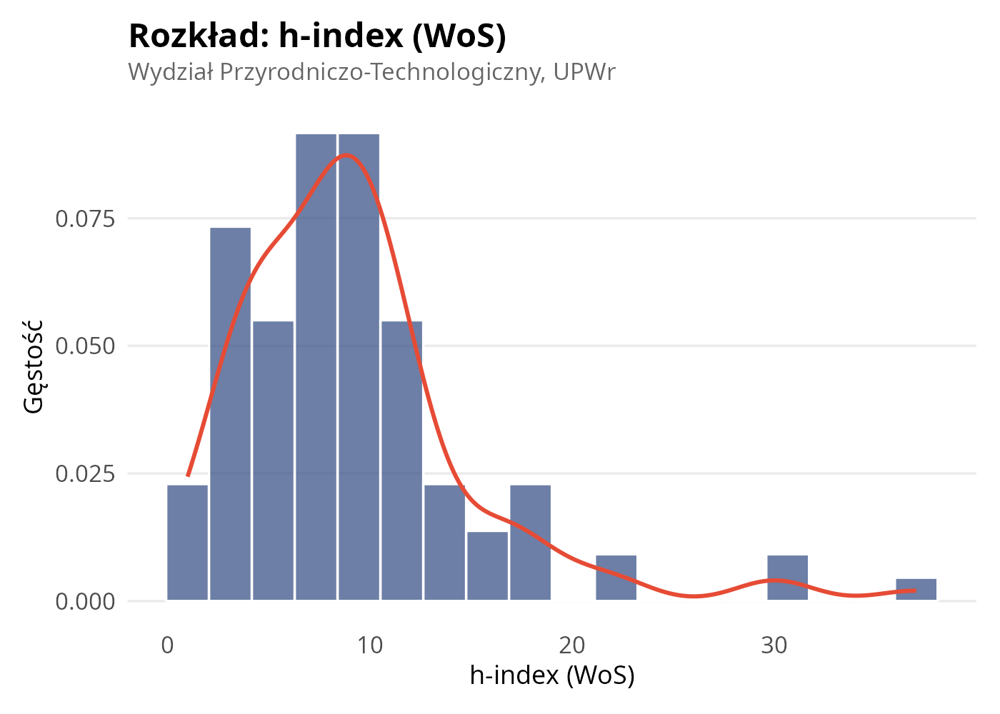
```

```{r rozklad-if, fig.cap="Rozkład sumarycznego IF.", fig.width=6, fig.height=4.5}
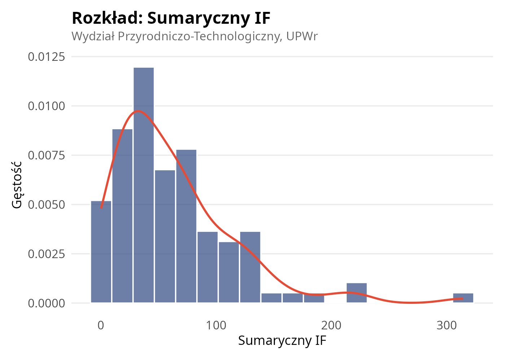
```

```{r rozklad-mein, fig.cap="Rozkład punktacji MEiN.", fig.width=6, fig.height=4.5}
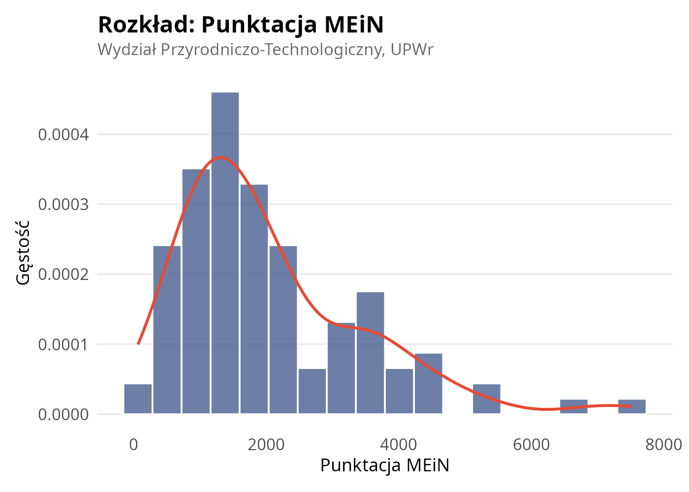
```

## Porównanie stanowisk

```{r stats-stanowisko}
stats_stan <- df %>%
  filter(!is.na(stanowisko), stanowisko != "asystent") %>%
  group_by(stanowisko) %>%
  summarise(
    n = n(),
    across(all_of(metryki), list(
      mean   = ~sprintf("%.1f", mean(., na.rm = TRUE)),
      median = ~sprintf("%.1f", median(., na.rm = TRUE))
    )),
    .groups = "drop"
  ) %>%
  rename(Stanowisko = stanowisko, N = n)
kable(stats_stan,
      col.names = c("Stanowisko", "N",
                     "Średnia", "Mediana",
                     "Średnia", "Mediana",
                     "Średnia", "Mediana"),
      caption = "Statystyki metryk wg stanowiska.",
      booktabs = TRUE)
```

Widoczny jest wyraźny gradient: profesorowie osiągają najwyższe wartości we wszystkich metrykach, profesorowie uczelni --- pośrednie, a adiunkci --- najniższe.

# Analiza porównawcza wg stanowiska

## Diagnostyka założeń i wybór testu

Ze względu na naruszenie założeń ANOVA (test Shapiro-Wilka odrzucił normalność reszt dla wszystkich metryk, test Levene'a odrzucił jednorodność wariancji dla sumarycznego IF i punktacji MEiN), zastosowano nieparametryczny test **Kruskala-Wallisa** z post hoc **testem Dunna** (korekta Bonferroniego).

## Wyniki

Test Kruskala-Wallisa wykazał istotne różnice między stanowiskami dla wszystkich trzech metryk (p < 0,001). Analiza post hoc (test Dunna z korektą Bonferroniego) ujawniła następujące grupy jednorodne:

- **h-index (WoS):** profesorowie (b) różnią się istotnie od adiunktów (a) i profesorów uczelni (a). Profesorowie uczelni nie różnią się istotnie od adiunktów.
- **Sumaryczny IF:** profesorowie (b) różnią się od adiunktów (a), profesorowie uczelni (ab) zajmują pozycję pośrednią, nieróżniącą się istotnie od żadnej z pozostałych grup.
- **Punktacja MEiN:** wszystkie trzy grupy różnią się istotnie między sobą --- adiunkci (a), profesorowie uczelni (b), profesorowie (c).

Punktacja MEiN okazała się metryką najsilniej różnicującą stanowiska, co może wynikać z tego, że uwzględnia ona szerszy zakres publikacji (w tym polskojęzyczne).

```{r box-h, fig.cap="h-index (WoS) wg stanowiska (Kruskal-Wallis + Dunn, litery = grupy jednorodne, p < 0,05).", fig.width=6, fig.height=5}
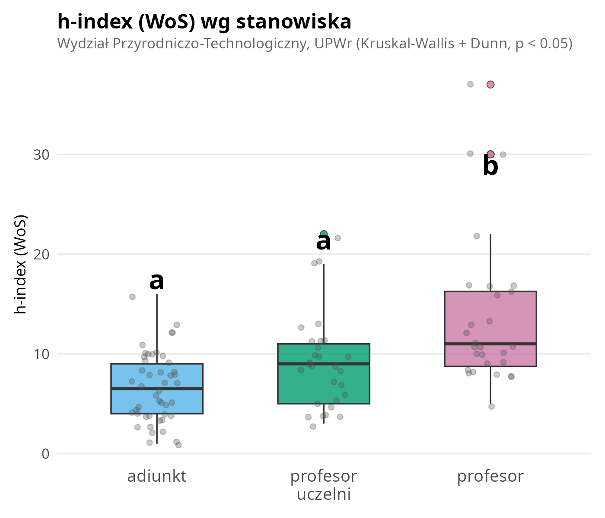
```

```{r box-if, fig.cap="Sumaryczny IF wg stanowiska.", fig.width=6, fig.height=5}
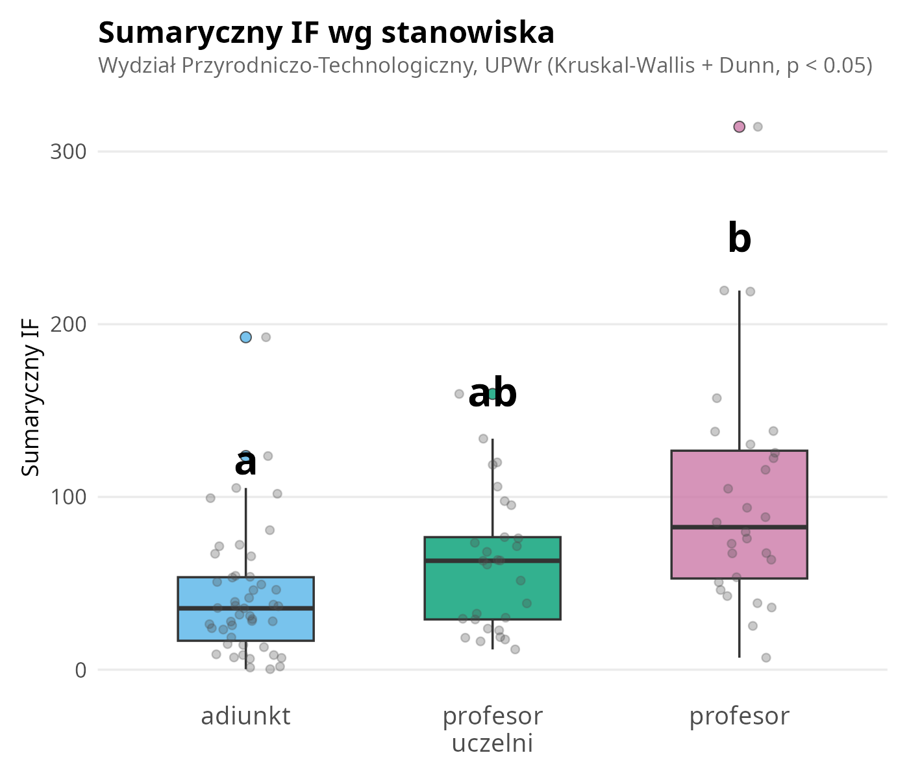
```

```{r box-mein, fig.cap="Punktacja MEiN wg stanowiska.", fig.width=6, fig.height=5}
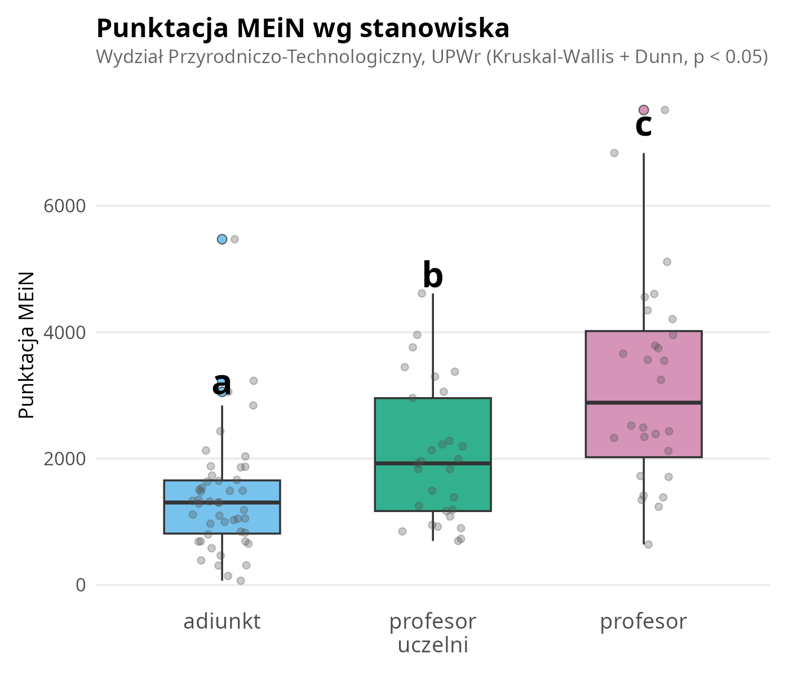
```

# Analiza porównawcza wg jednostki

## Diagnostyka i wyniki

Porównanie 7 jednostek organizacyjnych (z liczebnością $n \geq 5$) przeprowadzono analogiczną procedurą. Test Shapiro-Wilka odrzucił normalność reszt dla wszystkich metryk, wobec czego zastosowano test Kruskala-Wallisa.

```{r kw-jednostki}
top_katedry <- df %>%
  filter(!is.na(jednostka)) %>%
  count(jednostka) %>%
  filter(n >= 5) %>%
  pull(jednostka)

df_jedn <- df %>% filter(jednostka %in% top_katedry)

kw_jedn <- data.frame(
  Metryka = character(), `chi²` = character(), df = integer(),
  p = character(), Wniosek = character(), check.names = FALSE
)
for (m in metryki) {
  df_m <- df_jedn %>% filter(!is.na(.data[[m]]))
  kw <- kruskal.test(as.formula(paste(m, "~ jednostka")), data = df_m)
  kw_jedn <- rbind(kw_jedn, data.frame(
    Metryka = metryki_labels[m],
    `chi²` = sprintf("%.2f", kw$statistic),
    df = kw$parameter,
    p = gsub("\\.", ",", sprintf("%.3f", kw$p.value)),
    Wniosek = ifelse(kw$p.value < 0.05, "istotne różnice", "brak istotnych różnic"),
    check.names = FALSE
  ))
}
kable(kw_jedn, caption = "Wyniki testu Kruskala-Wallisa dla porównania jednostek.",
      booktabs = TRUE, row.names = FALSE)
```

**Żadna z metryk nie wykazała istotnych różnic między jednostkami** (p > 0,05 dla wszystkich porównań). Oznacza to, że zróżnicowanie aktywności publikacyjnej na WPT wynika przede wszystkim ze stanowiska akademickiego (i związanego z nim stażu naukowego), a nie z przynależności do konkretnej katedry czy instytutu.

```{r jedn-h, fig.cap="h-index (WoS) wg jednostki (Kruskal-Wallis n.s., wszystkie jednostki w jednej grupie jednorodnej).", fig.width=7, fig.height=5}
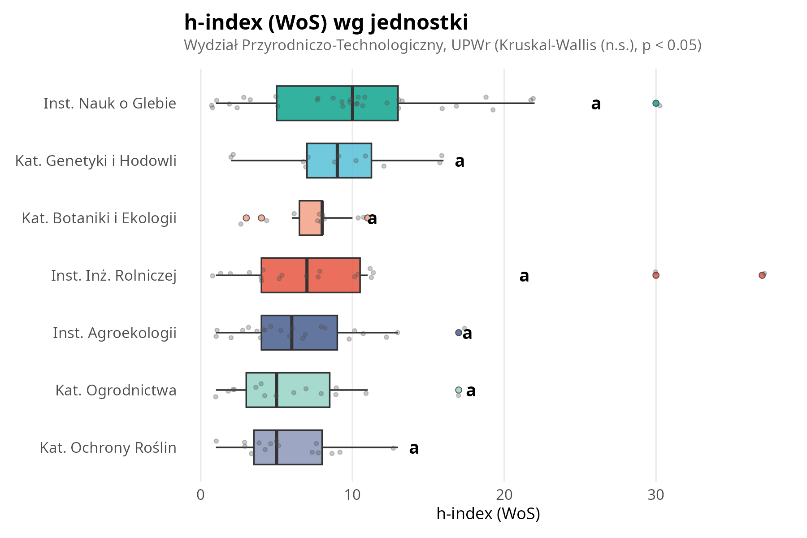
```

```{r jedn-if, fig.cap="Sumaryczny IF wg jednostki.", fig.width=7, fig.height=5}
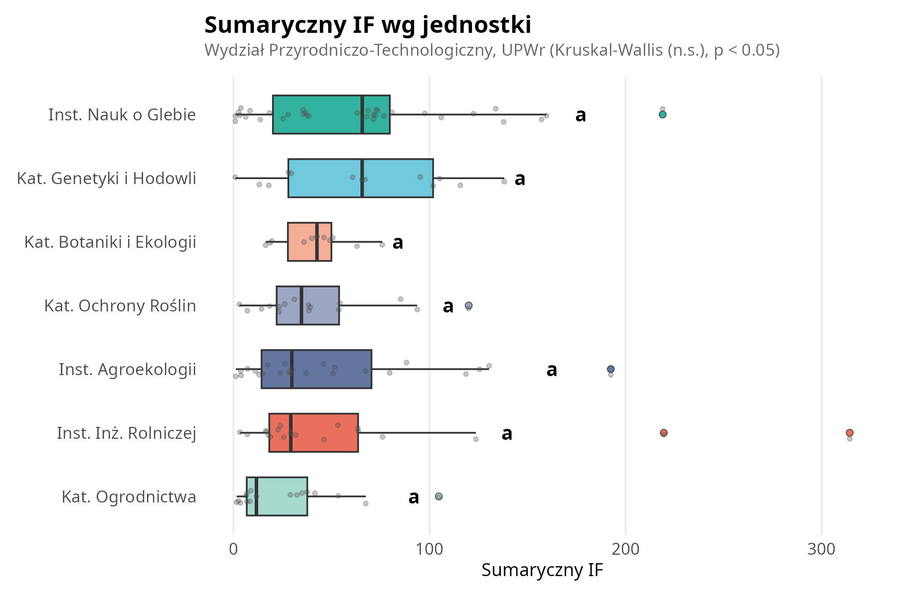
```

```{r jedn-mein, fig.cap="Punktacja MEiN wg jednostki.", fig.width=7, fig.height=5}
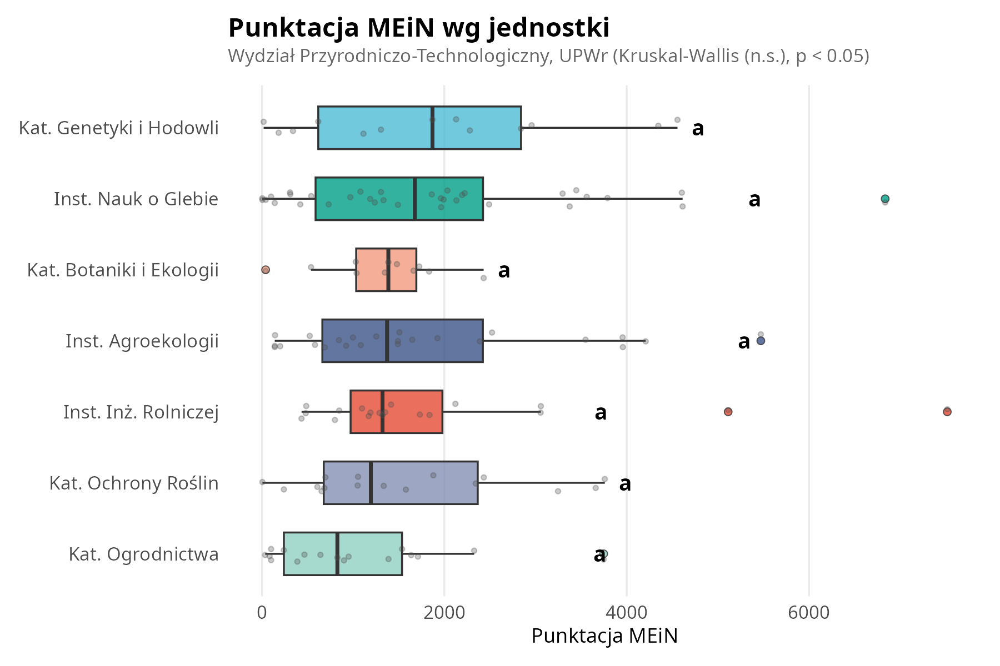
```

# Korelacje między metrykami

```{r korelacje-tab}
cor_mat <- cor(df[, metryki], use = "pairwise.complete.obs")
cor_df <- data.frame(
  Metryka = metryki_labels[metryki],
  `h-index (WoS)` = sprintf("%.3f", cor_mat[, 1]),
  `Sumaryczny IF` = sprintf("%.3f", cor_mat[, 2]),
  `Punktacja MEiN` = sprintf("%.3f", cor_mat[, 3]),
  check.names = FALSE
)
kable(cor_df, caption = "Macierz korelacji Pearsona między metrykami bibliometrycznymi.",
      booktabs = TRUE)
```

```{r korelacje-opis, results='asis'}
# Minimalna korelacja (poza przekątną)
cor_vals <- cor_mat[lower.tri(cor_mat)]
min_r <- min(cor_vals)

# Najsilniejsza para
max_idx <- which(cor_mat == max(cor_mat[lower.tri(cor_mat)]), arr.ind = TRUE)
max_pair <- paste(metryki_labels[rownames(cor_mat)[max_idx[1, 1]]],
                  "a", metryki_labels[colnames(cor_mat)[max_idx[1, 2]]])
max_r <- cor_mat[max_idx[1, 1], max_idx[1, 2]]

cat(sprintf("Wszystkie korelacje są bardzo silne (r > %.2f), co wskazuje na wysoką spójność metryk. Najsilniejsza korelacja występuje między %s (r = %.3f), co potwierdza, że oba wskaźniki w dużej mierze mierzą ten sam aspekt aktywności publikacyjnej.\n",
    floor(min_r * 100) / 100, max_pair, max_r))
```

```{r mapa-korelacji, fig.cap="Mapa ciepła korelacji między metrykami.", fig.width=5, fig.height=4.5}
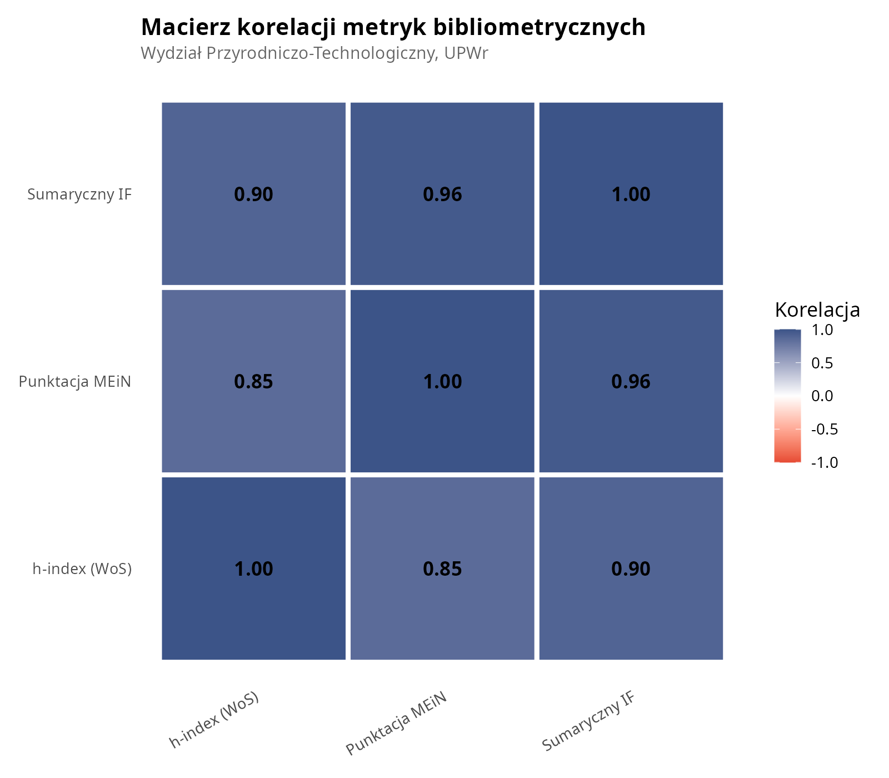
```

## Regresja: Sumaryczny IF vs Punktacja MEiN

```{r scatter, fig.cap="Zależność między sumarycznym IF a punktacją MEiN. Rozmiar punktu odpowiada h-index WoS, kolor --- stanowisku. Linia regresji z 95\\% przedziałem ufności.", fig.width=8, fig.height=5.5}
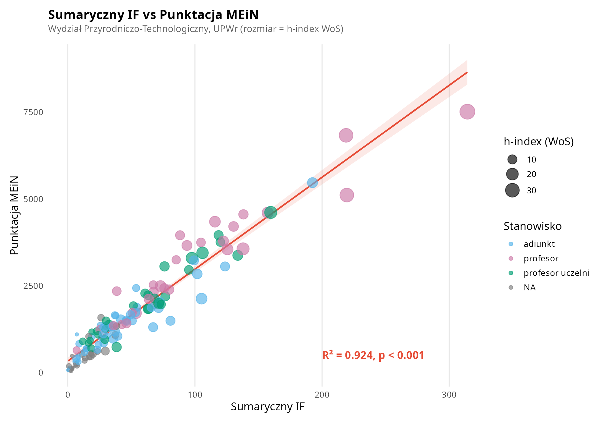
```

```{r regresja-opis, results='asis'}
df_reg <- df %>% filter(!is.na(sum_IF), !is.na(sum_MEiN))
mod <- lm(sum_MEiN ~ sum_IF, data = df_reg)
mod_s <- summary(mod)
r2 <- mod_s$r.squared
p_val <- pf(mod_s$fstatistic[1], mod_s$fstatistic[2], mod_s$fstatistic[3], lower.tail = FALSE)
b0 <- coef(mod)[1]
b1 <- coef(mod)[2]

p_txt <- ifelse(p_val < 0.001, "p < 0,001", sprintf("p = %.3f", p_val))

cat(sprintf("Regresja liniowa potwierdza bardzo silny związek między sumarycznym IF a punktacją MEiN ($R^2$ = %.3f; %s). Model: **MEiN = %.0f + %.1f $\\times$ IF**. Oznacza to, że sumaryczny IF wyjaśnia ponad %.0f%% zmienności punktacji MEiN.\n",
    r2, p_txt, b0, b1, r2 * 100))
```

# Ranking pracowników

## Top-15 wg poszczególnych metryk

```{r top-h, fig.cap="Top-15 pracowników wg h-index (WoS).", fig.width=8, fig.height=5.5}
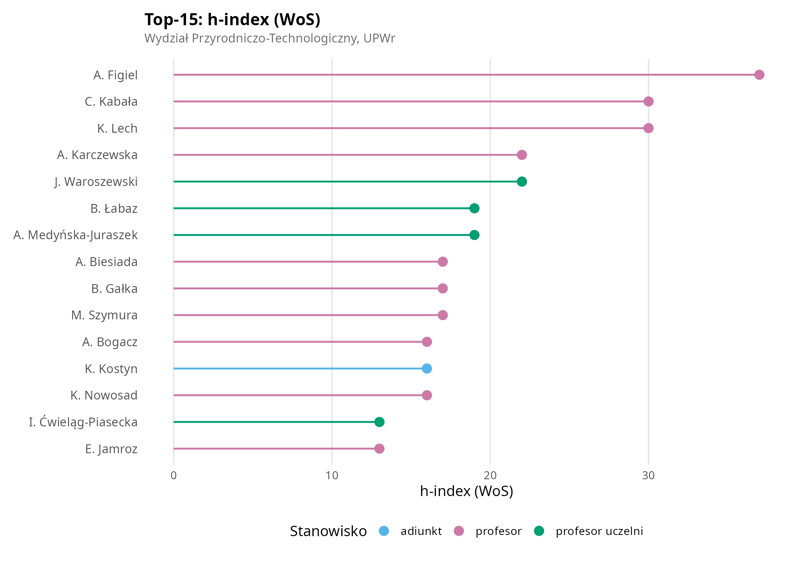
```

```{r top-if, fig.cap="Top-15 pracowników wg sumarycznego IF.", fig.width=8, fig.height=5.5}
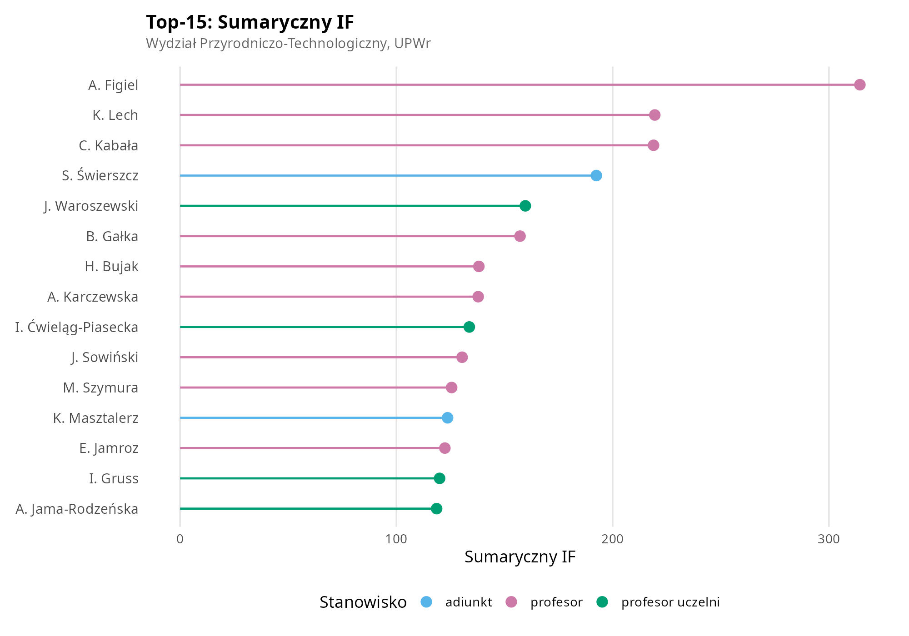
```

```{r top-mein, fig.cap="Top-15 pracowników wg punktacji MEiN.", fig.width=8, fig.height=5.5}
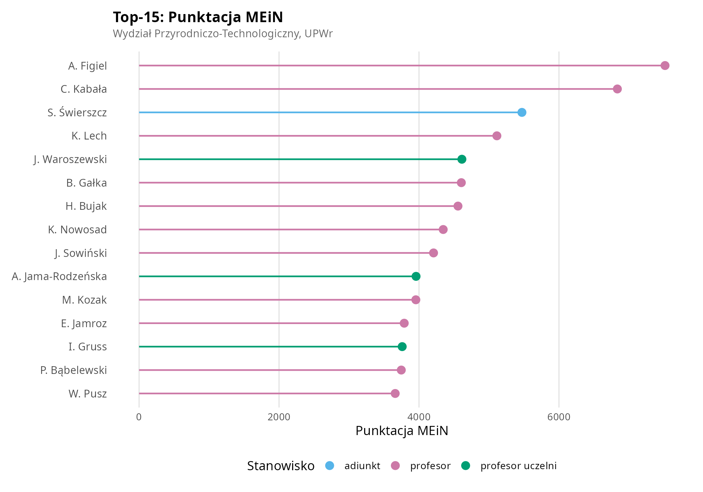
```

```{r ranking-opis, results='asis'}
# Lider w każdej metryce
liderzy <- sapply(metryki, function(m) {
  df %>% filter(!is.na(.data[[m]])) %>% arrange(desc(.data[[m]])) %>% slice(1) %>% pull(profil)
})

# Sprawdź czy ten sam lider we wszystkich
if (length(unique(liderzy)) == 1) {
  lider <- df %>% filter(profil == liderzy[1])
  cat(sprintf("We wszystkich trzech rankingach pozycję lidera zajmuje %s (%s), z wartościami: h-index = %d, IF = %.0f, MEiN = %d.\n",
      lider$profil, lider$stanowisko, lider$h_index_wos, lider$sum_IF, lider$sum_MEiN))
} else {
  for (m in metryki) {
    top1 <- df %>% filter(!is.na(.data[[m]])) %>% arrange(desc(.data[[m]])) %>% slice(1)
    cat(sprintf("- **%s:** lider --- %s (%s, %s).\n",
        metryki_labels[m], top1$profil, top1$stanowisko,
        gsub("Instytut ", "Inst. ", gsub("Katedra ", "Kat. ", top1$jednostka))))
  }
}

# Najlepszy adiunkt w top-5 jakiejkolwiek metryki
for (m in metryki) {
  top5 <- df %>% filter(!is.na(.data[[m]])) %>% arrange(desc(.data[[m]])) %>% head(5)
  adj_top5 <- top5 %>% filter(stanowisko == "adiunkt")
  if (nrow(adj_top5) > 0) {
    cat(sprintf("\nWarto odnotować obecność adiunkta %s w Top-5 %s, co wskazuje na wyjątkowo wysoką produktywność na tle grupy stanowiskowej.\n",
        adj_top5$profil[1], metryki_labels[m]))
    break
  }
}
```

# Podsumowanie

```{r podsumowanie, results='asis'}
n_prac <- nrow(df)
n_jedn <- length(unique(df$jednostka))

# Lider bibliometryczny (średnia rang)
df_complete <- df %>% filter(!is.na(h_index_wos), !is.na(sum_IF), !is.na(sum_MEiN))
df_complete <- df_complete %>%
  mutate(
    rank_mean = (rank(-h_index_wos) + rank(-sum_IF) + rank(-sum_MEiN)) / 3
  ) %>%
  arrange(rank_mean)
lider <- df_complete %>% slice(1)

# Korelacje
cor_min <- min(cor_mat[lower.tri(cor_mat)])
max_idx <- which(cor_mat == max(cor_mat[lower.tri(cor_mat)]), arr.ind = TRUE)
max_pair_names <- c(metryki_labels[rownames(cor_mat)[max_idx[1, 1]]],
                    metryki_labels[colnames(cor_mat)[max_idx[1, 2]]])

cat(sprintf("1. **Wydział Przyrodniczo-Technologiczny** UPWr liczy %d pracowników naukowych w %d jednostkach organizacyjnych. Rozkłady metryk bibliometrycznych są silnie prawo-skośne, co jest typowe dla danych naukometrycznych.\n\n",
    n_prac, n_jedn))

cat("2. **Stanowisko akademickie istotnie różnicuje** aktywność publikacyjną (Kruskal-Wallis, p < 0,001 dla wszystkich metryk). Profesorowie osiągają najwyższe wartości, adiunkci --- najniższe.\n\n")

cat("3. **Jednostki organizacyjne nie różnią się istotnie** pod względem metryk bibliometrycznych (Kruskal-Wallis, p > 0,05). Zróżnicowanie aktywności wynika ze struktury stanowiskowej, a nie przynależności do katedry/instytutu.\n\n")

cat(sprintf("4. **Metryki są silnie skorelowane** (r > %.2f), a najsilniejszy związek dotyczy %s i %s ($R^2$ = %.3f).\n\n",
    floor(cor_min * 100) / 100, max_pair_names[1], max_pair_names[2], r2))

cat(sprintf("5. **Liderem bibliometrycznym** wydziału jest %s (h = %d, IF = %.0f, MEiN = %d), znacząco przewyższający pozostałych pracowników we wszystkich metrykach.\n",
    lider$profil, lider$h_index_wos, lider$sum_IF, lider$sum_MEiN))
```

# Nota metodologiczna

- **Źródło danych:** portal Baza Wiedzy UPWr (scraping z dnia 2026-03-06)
- **Testy statystyczne:** Kruskal-Wallis + test Dunna z korektą Bonferroniego (z uwagi na naruszenie założeń ANOVA)
- **Oprogramowanie:** R 4.5.2, pakiety: dplyr, ggplot2, dunn.test, multcompView, emmeans, car
- **Outliery:** nie usuwano --- w danych bibliometrycznych wartości ekstremalne odzwierciedlają realną produktywność naukową, a zastosowane testy nieparametryczne są odporne na ich wpływ
